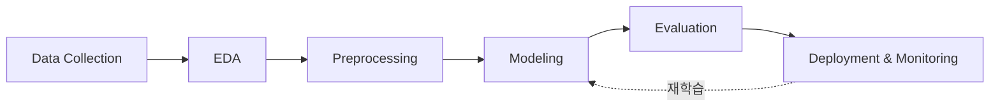
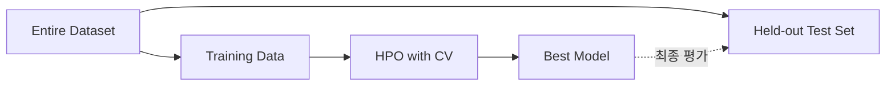

# Introduction to Tabular ML

> [!abstract] 강의 개요
> **TabML 1강** → [[TabML_02_Classical_ML_for_Tabular_Data|2강]]
>
> 표(table) 형태로 존재하는 데이터의 본질적 특성과, 이를 다루기 어렵게 만드는 7가지 challenge를 짚고, 데이터 수집부터 배포·모니터링까지 이어지는 **ML 파이프라인 전체**를 개관한다. 전처리·평가·해석가능성까지 다루며, 이후 강의(Classical ML → Deep Architecture → Representation Learning → LLM → TabPFN)의 로드맵을 제시한다.

> [!summary]- 핵심 요약 (클릭해서 펼치기)
> | 주제 | 핵심 내용 |
> | ---- | --------- |
> | ==Tabular Data 정의== | row(샘플) × column(feature)의 2차원 구조, 특정 컬럼이 target |
> | 7대 특성 | 이종 feature, 비정형 순서, 소규모 데이터, 결측치, 노이즈 레이블, 클래스 불균형, 도메인 다양성 |
> | 5대 Task | Prediction, Anomaly Detection, Clustering, Table QA, Synthetic Data Generation |
> | ML Pipeline | 수집 → EDA → 전처리 → 모델링 → 평가 → 배포/모니터링 |
> | 전처리 핵심 | 결측치 처리, 범주형 인코딩, 수치형 변환, Feature Engineering |
> | 평가 핵심 | CV/HPO, 문제 특성에 맞는 metric 선택 (Accuracy만으론 부족) |
> | 해석가능성 | Permutation Importance(global), SHAP(local) |

## 목차

1. [[#1. Tabular Data란 무엇인가]]
   - [[#1.1 정의]]
   - [[#1.2 Tabular Data의 7대 특성]]
2. [[#2. Tabular Data 위에서의 5가지 Task]]
3. [[#3. Machine Learning Pipeline]]
4. [[#4. Tabular Data 전처리]]
   - [[#4.1 결측치 처리]]
   - [[#4.2 범주형 변수 인코딩]]
   - [[#4.3 수치형 변환]]
   - [[#4.4 Feature Engineering]]
5. [[#5. Tabular ML 평가]]
   - [[#5.1 Cross-Validation과 HPO]]
   - [[#5.2 평가 지표]]
6. [[#6. 해석가능성 (Interpretability)]]
7. [[#7. Tools & Datasets]]

---

## 1. Tabular Data란 무엇인가

### 1.1 정의

> [!note] Tabular Data
> 행(row)과 열(column)로 구성된 2차원 데이터 구조.
> - **Row** (= sample, record, instance): 하나의 관측치/개체
> - **Column** (= feature, attribute, variable): 측정된 속성
> - 특정 column이 **target**(label)으로 지정될 수 있음

예: 고객 이탈(Churn) 데이터에서 `Age`, `Charge`, `Contract`, `Tenure`는 feature, `Churned`는 target.

### 1.2 Tabular Data의 7대 특성

> [!warning] Tabular ML이 어려운 이유
> 이미지·텍스트와 달리, tabular data는 아래 7가지 특성 때문에 모델링이 까다롭다.

| 특성 | 설명 | 모델에 요구되는 것 |
| ---- | ---- | ------------------ |
| **이종 Feature Type** | 수치·범주·이진·날짜·텍스트가 한 행에 혼재 | 서로 다른 통계적 성질을 동시에 처리 |
| **비정형 구조** | column 순서가 임의적 (이미지의 픽셀 인접성, 텍스트의 어순과 다름) | ==Permutation-invariance== |
| **소규모 데이터셋** | 수천 행 수준이 흔함 (이미지/텍스트는 수십억 샘플) | Data-efficient, 과적합 방지 |
| **결측치** | 센서 고장, 응답 누락 등으로 흔히 발생 | 불완전한 입력에 강건 |
| **노이즈·불완전 레이블** | 사람 판단 비일관성, 정책 변화, ==leakage== 위험 | 노이즈에 강건, 시계열 순서를 지키는 평가 |
| **클래스 불균형** | 사기 탐지·질병 진단 등에서 소수 클래스가 1% 미만일 수도 | accuracy 외의 적절한 지표 필요 |
| **도메인 다양성** | 금융·의료·제조 등 도메인마다 패턴이 다르고 사전 지식이 제한적 | 데이터로부터 직접 feature 관계를 학습 |

> [!quote] 핵심 메시지
> 이러한 특성들 때문에 tabular learning은 vision·NLP와는 **본질적으로 다른** 접근이 필요하다.

---

## 2. Tabular Data 위에서의 5가지 Task

> [!example] Task 분류와 대표 예시
> | Task | 목표 | Supervision | 예시 |
> | ---- | ---- | ----------- | ---- |
> | **Prediction** (지도학습) | $\mathcal{D}=\{(\mathbf{x}_i,y_i)\}_{i=1}^n$로부터 새 $\mathbf{x}$의 $y$ 추정 | Supervised | 신용 평점(Credit Scoring) |
> | **Anomaly Detection** | 패턴에서 벗어난 희귀 레코드 탐지 | 주로 Unsupervised | 신용카드 사기 탐지 |
> | **Clustering** | 레이블 없이 유사 레코드 그룹화 | Unsupervised | 고객 세그멘테이션 |
> | **Table QA** | 자연어 질문 + 테이블 → 답변 (lookup·filter·aggregation·다단계 추론) | LLM 기반 | 내부 매출 분석 어시스턴트 |
> | **Synthetic Data Generation** | 통계적 성질을 보존하면서 개인정보를 보호하는 가짜 데이터 생성 | Generative | 의료 데이터 공유 |

$$\text{Regression: } y \in \mathbb{R} \qquad \text{Classification: } y \in \{1,\dots,K\}$$

> [!tip] Table QA가 가능해진 이유
> 과거에는 자연어 이해와 표 추론을 동시에 요구하는 Table QA가 어려웠지만, **현대 LLM**의 등장으로 실용적인 수준에 도달했다.

---

## 3. Machine Learning Pipeline

> [!info] 이 섹션에서 다루는 것
> "원본 데이터 → 신뢰할 수 있는 배포 모델"까지의 전체 흐름을 6단계로 개관한다.



| 단계 | 핵심 내용 |
| ---- | --------- |
| **Data Collection** | 여러 테이블·외부 데이터 결합 (e.g., customers ↔ orders), 수집 과정의 재현성 확보 |
| **EDA** | 요약 통계, 결측 패턴, 분포, 상관관계, 이상치·불균형 파악 |
| **Preprocessing** | 모델이 이해할 수 있는 형태로 변환. ==Data Leakage== 방지가 핵심 |
| **Modeling** | 선형모델 → 트리 앙상블(XGBoost 등) → 딥러닝/Foundation Model(LLM, TabPFN) |
| **Evaluation** | held-out test + cross-validation, 과제에 맞는 metric |
| **Deployment & Monitoring** | batch/online 추론, data drift·성능 저하 모니터링, 필요 시 재학습 |

> [!warning] Data Leakage의 전형적 실수
> 전처리(scaler 등)는 **train set에만 fit**하고 그 변환을 val/test에 적용해야 한다.
> ```python
> # Wrong
> X = scaler.fit_transform(X)
> X_train, X_test = split(X, ...)
>
> # Correct
> X_train, X_test = split(X, ...)
> X_train = scaler.fit_transform(X_train)
> X_test  = scaler.transform(X_test)
> ```

---

## 4. Tabular Data 전처리

### 4.1 결측치 처리

| 방법 | 설명 |
| ---- | ---- |
| Deletion | 결측 행/열 제거 → 정보 손실 |
| Constant fill | "Unknown" 등으로 채움 → 결측 자체가 신호일 때 유용 |
| 통계적 대치 | 평균·중앙값·최빈값 대치 |
| 모델 기반 대치 | 다른 feature로 결측값 예측 (e.g., k-NN) |
| Native support | 일부 트리 모델은 결측치를 직접 처리 |

### 4.2 범주형 변수 인코딩

> [!note] 왜 인코딩이 필요한가
> ML 모델은 수치 입력을 요구하므로 범주형 feature는 반드시 인코딩해야 한다.

| 방법 | 핵심 아이디어 |
| ---- | -------------- |
| **One-Hot Encoding** | 카테고리마다 binary feature 생성 (순서 가정 없음, 고cardinality 시 차원 폭증) |
| **Ordinal Encoding** | 순서가 있는 카테고리를 정수로 매핑 (e.g., S < M < L < XL) |
| **Target Encoding** | 카테고리를 해당 그룹의 평균 target 값으로 대체 |
| **Embedding Encoding** | 카테고리별 벡터 표현을 학습 |

### 4.3 수치형 변환

$$\text{Standardization: } x' = \frac{x-\mu}{\sigma} \qquad \text{Min-Max Scaling: } x' = \frac{x-\min}{\max-\min}$$

- 트리 기반 모델은 ==scale-invariant==하지만, 거리·gradient 기반 모델은 스케일링이 중요
- **Log transform**: 오른쪽으로 치우친 분포(소득, 가격)에 유용
- **Quantile transform**: 분포의 순위로 매핑 → 이상치에 강건
- **Binning**: 선형 모델이 비선형 패턴을 포착하도록 도움

### 4.4 Feature Engineering

> [!tip] Feature Engineering이 모델 선택보다 중요할 수 있다
> 잘 설계된 feature는 패턴을 모델이 더 쉽게 학습하게 만든다.

| 패턴 | 예시 |
| ---- | ---- |
| Aggregation | 최근 30일 평균 구매액 |
| Ratio | 부채/소득 비율 |
| 시간 차이 | 마지막 로그인 이후 경과일 |
| 날짜 분해 | 월/요일/휴일 여부 |
| Interaction | 가격 × 수량 |
| 도메인 특화 | 의료의 BMI, 금융의 재무 지표 |

---

## 5. Tabular ML 평가

### 5.1 Cross-Validation과 HPO

> [!warning] 흔한 평가 실수 (Pitfalls)
> - **Train-test contamination**: 전처리·학습 과정에서 test 데이터를 사용
> - **단일 검증셋에 대한 과적합**: 수천 개 하이퍼파라미터 조합을 하나의 split에만 튜닝



### 5.2 평가 지표

$$R^2 = 1 - \frac{\sum_i (y_i - \hat{y}_i)^2}{\sum_i (y_i - \bar{y})^2}$$

> [!example] 혼동 행렬 기반 지표
> | | Pred. Positive | Pred. Negative |
> | --- | --- | --- |
> | **Real. Positive** | TP | FN |
> | **Real. Negative** | FP | TN |
>
> $$\text{Accuracy} = \frac{TP+TN}{\text{total}} \quad \text{Precision} = \frac{TP}{TP+FP} \quad \text{Recall} = \frac{TP}{TP+FN}$$
> $$\text{F1} = \text{harmonic mean(Precision, Recall)}$$

> [!tip] 문제 상황에 맞는 metric 선택
> - **불균형 데이터** → AUC-PR이 AUC-ROC보다 더 유의미
> - **사기 탐지**: 양성이 매우 드묾 → PR-AUC, 고정 precision에서의 recall
> - **질병 진단**: 놓치면 치명적 → Recall 최적화
> - **스팸 필터링**: false positive 비용이 큼 → Precision 최적화
> - 결국 **실제 비용 구조를 반영하는 지표**가 최선의 지표

---

## 6. 해석가능성 (Interpretability)

> [!note] 왜 필요한가
> 예측 성능이 높아도, "왜 이 예측이 나왔는가"를 설명하지 못하면 신뢰할 수 없다.
> - **Global**: 모델 전체적으로 어떤 feature가 중요한가?
> - **Local**: 이 샘플에 대해 왜 이 예측이 나왔는가?

| 기법 | 설명 |
| ---- | ---- |
| **Permutation Importance** | feature를 셔플했을 때 성능이 얼마나 떨어지는지로 중요도 측정 (Global) |
| **==SHAP==** | 각 feature의 예측 기여도를 분해 (Local, 트리 모델에 특히 효율적) |

---

## 7. Tools & Datasets

| 구분 | 목록 |
| ---- | ---- |
| 라이브러리 | NumPy, Pandas, scikit-learn, Optuna(AutoML), PyTorch |
| 공개 데이터셋 | Kaggle, UCI ML Repository, OpenML, AI Hub(aihub.or.kr) |

> [!success] 이번 강의 정리 & 다음 강의 로드맵
> Tabular data는 어디에나 있지만, 이종 feature·결측치·소규모·불균형·도메인 다양성 때문에 여전히 어렵다. 다음 강의들에서 순서대로 다룬다:
> [[TabML_02_Classical_ML_for_Tabular_Data|Classical ML]] → [[TabML_03_Deep_Architectures_for_Tabular_Data|Deep Architectures]] → [[TabML_04_Tabular_Representation_Learning|Representation Learning]] → [[TabML_05_LLMs_with_Tabular_Data|LLMs]] → [[TabML_06_A_New_Paradigm_TabPFN|TabPFN]]

---

%%
관련 노트:
- [[TabML_02_Classical_ML_for_Tabular_Data]] — 2강: 고전적 ML 모델 (트리 앙상블 등)
%%
