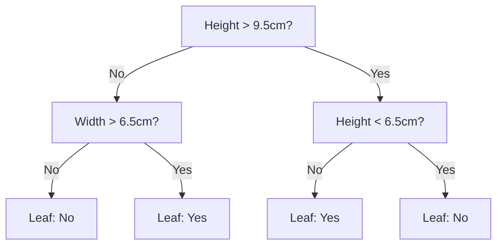
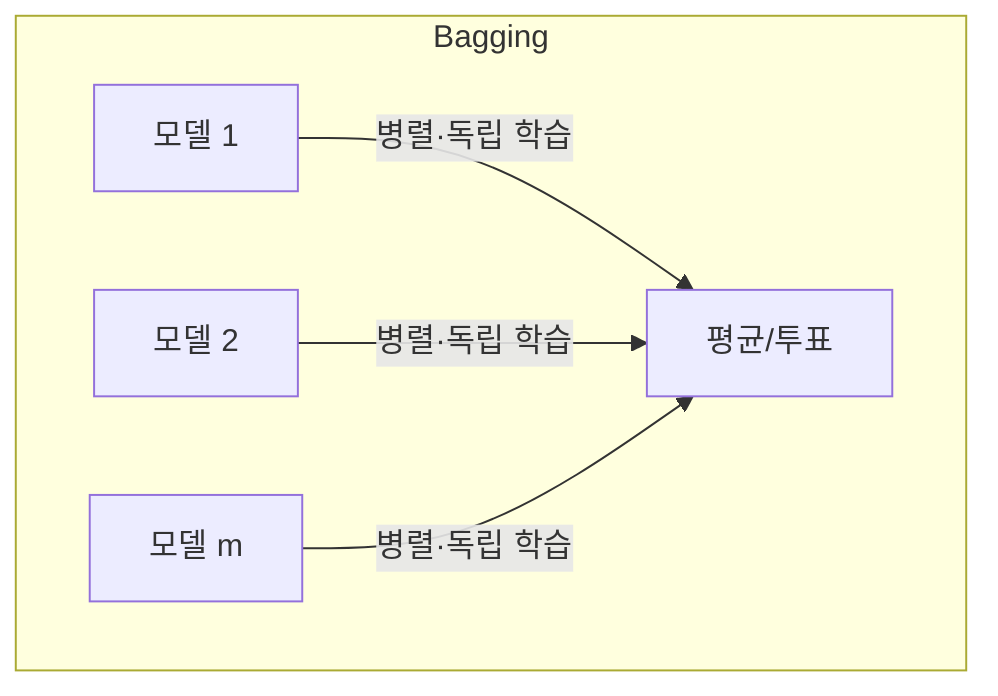
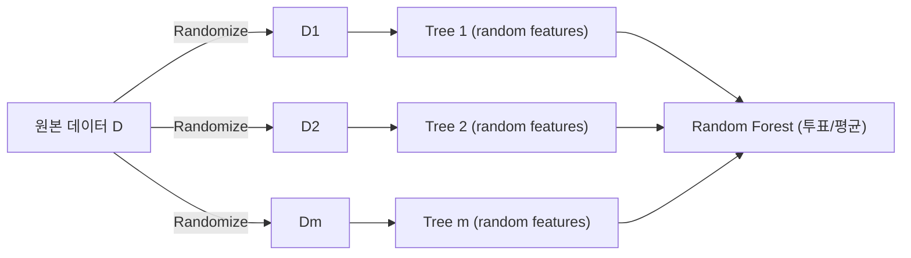

# Classical ML for Tabular Data

> [!abstract] 강의 개요
> [[TabML_01_Introduction_to_Tabular_ML|1강]] ← **TabML 2강** → [[TabML_03_Deep_Architectures_for_Tabular_Data|3강]]
>
> 선형/로지스틱 회귀·kNN 같은 simple baseline부터 Decision Tree, 그리고 ==Bagging==/==Boosting== 기반 ensemble(Random Forest, GBDT)까지 — tabular 데이터의 **사실상 표준(de-facto standard)** 인 classical ML 기법을 체계적으로 다룬다.

> [!summary]- 핵심 요약 (클릭해서 펼치기)
> | 모델 | 핵심 아이디어 | 강점 | 약점 |
> | ---- | ------------- | ---- | ---- |
> | **Linear/Logistic Regression** | 선형 결정 함수 + (MSE / Cross-Entropy) | 단순·해석 용이·빠름 | 비선형 패턴 포착 불가 |
> | **kNN** | "이웃과 비슷하다" — 학습 없는 lazy model | 비선형 경계 포착 | 느림, scale에 민감, 고차원에서 약함 |
> | **Decision Tree** | 입력 공간을 재귀적으로 분할 | 해석 용이, 전처리 불필요 | 과적합·불안정 |
> | **Bagging (Random Forest)** | 병렬 학습 + 평균 → variance 감소 | 안정적, 튜닝 쉬움 | bias는 줄지 않음 |
> | **Boosting (GBDT)** | 순차 학습, 이전 오차를 보정 | 매우 강력한 성능 | 튜닝 민감, 느림 |
> | **XGBoost/LightGBM/CatBoost** | GBDT의 실전 최적화 라이브러리 | 강건/빠름/범주형 특화 | 라이브러리별 특성 이해 필요 |

## 목차

1. [[#1. Simple Baselines]]
   - [[#1.1 Linear Regression]]
   - [[#1.2 Logistic Regression]]
   - [[#1.3 k-Nearest Neighbors (kNN)]]
2. [[#2. Decision Trees]]
   - [[#2.1 트리 구조와 예측]]
   - [[#2.2 Model Fitting (Greedy Splitting)]]
   - [[#2.3 Under/Overfitting과 Pruning]]
3. [[#3. Ensemble Methods]]
   - [[#3.1 Bagging과 Random Forest]]
   - [[#3.2 Boosting과 GBDT]]
   - [[#3.3 Modern GBDT Libraries]]
4. [[#4. 부록 Isolation Forest (이상 탐지)]]

---

## 1. Simple Baselines

> [!info] 왜 Classical ML인가
> 단순함·빠른 학습·강한 성능·해석가능성 덕분에 tabular data에서 classical ML은 여전히 강력한 baseline이다. 특히 트리 기반 방법은 이종 feature를 자연스럽게 다루며 지금도 가장 널리 쓰이는 off-the-shelf 방법이다.

### 1.1 Linear Regression

$$\hat{y} = \mathbf{w}^\top \mathbf{x} + b, \qquad \mathbf{w}\in\mathbb{R}^d,\ b\in\mathbb{R}$$

> [!note] MSE 최소화 → closed-form 해
> $$\mathcal{L}(\mathbf{w}) = \frac{1}{n}\sum_{i=1}^n (y_i - \mathbf{w}^\top\mathbf{x}_i - b)^2$$
> Closed-form 해 $\hat{\mathbf{w}} = (\mathbf{X}^\top\mathbf{X})^{-1}\mathbf{X}^\top y$ 가 존재 (계산 비용 $O(nd^2+d^3)$, 일반적인 tabular 규모에서는 ==tractable==). 해가 어려울 때는 gradient 기반 최적화 사용. 이는 가우시안 노이즈 가정 하의 MLE와 동치.

> [!warning] 과적합과 정규화
> $d$가 크거나 feature 간 상관관계가 높을 때 과적합 발생.
> $$\text{Ridge (L2): } \Omega(\mathbf{w}) = \|\mathbf{w}\|_2^2 \quad\text{(부드럽게 0으로 축소)}$$
> $$\text{Lasso (L1): } \Omega(\mathbf{w}) = \|\mathbf{w}\|_1 \quad\text{(일부 weight를 정확히 0으로)}$$
> 정규화 강도 $\lambda$는 cross-validation으로 선택.

### 1.2 Logistic Regression

이진 분류($y\in\{0,1\}$)에서 확률 $P(y=1\mid x)\in[0,1]$을 예측하려면, $(-\infty,\infty)$ 범위의 raw score를 ==sigmoid==로 압축한다.

$$P(y=1\mid \mathbf{x}) = \sigma(\mathbf{w}^\top\mathbf{x}+b) = \frac{1}{1+e^{-(\mathbf{w}^\top\mathbf{x}+b)}}$$

결정 경계는 $\mathbf{w}^\top\mathbf{x}+b=0$인 선형 평면.

> [!note] 손실 함수: Cross-Entropy
> Bernoulli 모델의 negative log-likelihood와 동치이며 **convex**라서 최적화가 안정적. Closed-form 해는 없어 gradient descent로 반복 최적화. 다중분류 시 sigmoid → ==softmax==로 대체.

### 강점·한계 (Linear/Logistic 공통)

> [!success] 강점
> 단순·빠름·해석 용이, 회귀·분류 모두에서 강력한 baseline

> [!warning] 한계
> 비선형 패턴/복잡한 feature 상호작용을 직접 포착하지 못함, 이상치에 민감, 전처리·feature engineering 필요

> [!quote] Takeaway
> 선형 가정이 정확히 맞지 않아도, 선형 모델은 실전에서 여전히 유용한 baseline이다.

### 1.3 k-Nearest Neighbors (kNN)

> [!note] 핵심 아이디어
> "당신은 가장 가까운 k개의 이웃과 비슷하다." 학습 단계가 없는 **lazy model** — 데이터셋 자체가 모델.
> - 분류: $k$개 이웃의 다수결(majority vote)
> - 회귀: $k$개 이웃 target의 평균(또는 가중 평균)

거리 척도는 기본적으로 ==Euclidean distance==를 사용하며 Manhattan, Cosine 등으로 대체 가능.

> [!warning] Feature Scaling이 결정적
> "Annual Income"처럼 값의 범위가 큰 feature가 스케일링 없이는 거리를 지배해버려 "Age" 같은 feature를 무력화할 수 있다.

> [!tip] k 선택 가이드
> - 작은 $k$ (e.g., $k=1$): local·flexible하지만 노이즈에 민감 (과적합)
> - 큰 $k$: smooth·stable하지만 local pattern을 무시
> - $k$는 hyperparameter로 취급, cross-validation으로 선택. 분류 시 홀수 $k$로 동률 방지. $k$가 클 때는 Weighted kNN 유용

> [!warning] 한계
> 예측이 느리고 메모리 집약적, feature scaling과 무관한 feature에 민감, 고차원에서 성능 저하 (curse of dimensionality)

---

## 2. Decision Trees

### 2.1 트리 구조와 예측

> [!note] 정의
> Decision Tree는 (1) 입력 공간을 재귀적으로 분할(partition)하고, (2) 각 region마다 local model을 두는 방식으로 정의된다.
> - 내부 노드 $i$: feature 차원 $d_i$를 threshold $t_i$와 비교 → 좌/우 branch로 분기
> - 리프 노드 $j$: 해당 영역 $\mathcal{R}_j$에 속하는 모든 입력에 대해 $\hat{y}_j$를 예측

$$f(\mathbf{x};\theta) = \sum_j \hat{y}_j \,\mathbb{I}[\mathbf{x}\in\mathcal{R}_j], \qquad \hat{y}_j = \frac{\sum_n y_n\,\mathbb{I}[\mathbf{x}_n\in\mathcal{R}_j]}{\sum_n \mathbb{I}[\mathbf{x}_n\in\mathcal{R}_j]}$$

### 2.2 Model Fitting (Greedy Splitting)

> [!warning] 왜 그냥 최적화할 수 없는가
> 손실 $\mathcal{L}(\theta)=\sum_{j\in\mathcal{J}} p_j \ell_j$ ($\mathcal{J}$: 리프 집합, $p_j$: 노드 $j$ 도달 확률, $\ell_j$: 노드 $j$의 기대 손실)는 **미분 불가능**하고, 최적 분할을 찾는 것은 **NP-complete**. → ==Greedy== 알고리즘으로 한 노드씩 트리를 키운다.

리프 $k$를 $k_L,k_R$로 분할할 때 개선량:

$$\Delta(k,d,t) = p_k\ell_k - p_{k_L}\ell_{k_L} - p_{k_R}\ell_{k_R}$$

$$\text{매 단계에서: } \arg\max_{k\in\mathcal{J},\,d,\,t}\ p_k\,\Delta(k,d,t)$$

> [!example] 노드별 손실 함수 설계
> - **회귀**: $\hat{y}_k = \text{mean}(y)$, $\ell_k = \text{MSE}$
> - **분류 (Gini)**: $\ell_k = \sum_c \hat{y}_{kc}(1-\hat{y}_{kc})$
> - **분류 (Entropy)**: $\ell_k = -\sum_c \hat{y}_{kc}\log\hat{y}_{kc}$

### 2.3 Under/Overfitting과 Pruning

> [!warning] 트리 복잡도의 trade-off
> - 너무 얕음 → 중요한 패턴을 놓침 (==Underfitting==)
> - 너무 깊음 → 학습 데이터 노이즈까지 암기 (==Overfitting==) — 완전히 자란 트리는 train accuracy가 거의 100%지만 일반화는 나쁨

> [!tip] 복잡도 제어 방법
> - **Pre-pruning**: 트리가 복잡해지기 전에 성장을 멈춤 (`max_depth`, `min_samples_leaf`, `min_impurity_decrease`)
> - **Post-pruning**: 큰 트리를 먼저 키운 뒤 불필요한 branch 제거 (Cost-complexity pruning이 예측력과 트리 크기의 균형을 맞춤)

> [!success] 강점 / [!warning] 한계
> 강점: 규칙 기반이라 해석 쉬움, 비선형 패턴·feature 상호작용 포착, 전처리·scaling 불필요
> 한계: 깊게 키우면 과적합, 데이터가 조금만 바뀌어도 트리가 불안정 — 하지만 강력한 ensemble의 빌딩 블록이 됨

---

## 3. Ensemble Methods

> [!note] 핵심 아이디어
> 여러 base model의 예측을 결합해 일반화·강건성을 향상. base model들은 서로 달라야 함(다른 데이터, 다른 알고리즘, 다른 하이퍼파라미터).

| | Bagging | Boosting |
| --- | --- | --- |
| 학습 방식 | 병렬·독립 | 순차적 |
| 목적 | Variance 감소 | Bias 감소 (오차 보정) |
| 대표 모델 | Random Forest | AdaBoost, GBDT |

### 3.1 Bagging과 Random Forest

> [!note] Bagging (Bootstrap Aggregating)
> $m$개의 독립적인 training set $\{\mathcal{D}_i\}$을 **복원추출**로 샘플링 → 각각 분류기 $h_i$를 학습 → 평균:
> $$\hat{y} = \frac{1}{m}\sum_{i=1}^m \hat{y}_i,\quad \hat{y}_i = h_i(\mathbf{x})$$

> [!example] Bias-Variance 분석
> $$\mathbb{E}[\hat{y}] = \mathbb{E}[\hat{y}_i] \quad(\text{bias 불변})$$
> $$\text{Var}[\hat{y}] = \frac{1}{m}\text{Var}[\hat{y}_i] \quad(\text{variance가 } 1/m\text{로 감소})$$
> 각 데이터셋이 원본의 $n$개 샘플을 복원추출하므로, 한 샘플이 선택되지 않을 확률은 $(1-1/n)^n \to 1/e$. 즉 각 부트스트랩 데이터셋은 평균적으로 원본의 약 ==63%==만 포함 — 나머지(OOB)는 검증용으로 활용 가능.

> [!warning] 상관관계의 함정
> 데이터셋이 완전히 독립적이지 않으면 $1/m$ variance 감소를 얻지 못함:
> $$\text{Var}[\hat{y}] = \frac{1}{m}(1-\rho)\sigma^2 + \rho\sigma^2$$
> 해결책: 모델에 추가적인 무작위성을 주어 예측 간 상관관계 $\rho$를 낮춘다.

> [!success] Random Forest = Bagging + 추가 트릭
> 두 가지 무작위성을 결합해 decorrelate:
> 1. **Random dataset**: 각 트리는 bootstrap sampling으로 성장
> 2. **Random feature subset**: 각 노드에서 전체 feature가 아닌 **무작위 부분집합**에서 최선의 분할을 선택
>
> 단순하지만 Kaggle 대회에서 널리 쓰이는 강력한 모델.

### 3.2 Boosting과 GBDT

> [!note] Boosting
> 분류기를 **순차적으로** 학습하며 현재 ensemble의 오차를 교정한다.
> - **AdaBoost**: 잘못 분류된 샘플에 더 큰 weight 부여
> - **Gradient Boosting**: 남은 손실(residual)을 줄이도록 새 모델을 적합

> [!quote] GBDT (Gradient Boosting Decision Trees) 알고리즘
> 1. 초기 예측: $F_0(\mathbf{x}) = \bar{y}$
> 2. 잔차(residual): $r_i^{(m)} = y_i - F_{m-1}(\mathbf{x}_i)$
> 3. 잔차에 트리 적합: $h_m(\mathbf{x})$ on $\{(\mathbf{x}_i, r_i^{(m)})\}$
> 4. Ensemble 갱신: $F_m(\mathbf{x}) = F_{m-1}(\mathbf{x}) + \eta\, h_m(\mathbf{x})$
>
> "Gradient" Boosting인 이유: $r_i^{(m)}$은 제곱오차의 gradient이고, $h_m$이 이 gradient를 학습하기 때문. $\eta$는 learning rate.

> [!tip] 왜 얕은 트리(weak learner)를 쓰는가
> 비선형성·상호작용을 기본적으로 포착하면서, pseudo-residual을 효율적으로 학습하고 ensemble에 자연스러운 piecewise-constant 보정을 추가한다.

> [!warning] 주요 하이퍼파라미터
> - 트리 개수 ↑ → 표현력 ↑, 과적합 위험 ↑
> - learning rate $\eta$ ↑ → 빠른 교정, 덜 보수적
> - 트리 깊이/leaf 수 ↑ → 더 많은 상호작용 포착, 과적합 위험 ↑
> - Subsampling → 강건성 향상

### 3.3 Modern GBDT Libraries

| 라이브러리 | 핵심 포커스 |
| ---------- | ----------- |
| **XGBoost** (Chen & Guestrin, 2016) | 강건하고 확장 가능한 tree boosting |
| **LightGBM** (Ke et al., 2017) | 빠르고 메모리 효율적인 학습 |
| **CatBoost** (Prokhorenkova et al., 2018) | 범주형 feature를 효과적으로 처리 |

> [!success] 종합 정리
> Classical ML은 tabular data에서 여전히 강력하고 실용적인 선택이다 — 빠른 학습, 쉬운 평가, 경쟁력 있는 성능, 상대적으로 높은 해석가능성. 특히 트리 기반 방법은 tabular prediction에 특히 효과적이다. **"구식 대안"이 아니라 가장 먼저 시도해야 할 모델**이다.

---

## 4. 부록: Isolation Forest (이상 탐지)

> [!note] 핵심 아이디어
> 이상치(anomaly)는 무작위 분할로 **더 쉽게 isolate** 된다 — 정상 데이터는 군집을 이루어 isolate하는 데 더 많은 분할이 필요하지만, 이상치는 적은 분할로 고립됨.

> [!example] Isolation Tree 구성
> 1. 학습 데이터의 부분집합을 무작위 샘플링
> 2. 각 노드에서 feature와 split value를 무작위로 선택
> 3. 샘플이 isolate되거나 최대 깊이에 도달할 때까지 반복

> [!tip] Isolation Tree → Isolation Forest
> 여러 무작위 isolation tree를 만들고 각 샘플의 평균 path length를 측정 — **path length가 짧을수록 anomaly score가 높음**. 클래스 레이블이나 anomaly 레이블이 전혀 필요 없는 unsupervised 방법.

---

%%
관련 노트:
- [[TabML_01_Introduction_to_Tabular_ML]] — 1강: Tabular ML 개관, 평가지표, 전처리
- [[TabML_03_Deep_Architectures_for_Tabular_Data]] — 3강: 트리 기반을 넘어선 딥러닝 아키텍처
%%
