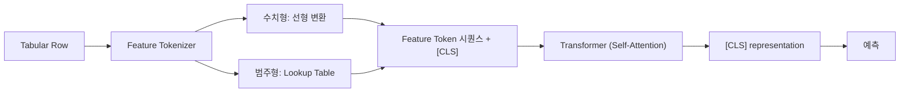

# Deep Architectures for Tabular Data

> [!abstract] 강의 개요
> [[TabML_02_Classical_ML_for_Tabular_Data|2강]] ← **TabML 3강** → [[TabML_04_Tabular_Representation_Learning|4강]]
>
> "Tree 기반 모델이 여전히 강하다"는 사실을 인정한 위에서, **왜 그래도 딥러닝인가**를 묻는다. MLP 계열(임베딩 개선, 학습 레시피 개선, 이웃 정보 활용, ensemble)과 Attention 계열(feature-level / sample-level interaction) 두 축으로 최근 tabular DNN 아키텍처들을 정리한다.

> [!summary]- 핵심 요약 (클릭해서 펼치기)
> | 계열 | 핵심 질문 | 대표 모델 |
> | ---- | --------- | --------- |
> | MLP 기반 | 단순 MLP를 어떻게 진짜 경쟁력 있게 만들 것인가 | ResNet-MLP, MLP-PLR, RealMLP, ==TabR==, ModernNCA, ==TabM== |
> | Attention 기반 | feature·sample 간 interaction을 어떻게 모델링할 것인가 | TabTransformer, ==FT-Transformer==, NPT, SAINT, T2G-Former, ExcelFormer, AMFormer |
> | 공통 결론 | Tree 기반 모델은 여전히 강력한 baseline. 딥러닝은 representation learning·interaction·retrieval·extensibility가 중요할 때 매력적 |

## 목차

1. [[#1. 왜 여전히 딥러닝인가]]
2. [[#2. MLP 기반 아키텍처]]
   - [[#2.1 Simple MLP Baselines]]
   - [[#2.2 수치형 Feature의 더 나은 임베딩]]
   - [[#2.3 더 나은 학습 레시피 — RealMLP]]
   - [[#2.4 최근접 이웃을 활용한 딥러닝 — TabR·ModernNCA]]
   - [[#2.5 Ensemble로서의 MLP — TabM]]
3. [[#3. Attention 기반 아키텍처]]
   - [[#3.1 Tabular Data에 Attention이 필요한 이유]]
   - [[#3.2 Feature-level Attention — TabTransformer·FT-Transformer]]
   - [[#3.3 Sample 간 Attention — NPT·SAINT]]
   - [[#3.4 구조화된 Interaction — T2G-Former·ExcelFormer·AMFormer]]

---

## 1. 왜 여전히 딥러닝인가

> [!warning] Tree 기반 모델은 여전히 강하다
> Grinsztajn et al. (NeurIPS 2022)의 실증 연구에 따르면:
> - 신경망은 ==overly smooth== 한 해로 편향되는 경향
> - 비정보적(uninformative) feature가 MLP류 신경망에 더 큰 영향을 줌
> - tabular data는 **회전(rotation)에 invariant하지 않음** — 이는 MLP의 가정과 충돌

> [!tip] 그래도 딥러닝을 쓰는 이유
> | 이유 | 설명 |
> | ---- | ---- |
> | **학습 가능한 표현** | 범주형·수치형 feature의 embedding을 학습 → 원시값보다 풍부한 유사도/구조 포착 |
> | **End-to-end Feature Interaction** | 트리의 순차적 분할이 아니라, MLP/Transformer가 비선형 상호작용을 한번에 학습 |
> | **확장성** | pretraining, retrieval, multitask, 텍스트·이미지·시계열과의 multimodal 결합으로 자연스럽게 확장 |

---

## 2. MLP 기반 아키텍처

### 2.1 Simple MLP Baselines

> [!note] Plain MLP vs ResNet-like MLP
> 각 수치형 column을 dense layer에 들어가는 scalar로, 범주형은 one-hot 또는 학습된 embedding으로 처리. *(Gorishniy et al., NeurIPS 2021)*

> [!quote] 핵심 결론
> - MLP는 여전히 좋은 sanity check
> - **ResNet 스타일 MLP**는 경쟁 모델들이 일관되게 능가하지 못하는 효과적인 baseline
> - 튜닝이 MLP·ResNet 같은 단순 모델도 경쟁력 있게 만든다 → **baseline도 충분히 튜닝해야 함**
> - DL 모델과 GBDT 사이에 **universal winner는 없음**

### 2.2 수치형 Feature의 더 나은 임베딩

> [!warning] 단일 scalar 표현의 한계
> 각 수치형 feature를 단일 스칼라로 표현하면, threshold 패턴·구간별 local variation·target과의 불규칙한 관계를 raw feature가 뒤섞인 뒤에야 학습해야 한다.

> [!note] 대안: Feature별 벡터 임베딩
> $$\mathbf{z}_i = f_i(x_i) \in \mathbb{R}^{d_i}$$
> 각 수치형 feature를 독립적인 embedding function $f_i$로 변환. *(Gorishniy et al., NeurIPS 2022)*

| 임베딩 방법 | 핵심 아이디어 |
| ----------- | -------------- |
| **PLE** (Piecewise Linear Encoding) | quantile 또는 target-aware한 구간(bin)으로 분할 후 piecewise linear 인코딩 |
| **Periodic Activation** | $\sin/\cos$ 계열의 주기 함수 사용, 파라미터 $c_i$는 $\mathcal{N}(0,\sigma)$로 초기화되어 학습됨 |

> [!success] 핵심 결론
> Feature-wise embedding은 일관되게 성능을 향상시키며, **더 나은 임베딩을 적용한 MLP는 tree 기반·Transformer 기반 모델을 능가**할 수 있다. → tabular DL에서는 **backbone 선택만큼 수치형 feature 표현 방식이 중요**하다.

### 2.3 더 나은 학습 레시피 — RealMLP

> [!warning] 비교의 함정
> 많은 tabular DNN 논문이 충분히 튜닝되지 않은 MLP baseline과 비교한다. → "MLP는 정말 약한가?"라는 질문에 Holzmüller et al. (NeurIPS 2024)이 답한다.

> [!note] RealMLP의 구성 요소
> - 강건한 전처리
> - 개선된 수치형·범주형 feature 표현
> - 개선된 초기화·학습 스케줄
> - **Meta-tuned 기본 하이퍼파라미터**: 여러 meta-train 데이터셋에 걸쳐 기본 레시피를 튜닝 → 새 데이터셋에 비용이 큰 per-dataset HPO 없이 적용

> [!success] 결론
> 신중하게 설계되고 meta-tuned된 MLP는 보지 못한 데이터셋에서도 강한 ==accuracy-efficiency trade-off==를 달성한다.

### 2.4 최근접 이웃을 활용한 딥러닝 — TabR·ModernNCA

> [!quote] 동기
> kNN은 가까운 학습 샘플을 직접 사용하지만, 신경망은 보통 학습 데이터를 파라미터로 압축해버린다. → **신경망 표현 + 최근접 이웃 추론을 결합**할 수 있을까?

| 모델 | 핵심 아이디어 | 예측 메커니즘 |
| ---- | -------------- | -------------- |
| **TabR** (ICLR 2024) | embedding space에서 후보 집합 중 유사 샘플을 ==retrieve==하여 신경망 내부에서 사용 | Encoder + retrieval module + predictor |
| **ModernNCA** (ICLR 2025) | soft nearest-neighbor 예측이 잘 작동하는 embedding 공간을 학습 (NCA의 현대화) | 이웃 label들의 weighted average |

> [!example] TabR의 retrieval 모듈
> Attention처럼 동작: embedding space에서 top-$m$개의 관련 이웃만 retrieve하고, context label과 (target − neighbor) 차이를 함께 사용해 target representation에 정보를 추가.

> [!tip] ModernNCA가 "Modern"인 이유
> - 신경망 기반의 더 나은 embedding + PLR 스타일 수치형 인코딩
> - Stochastic Neighborhood Sampling(SNS)으로 효율적인 학습
> - TabR보다 **더 간단하고 빠름**

> [!quote] Takeaway
> ==이웃(neighborhood) 정보==는 tabular 딥러닝에 강력한 inductive bias다.

### 2.5 Ensemble로서의 MLP — TabM

> [!warning] 간과되어 온 방향: Ensembling
> 기존 tabular DL 연구는 더 나은 표현·학습 레시피·attention/retrieval에 집중했지만, **ensembling 자체는 충분히 탐구되지 않았다.** *(Gorishniy et al., ICLR 2025)*

> [!note] Ensemble을 만드는 3가지 방법
> | 방법 | 설명 |
> | ---- | ---- |
> | **Deep Ensemble** | 여러 MLP를 독립적으로 학습 (비용 큼) |
> | **Packed-Ensemble** | 여러 MLP를 하나로 패킹해 함께 학습 |
> | **==TabM== / TabM-mini** | ensemble 멤버 간 대부분의 파라미터를 **공유** |

> [!success] 결론
> Parameter-efficient ensemble(TabM)은 단일 MLP와 기존 deep ensemble을 모두 능가할 수 있다 — **파라미터 공유로도 ensemble의 이득을 얻을 수 있음**을 보여준다.

> [!summary]- MLP 계열 정리
> 신중히 설계·학습된 단순 MLP도 강력한 모델이 될 수 있다 — (1) 수치형·범주형의 풍부한 표현, (2) 더 나은 전처리·학습 레시피, (3) 유사 샘플의 이웃 정보, (4) 효율적인 multi-predictor ensembling을 통해. **MLP 기반 모델은 여전히 강력하고 유연한 방향이다.**

---

## 3. Attention 기반 아키텍처

### 3.1 Tabular Data에 Attention이 필요한 이유

> [!note] Attention이란
> 항목들 사이의 관련성을 식별하고 그에 따라 정보를 종합하는 메커니즘 (Scaled Dot-Product Attention). 텍스트·이미지·시계열 등 다양한 도메인에서 널리 사용됨. Self-Attention(같은 집합 내) vs Cross-Attention(다른 집합 간).

> [!quote] Tabular에서 Attention이 유효한 이유
> Tabular 예측은 종종 **column 간 상호작용**에 의존한다 (e.g., "Debt"는 "Income"과 함께 고려될 때 의미가 생김). 행(row)을 column token들의 집합으로 보면:
> - 각 feature token이 다른 관련 feature의 정보를 흡수할 수 있음
> - Attention은 ==permutation-equivariant== → tabular column에는 자연적인 순서가 없으므로 이 성질이 중요

### 3.2 Feature-level Attention — TabTransformer·FT-Transformer

> [!note] TabTransformer (2020)
> 각 **범주형** column을 token으로 취급해 Transformer에 통과시켜 contextualize. 수치형 feature는 scalar로 유지한 뒤, contextualized 범주형 embedding과 concat하여 MLP head에 입력.

> [!quote] FT-Transformer = Feature Tokenizer + Transformer
> *(Gorishniy et al., NeurIPS 2021)* — tabular attention 모델의 표준 템플릿:
> 1. **Feature Tokenizer**: 수치형은 선형 변환, 범주형은 lookup table로 embedding $T \in \mathbb{R}^{k\times d}$ 생성
> 2. **Transformer**: `[CLS]` token을 추가하고 PreNorm Transformer 레이어 적용
> 3. 최종 `[CLS]` representation으로 예측

> [!success] 성능
> FT-Transformer는 MLP와 GBDT baseline을 능가하며, attention 기반 tabular 모델링의 표준 템플릿을 제시한다.

### 3.3 Sample 간 Attention — NPT·SAINT

> [!warning] Feature-wise Attention만으로는 부족
> FT-Transformer는 각 row를 **독립적으로** 처리한다. 하지만 관련된 다른 샘플들이 예측에 유용한 정보를 줄 수 있다 (tabular에서 nearest-neighbor 예측이 잘 작동하는 이유와 동일한 직관).

> [!note] Non-Parametric Transformers (NPT, NeurIPS 2021)
> 기존 parametric 모델: $\theta$를 학습해 $p(y\mid x;\theta)$를 최대화 — 데이터포인트 간 직접적 의존성을 고려하지 않음.
> NPT: 학습 데이터를 직접 활용 → $p(y \mid x, \mathcal{D}_{\text{train}}; \theta)$를 최대화.
> - 전체 데이터셋 + masking matrix를 입력으로 받아, masked language modeling처럼 마스킹된 값을 예측하며 학습
> - **Attention Between Datapoints**: flatten 후 multi-head self-attention
> - **Attention Between Attributes**: 각 row에 독립적으로 MHSA 적용

> [!note] SAINT (2021)
> Self-Attention and Intersample Attention Transformer — NPT와 유사하게 feature-wise self-attention + intersample attention을 사용하며, label이 제한된 상황을 위한 **contrastive·denoising pre-training**을 추가로 제공.

> [!tip] Sample 간 Attention의 강점과 한계
> **강점**: 샘플 수준 관계 포착, 학습된 유연한 nearest-neighbor 추론처럼 동작, 유사 샘플이 상호보완적 증거를 줄 때 유용
> **한계**: 계산·메모리 비용 증가, ==target leakage== 방지를 위한 주의 필요

### 3.4 구조화된 Interaction — T2G-Former·ExcelFormer·AMFormer

> [!example] Plain Self-Attention을 개선하는 최근 접근들
> | 모델 | 접근 방식 |
> | ---- | --------- |
> | **T2G-Former** (AAAI 2023) | relation graph로 feature interaction을 가이드 |
> | **ExcelFormer** (KDD 2024) | feature 간 유해한 정보 흐름을 제한 |
> | **AMFormer** (AAAI 2024) | 산술적(arithmetic) feature interaction을 명시적으로 모델링 |

> [!summary]- Attention 계열 정리
> Attention 기반 모델은 (1) row 내 feature-level interaction, (2) row 간 sample-level interaction, (3) tabular에 특화된 구조화/제약된 interaction을 학습하는 데 초점을 맞춘다. 최근 모델들은 "어떤 feature가 상호작용해야 하는가", "어떤 샘플이 상호작용해야 하는가", "어떤 interaction을 제한/강조해야 하는가"를 묻는다.

---

> [!success] 이번 강의 정리
> Tabular 딥러닝은 단순히 "더 깊은 네트워크"의 문제가 아니다. Tree 기반 모델은 여전히 강력한 baseline이며, 딥러닝은 **representation learning·interaction modeling·retrieval·extensibility**가 중요할 때 매력적인 선택이 된다. 핵심은 tabular data에 맞는 **올바른 inductive bias**를 설계하는 것.

---

%%
관련 노트:
- [[TabML_02_Classical_ML_for_Tabular_Data]] — 2강: Tree 기반 classical ML (이 강의의 비교 대상)
- [[TabML_04_Tabular_Representation_Learning]] — 4강: Tabular Representation Learning
%%
