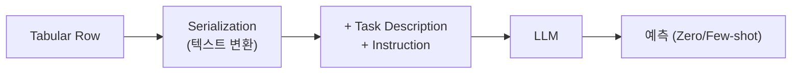

# LLMs with Tabular Data

> [!abstract] 강의 개요
> [[TabML_04_Tabular_Representation_Learning|4강]] ← **TabML 5강** → [[TabML_06_A_New_Paradigm_TabPFN|6강]]
>
> LLM이 tabular ML에 가져다주는 것은 **통계적 패턴을 넘어선 의미론적 추론**이다. 이 강의는 네 가지 질문 — *직접 예측할 수 있는가, 다른 예측기를 개선할 수 있는가, 이상 탐지를 도울 수 있는가, foundation model을 만들 수 있는가* — 을 따라 LLM-tabular 결합의 전체 지형을 정리한다.

> [!summary]- 핵심 요약 (클릭해서 펼치기)
> | 질문 | 전략 | 대표 방법 |
> | ---- | ---- | --------- |
> | LLM이 직접 예측? | 행을 텍스트로 serialize 후 LLM이 예측 | LIFT, TabLLM, TABLET |
> | LLM이 다른 예측기를 개선? | semantic feature engineering / rule 보강 | CAAFE, LLM Few-Shot FE, DeLTa |
> | LLM이 이상 탐지를 도움? | likelihood scoring, semantic context 복원, 평가셋 생성 | AnoLLM, ReTabAD, AutoAnoEval |
> | LLM 기반 Foundation Model? | 대규모 테이블 코퍼스로 LLM fine-tune | TabuLa-8B |

## 목차

1. [[#1. LLM이 Tabular ML에 가져오는 것]]
2. [[#2. Tables as Language — Serialization과 직접 예측]]
3. [[#3. LLM을 Tabular ML의 Semantic Component로]]
4. [[#4. LLM 기반 Tabular Anomaly Detection]]
5. [[#5. LLM 기반 Tabular Foundation Model]]

---

## 1. LLM이 Tabular ML에 가져오는 것

> [!note] LLM이란
> 대규모 텍스트로부터 단어·개념·설명 간 의미 관계를 학습한 모델. 자연어 지시를 따르고, 적거나 없는 시범으로도 새 문제에 적응하며, 실세계 개체·개념에 대한 prior knowledge를 제공한다.

> [!warning] 그러나 테이블은 자연스러운 텍스트가 아니다
> tabular row를 LLM이 처리하려면 **언어와 호환되는 형태로 직렬화(serialization)**해야 하며, 수치값과 구조적 관계는 LLM에게 여전히 까다로울 수 있다.

> [!quote] LLM이 추가하는 것
> 기존 tabular 모델은 주로 관측값·통계적 패턴으로부터 학습한다. LLM은 추가로:
> - **Column/Value의 의미론적 이해** (e.g., "BMI", "Diagnosis Code"는 해석 가능한 의미를 가짐)
> - **상식·도메인 지식** (도시, 직업, 질병, 제품, 기관 등의 context)
> - **자연어 task 명세** — 레이블 의미·결정 맥락을 prompt에 직접 기술
> - **Zero/Few-shot 적응** — task-specific 학습 데이터가 거의 없어도 예측 가능
> - **이상 탐지를 위한 semantic reasoning** — abnormality가 단순 수치 이상치가 아닌 맥락적 의미에 의존할 수 있음
>
> **LLM은 tabular ML을 "수치 패턴 학습"에서 "semantic context에 대한 추론"으로 확장한다.**

이 강의는 네 가지 질문을 순서대로 다룬다: ① LLM이 직접 tabular data로부터 예측할 수 있는가? ② LLM이 다른 tabular 예측기를 개선할 수 있는가? ③ LLM이 의미론적으로 비정상적인 샘플을 탐지하는 데 도움이 되는가? ④ LLM 기반 tabular foundation model을 만들 수 있는가?

---

## 2. Tables as Language — Serialization과 직접 예측

> [!note] Serialization (Linearization)
> LLM은 구조화된 테이블을 직접 처리하지 못하므로, 예측 전에 테이블을 **토큰 시퀀스로 변환**해야 한다. Serialization 형식 자체가 모델 설계의 일부이며, LLM이 어떤 구조를 볼 수 있는지·토큰을 얼마나 소비하는지에 영향을 준다.

> [!example] 대표 방법
> | 모델 | 핵심 아이디어 |
> | ---- | -------------- |
> | **LIFT** (NeurIPS 2022) | 비언어 ML task를 언어 입출력 task로 변환 — 아키텍처/손실 함수 수정 없이, 자연어 인터페이스로 LLM을 fine-tune할 수 있음을 보임 |
> | **TabLLM** (AISTATS 2023) | tabular row를 짧은 task 설명과 함께 자연어 문자열로 직렬화 → zero/few-shot 분류. **입력 직렬화 방식 자체가 성능에 큰 영향**을 줌을 보임 |
> | **TABLET** (2023) | 자연어 instruction이 LLM의 tabular 예측에 어떻게 도움이 되는지 평가 — instruction이 zero/few-shot 성능을 향상시키며, **LLM이 생성한 instruction**도 유용함을 보임 |

> [!success] 강점 / [!warning] 약점
> **강점**: semantic prior knowledge와 task 설명을 활용 가능
> **약점**: 추론 비용, context 길이 제한, **serialization 방식에 대한 민감도**
>
> LLM은 tabular 예측 문제를 직접 풀 수 있지만, **항상 실용적인 것은 아니다** — 수치값, 긴 테이블, 추론 비용에서 어려움을 겪을 수 있다.

---

## 3. LLM을 Tabular ML의 Semantic Component로

> [!warning] 직접 예측의 비효율
> 모든 row를 직렬화해 매번 LLM을 호출하는 것은 prompt 길이·입력 형식에 민감하고 대규모 추론에서 비용이 크다.

> [!tip] 대안: LLM을 의미론적 구성요소로 사용
> 최종 예측은 표준 ML 모델이 담당하고, LLM은 **feature 생성·feature-생성 규칙 개선·decision tree 규칙 정제**를 담당한다.

> [!note] Semantic Feature Engineering
> LLM은 column명·값의 의미·task 설명을 활용해, 고정된 탐색 공간을 넘어선 feature를 생성할 수 있다. 공통 패턴: **LLM이 feature 변환을 제안 → 표준 ML 모델이 평가 → 유용한 feature만 채택**.

| 모델 | 핵심 아이디어 |
| ---- | -------------- |
| **CAAFE** (NeurIPS 2023) | 데이터셋 context·column명·task 설명을 제공 → LLM이 새 feature 생성용 Python 코드 작성. 더 나은 LLM일수록 더 나은 feature 생성. Downstream 성능 향상 확인 |
| **LLM as Few-Shot Feature Engineer** (ICML 2024) | few-shot example로부터 LLM이 rule 기반 feature를 제안 → 간단한 예측기 학습. 서로 다른 LLM 생성 rule은 서로 다른 semantic hypothesis를 포착 → **여러 예측기를 ensemble** |
| **Feature Generation with Decision Tree** (NeurIPS 2024) | LLM을 feature-생성 규칙의 **optimizer**로 사용하며 decision tree reasoning을 활용. Decision tree는 LLM에게 compact한 피드백 제공 (validation score만으로는 피드백이 약함) — tree rule이 이전 feature 시도에 대한 해석 가능한 reasoning을 제공해 LLM이 다음 규칙을 개선 |
| **DeLTa** (NeurIPS 2025) | 여러 decision tree로부터 개선된 rule을 생성하도록 LLM에 요청 → 이 rule로 원본 decision tree의 예측을 ==calibration==. column명의 semantic prior가 아니라 **decision tree rule 자체에만 의존** |

> [!success] 실용적 이점
> 모든 test row마다 직렬화·LLM 호출이 필요 없어 추론 비용·지연(latency)이 줄고, 표준 tabular 모델의 효율성을 유지한다. **LLM이 최종 예측기가 되지 않고도** 효율적인 tabular 파이프라인에 의미론적 지식을 주입할 수 있다.

---

## 4. LLM 기반 Tabular Anomaly Detection

> [!quote] 핵심 질문
> 이상치는 종종 도메인 특화적이고 맥락 의존적이다 — 드문 값이 항상 비정상은 아니고, 흔한 값도 잘못된 맥락에서는 의심스러울 수 있다. 전통적인 AD 모델은 raw feature 값에만 의존해 의미론적 불일치를 놓치고 column 설명·단위·도메인 지식을 무시한다. **LLM이 semantic context로 "비정상"을 정의하는 데 도움이 될 수 있는가?**

| 모델 | 핵심 아이디어 |
| ---- | -------------- |
| **AnoLLM** (ICLR 2025) | tabular row를 표준화된 텍스트로 변환 → 정상 데이터에 LLM을 fine-tune → **낮은 likelihood = 비정상**. mixed-type 데이터 처리 가능하나, fine-tuning 비용과 추론 비용이 크고 likelihood가 항상 semantic abnormality와 일치하지는 않음 |
| **ReTabAD** (ICLR 2026) | 기존 tabular AD 벤치마크는 raw feature 값만 제공하고 feature 설명·도메인 지식 같은 텍스트 메타데이터가 부족하다는 문제를 지적 → semantically enriched 벤치마크 구축. semantic metadata는 context-aware **zero-shot** 이상 탐지와 더 해석 가능한 reasoning을 가능케 함 |
| **AutoAnoEval** (EACL Findings 2026) | anomaly 레이블이 없을 때 AD 모델 선택이 어려운 문제를 다룸 — decision tree로 정상 decision path를 추출하고, LLM이 이 경로를 변형해 **pseudo-anomaly**를 생성. 생성된 평가셋은 실제 이상치 기반 성능 추정과 유사한 결과를 제공 |

> [!success] 핵심 결론
> LLM은 tabular AD를 세 방식으로 지원한다: **anomaly scoring**(정상 행을 텍스트로 모델링), **context-awareness**(semantic metadata로 비정상을 추론), **model selection**(평가용 의미 있는 pseudo-anomaly 생성). LLM은 tabular anomaly detection을 **값 기반 scoring에서 semantic reasoning·evaluation으로** 확장한다.

---

## 5. LLM 기반 Tabular Foundation Model

> [!warning] 왜 어려운가
> 많은 테이블·task에 걸쳐 전이되는 tabular foundation model을 만들고 싶지만, 테이블은 극도로 이종적이고 텍스트와 달리 tabular task는 자연스럽게 표준화되어 있지 않다 — 대규모 학습을 위해서는 수많은 테이블을 공통 형식으로 통합해야 한다.

> [!note] 두 방향
> 1. **LLM 기반 tabular foundation model** (이번 강의)
> 2. **TabPFN 스타일 foundation model** ([[TabML_06_A_New_Paradigm_TabPFN|다음 강의]])

> [!example] TabuLa-8B (Gardner et al., NeurIPS 2024)
> 대규모 직렬화된 tabular 예측 task 코퍼스로 LLM을 fine-tune.
> - Base model: **Llama 3-8B**
> - 학습 데이터셋(T4): **4M개 이상의 고유 테이블에서 21억(2.1B) 행**
> - 평가: **329개의 보지 못한 데이터셋**

---

> [!success] 이번 강의 정리
> LLM은 테이블의 semantic 정보를 활용할 수 있지만, 직접 예측이 항상 실용적인 것은 아니다. LLM은 (1) semantic feature engineering·rule 정제, (2) context-aware anomaly detection, (3) 테이블·task 간 전이 가능한 foundation model이라는 더 넓은 응용을 가능케 한다. 핵심은 **tabular 모델링의 효율성·신뢰성을 유지하면서 semantic knowledge를 활용**하는 것이다.

---

%%
관련 노트:
- [[TabML_04_Tabular_Representation_Learning]] — 4강: SSL/Transfer/Anomaly Detection (비-LLM 접근)
- [[TabML_06_A_New_Paradigm_TabPFN]] — 6강: TabPFN 스타일 foundation model
%%
