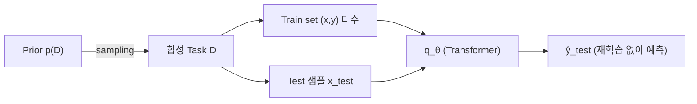

# A New Paradigm: TabPFN

> [!abstract] 강의 개요
> [[TabML_05_LLMs_with_Tabular_Data|5강]] ← **TabML 6강 (시리즈 마지막)**
>
> LLM 기반 foundation model과는 다른 길 — **Prior-Fitted Network(PFN)** 패러다임으로 tabular foundation model을 만드는 ==TabPFN== 계열을 다룬다. 합성 task로 사전학습해 **재학습 없이(in-context) 즉시 예측**하는 방식이 v1→v2→v3로 어떻게 발전했는지, 그리고 TabDPT·TabICL·MITRA 등 최근 변형까지 정리한다.

> [!summary]- 핵심 요약 (클릭해서 펼치기)
> | 버전/모델 | 핵심 변화 |
> | --------- | --------- |
> | **PFN** | 합성 prior로부터 다양한 task를 sampling해 Bayesian posterior를 in-context로 근사 |
> | **TabPFN v1** | row를 token으로, Transformer로 ICL — 1K행/100열/10클래스 한계 |
> | **TabPFN v2** | cell을 token으로 한 **2D attention** (feature-wise + sample-wise) — 10K행/500열로 확장 |
> | **TabPFN v3** | row compression + retrieval 기반 디코더 — SOTA + 빠른 추론 |
> | **TabDPT/TabICL** | 실데이터 pretraining, 유사 row retrieval, attention 비용 절감 |
> | **MITRA/ConTextTab** | prior 다양화, semantic-aware ICL |

## 목차

1. [[#1. Tabular Foundation Model을 향한 두 갈래 길]]
2. [[#2. Prior-Fitted Networks (PFN)]]
3. [[#3. TabPFN의 진화 v1 → v2 → v3]]
   - [[#3.1 TabPFN v1]]
   - [[#3.2 TabPFN v2]]
   - [[#3.3 TabPFN v3]]
4. [[#4. 최근 TabPFN 변형들]]
5. [[#5. 열린 연구 방향]]

---

## 1. Tabular Foundation Model을 향한 두 갈래 길

> [!warning] 왜 어려운가
> 테이블은 극도로 이종적이고, 텍스트와 달리 tabular task는 자연스럽게 표준화되어 있지 않다. 대규모 학습을 위해서는 수많은 테이블을 공통 형식으로 통합해야 한다.

> [!note] 두 방향
> 1. [[TabML_05_LLMs_with_Tabular_Data|LLM 기반 tabular foundation model]] (5강에서 다룸)
> 2. **TabPFN 스타일 foundation model** (이번 강의)

---

## 2. Prior-Fitted Networks (PFN)

> [!quote] 핵심 아이디어 *(Müller et al., ICLR 2022)*
> 미리 정의된 **prior** $p(D)$로부터 샘플링한 수많은 **합성(synthetic) task**로 학습해, 새로운 task를 푸는 법을 학습한다.

> [!note] 절차
> 1. $D \sim p(D)$: 다양한 데이터 생성 분포(≈ task)를 prior에서 샘플링
> 2. 학습 데이터셋 $D_{\text{train}}=\{(x_i,y_i)\}_{i=1}^n$과 테스트 샘플 $(x_{\text{test}}, y_{\text{test}})$을 $D$로부터 생성
> 3. 모델 $q_\theta(\cdot \mid x_{\text{test}}, D_{\text{train}})$이 $y_{\text{test}}$를 예측하도록 학습

$$q_\theta\big(x_1,y_1,\dots,x_n,y_n,\ x_{\text{test}}\big) \rightarrow \hat{y}_{\text{test}}$$

> [!tip] In-Context Learning과의 연결
> 이 형태는 **In-Context Learning**과 유사하며, $q_\theta$를 ==Transformer==로 모델링할 수 있다. 어떤 실제 데이터셋 $D_{\text{real}}$과 테스트 포인트 $x_{\text{test}}$가 주어져도, 모델 $q_\theta$는 **추가 학습(adaptation) 없이** $y_{\text{test}}$를 예측할 수 있다 — 이것이 PFN의 핵심 매력이다.

---

## 3. TabPFN의 진화: v1 → v2 → v3

### 3.1 TabPFN v1

> [!note] 핵심 아이디어 *(Hollmann et al., ICLR 2023)*
> Tabular 예측을 위한 PFN. **각 row를 하나의 token**으로 취급:
> - 학습 데이터포인트: $(x,y) \mapsto \text{MLP}_x(x) + \text{MLP}_y(y)$
> - 테스트 입력: $x \mapsto \text{MLP}_x(x) + \text{MLP}_y([\text{mask}])$
> - column 수가 다른 테이블은 zero-padding으로 처리

> [!example] 아키텍처와 합성 Prior
> - Transformer가 train/test row token을 모두 함께 처리, self-attention으로 test 샘플이 train 샘플을 참조
> - 각 test token의 최종 hidden state → MLP classifier
> - 합성 prior: **SCM**(무작위 그래프에서 관측 feature/target node 선택), **BNN**(신경망을 샘플링해 $\tilde y$ 생성), 연속 target은 class label로 변환

> [!success] 왜 작동하는가
> - 합성 prior가 대부분의 실데이터를 근사적으로 커버할 만큼 풍부함
> - Transformer는 그 prior에 대한 Bayesian posterior를 학습할 만큼 유연한 함수 근사기
> - Full row-attention으로 새 학습 데이터에 **즉시 적응**

> [!warning] TabPFN v1의 한계
> - row를 단일 token으로 취급 → tabular의 **2D 구조**(feature 간 이종성)를 고려하지 못함
> - 학습 샘플 1,000개·column 100개 미만, 클래스 10개 미만의 다중분류로 제한
> - 결측치·범주형 값에 대한 수동 전처리 필요

### 3.2 TabPFN v2

> [!note] 핵심 변화 #1 — Row Token에서 2D Table Modeling으로 *(Hollmann et al., Nature 2025)*
> 각 **cell**을 하나의 token으로 표현 → **2D attention**을 feature-wise·sample-wise로 번갈아 적용해 tabular 구조와 feature 이종성을 더 잘 처리.

> [!note] 핵심 변화 #2 — 더 풍부한 합성 Prior
> 범주형 feature, 결측치, quantization 등을 포함하는 합성 task로 학습 → **10,000 샘플, 500 feature**까지 데이터셋 규모 확장.

> [!success] 결과
> 소규모 데이터셋에서 MLP·GBDT baseline을 능가.

> [!warning] TabPFN v2의 한계
> | 한계 | 설명 |
> | ---- | ---- |
> | 계산 비용 | cell 단위 표현 + 2-way attention → 추론 비용 증가 |
> | 메모리 확장성 | context 테이블이 커지면 메모리 요구량 급증 |
> | Task 규모 | 분류 평가가 최대 10개 클래스로 제한 |

### 3.3 TabPFN v3

> [!note] 핵심 변화 *(Grinsztajn et al., 2026)*
> - **Row Compression**: in-context learning 전에 feature-level 정보를 압축된 row embedding으로 집약
> - **Retrieval 기반 예측**: 고정된 classification head를 attention 기반 ==soft nearest-neighbor 디코더==로 대체

> [!success] 성과
> SOTA 성능 + 빠른 추론 속도, baseline 대비 더 나은 확장성(scalability). TabPFN-3을 자동 flatten된 관계형 테이블에 적용한 **TabPFN-REL**은 relational foundation model 중 SOTA를 달성했으나, supervised RelGNN이 전체적으로는 여전히 더 우수.

> [!summary]- TabPFN v1/v2/v3 정리
> - **v1**: 합성 pretraining으로 작은 tabular task에 대한 in-context 예측을 가능케 함
> - **v2**: table-aware modeling으로 현실적인 테이블에서 성능 향상
> - **v3**: 효율적인 row-level ICL로 패러다임을 훨씬 큰 데이터셋까지 확장
>
> 최근 연구 방향: tabular ICL을 더 확장 가능·효율적으로, 더 풍부한 합성 prior/실데이터로 pretraining 개선, semantic하고 이종적인 테이블로 TabPFN 확장.

---

## 4. 최근 TabPFN 변형들

> [!example] 효율성·확장성 중심
> | 모델 | 핵심 아이디어 |
> | ---- | -------------- |
> | **TabDPT** (NeurIPS 2025) | 전체 데이터셋이 아니라 **유사한 row들만 context로 retrieve**하는 것이 ICL에 더 효과적 — row를 단일 token으로(v1과 유사), 실데이터에 masked-column SSL로 pretrain. Semi-supervised 설정에서는 모델 자신의 예측을 pseudo-label로 사용해 context 확장 |
> | **TabICL** (ICML 2025) | TabPFN v2의 alternating row/column attention이 큰 테이블에서 비용이 큰 문제를 지적 → feature 정보를 고정 차원 row embedding으로 압축한 뒤 row에 대해서만 ICL 수행. 복잡도 $O(m^2n+n^2)$ (TabPFNv2의 $O(m^2n+mn^2)$보다 큰 테이블에서 유리) |
> | **TabICLv2** (2026) | 더 풍부한 합성 데이터 생성, circular-shift feature grouping(representation collapse 완화), target-aware embedding, QASSMax(긴 context에서 확장 가능한 attention), Muon optimizer 등 최적화된 pretraining — TabPFN-2.5보다 일관되게 빠름 |
> | **TACO** (ICML 2026) | ICL 전에 context set 자체를 압축 — 학습 샘플의 compact latent representation을 학습해 attention의 2차 비용을 줄임. predictor-only transformer 대비 **53배 속도 향상, 메모리 94% 절감**, 성능 저하는 미미 |

> [!example] Prior/Semantic 중심
> | 모델 | 핵심 아이디어 |
> | ---- | -------------- |
> | **MITRA** (NeurIPS 2025) | 단일 prior 대신 여러 합성 task generator를 **혼합** — SCM prior는 단독으로도 강력하지만, 다양한 prior를 섞으면 강건성이 향상됨을 보임 (==prior 설계도 아키텍처만큼 중요==) |
> | **ConTextTab** (NeurIPS 2025) | column명·텍스트/범주형 값에 대해 사전학습된 embedding(e.g., all-MiniLM-L6-v2)을 사용해 semantic 정보를 ICL에 통합 — semantically rich한 CARTE benchmark에서 SOTA |
> | **MultiModalPFN** (CVPR 2026) | 이미지·텍스트를 포함하는 tabular data로 TabPFN을 확장 — non-tabular 입력을 인코딩해 TabPFN과 호환되는 표현으로 projection |
> | **nanoTabPFN** (2025) | TabPFN v2의 경량 재구현 — 500줄 미만 코드로 핵심 아키텍처·학습 루프 구현, 단일 GPU에서 수 분 내 pretraining 가능 (교육·실험용) |

---

## 5. 열린 연구 방향

> [!tip] Open Directions for Tabular Foundation Models
> | 방향 | 설명 |
> | ---- | ---- |
> | **확장성·효율성** | 백만 단위 추론이 가능해지고 있지만, 메모리·지연시간·long-context 처리가 여전한 bottleneck |
> | **Pretraining 분포** | 더 풍부한 합성 prior와 실세계 테이블이 상호보완적인 신호를 제공 |
> | **Semantic·이종 테이블** | column명, 텍스트 값, 결측성, mixed feature type은 여전히 충분히 탐구되지 않은 정보원 |
> | **표준 flat table을 넘어서** | 관계형(relational)·시계열·multimodal·causal 설정이 향후 유망한 방향 |

---

> [!success] 시리즈 전체 정리
> "Tabular ML — From Classical Models to Foundation Models" 시리즈는 [[TabML_01_Introduction_to_Tabular_ML|tabular data의 본질적 어려움]]에서 시작해 [[TabML_02_Classical_ML_for_Tabular_Data|classical ML]] → [[TabML_03_Deep_Architectures_for_Tabular_Data|딥러닝 아키텍처]] → [[TabML_04_Tabular_Representation_Learning|representation learning]] → [[TabML_05_LLMs_with_Tabular_Data|LLM 결합]]을 거쳐, 이번 강의의 **PFN/TabPFN 패러다임**으로 마무리된다. Tree 기반 모델은 여전히 강력한 baseline이지만, **합성 prior 기반 in-context learning**은 특히 소규모 데이터셋에서 "학습 없는 즉시 예측"이라는 새로운 가능성을 연다.

---

%%
관련 노트:
- [[TabML_05_LLMs_with_Tabular_Data]] — 5강: LLM 기반 tabular foundation model (대안적 접근)
- [[TabML_01_Introduction_to_Tabular_ML]] — 1강: 시리즈 전체 로드맵
%%
