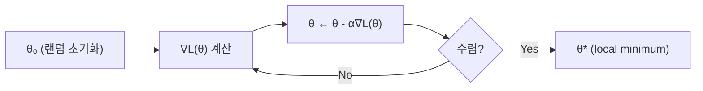

# Gradient Descent

> [!abstract] 강의 개요
> [[SupL_02_Linear_Regression|2강]] ← **지도학습 3강** → [[SupL_04_Classification|4강]]
>
> Normal Equation 같은 ==닫힌 해==가 항상 존재하지 않는 복잡한 모델(딥러닝 등)을 위해, **반복적으로 손실을 줄여나가는** ==Gradient Descent==를 도입한다. Learning rate의 영향, SGD/Mini-batch, 그리고 Momentum·RMSProp·Adam 같은 현대적 최적화 기법까지 다룬다.

> [!summary]- 핵심 요약 (클릭해서 펼치기)
> | 개념 | 핵심 |
> | ---- | ---- |
> | Gradient Descent | $\theta_{i+1} = \theta_i - \alpha\nabla\mathcal{L}(\theta_i)$ — gradient의 반대 방향으로 반복 이동 |
> | Learning Rate $\alpha$ | 너무 작으면 느림, 너무 크면 발산 |
> | SGD / Mini-batch | 전체 데이터 대신 샘플(또는 batch)로 gradient 근사 — 계산량 절감 |
> | 한계 | Plateau·Local minima에 갇힐 수 있음 |
> | Momentum | 과거 gradient의 가중 평균으로 관성을 줌 |
> | RMSProp | gradient 크기에 따라 learning rate를 적응적으로 조절 |
> | ==Adam== | Momentum + RMSProp 결합 (1차/2차 모멘트 모두 사용) |

## 목차

1. [[#1. 왜 Gradient Descent가 필요한가]]
2. [[#2. Gradient Descent 알고리즘]]
3. [[#3. Learning Rate의 영향]]
4. [[#4. SGD와 Mini-batch Gradient Descent]]
5. [[#5. Gradient Descent의 한계]]
6. [[#6. 현대적 최적화 기법]]
   - [[#6.1 Momentum SGD]]
   - [[#6.2 RMSProp]]
   - [[#6.3 Adam]]
   - [[#6.4 Learning Rate Scheduling]]

---

## 1. 왜 Gradient Descent가 필요한가

> [!warning] Normal Equation이 통하지 않는 경우
> 지도학습을 다시 보면: 데이터셋 + 함수 클래스 + 손실 함수가 주어지고 손실을 최소화하는 $g_\theta$를 찾는다. 그런데:
> - 함수 클래스가 복잡할 수 있다 (e.g., **Deep Neural Network**, 파라미터가 수백만~수십억 개)
> - 손실 함수가 복잡할 수 있다 → **analytic solution이 없을 수 있음**
>
> 그렇다면 어떻게 최적화할 것인가?

> [!note] 고등학교 수학적 직관
> $f$를 최소화 → $f'(x)=0$인 지점을 찾기. 손실 함수를 최소화한다면 $\nabla\mathcal{L}(\theta)=0$을 만족하는 $\theta$를 찾는 것과 같다.
>
> > [!warning] 주의
> > 이런 $\theta$는 ==local minimum==일 수도 있다 (global minimum이 보장되지 않음).

---

## 2. Gradient Descent 알고리즘

> [!note] 핵심 가정
> - gradient는 계산할 수 있다(==We know gradient==)
> - 하지만 전체 손실 지형(global view)은 모른다 — 할 수 있는 최선은 **현재 위치에서의 기울기(slope)를 보는 것**

> [!success] 알고리즘
> 1. 임의의 점 $\theta_0$에서 초기화
> 2. $i$번째 step에서:
>    - gradient $\nabla\mathcal{L}(\theta_i)$ 계산
>    - 파라미터 업데이트:
>    $$\theta_{i+1} = \theta_i - \alpha \nabla\mathcal{L}(\theta_i)$$
>    ($\nabla\mathcal{L}(\theta_i)$: steepest **increasing** 방향, $\alpha$: ==Learning Rate==)

> [!example] 1D 예시
> $f(x) = (x-3)^2$, $x_0=0$, $f'(x)=2(x-3)$, $\alpha=0.1$로 반복하면 점들이 $x=3$(최솟값)으로 점점 수렴한다.

---

## 3. Learning Rate의 영향

> [!warning] Small vs Large Learning Rate
> - **너무 작은 $\alpha$**: 수렴이 매우 느림
> - **너무 큰 $\alpha$**: 손실이 진동하거나 ==발산(diverge)==할 수 있음

> [!tip] 실전 팁
> - 여러 임의의 초기화(random initialization)를 시도
> - learning rate 조정: **손실이 너무 느리게 줄면 lr을 늘리고, 손실이 발산하면 lr을 줄인다**
> - 2D 이상에서는 초기화 위치에 따라 다른 local minimum에 도달할 수 있음

---

## 4. SGD와 Mini-batch Gradient Descent

> [!note] 실전에서의 Gradient Descent
> 자동 미분 도구(autograd)가 있어 gradient를 직접 계산할 필요는 없다. 하지만 데이터가 매우 많을 경우, 전체 데이터에 대한 gradient 계산이 비싸다.

> [!success] Gradient의 선형성을 활용
> Loss가 각 샘플의 합/평균이므로 gradient도 선형적으로 분해된다 → **일부만 샘플링해서 gradient를 근사**할 수 있다.

| 방법 | 설명 |
| ---- | ---- |
| **(Batch) Gradient Descent** | 전체 데이터셋으로 gradient 계산 |
| **Stochastic Gradient Descent (SGD)** | 한 개의 샘플로 gradient 근사 |
| **Mini-batch Gradient Descent** | 작은 batch로 gradient 근사 (실무에서 가장 흔히 사용) |

---

## 5. Gradient Descent의 한계

> [!warning] Plateau와 Local Minima
> Gradient Descent는 두 가지 상황에 갇힐 수 있다:
> - **Plateau**: 기울기가 거의 0인 평평한 지역에서 학습이 매우 느려짐
> - **Local Minima**: global minimum이 아닌 지점에 수렴

> [!info] 참고 자료
> *QUALITATIVELY CHARACTERIZING NEURAL NETWORK OPTIMIZATION PROBLEMS* (ICLR 2015), losslandscape.com — 신경망의 손실 지형(loss landscape)이 매우 복잡하고 비대칭적임을 시각적으로 보여준다.

---

## 6. 현대적 최적화 기법

> [!note] 공통 목표
> 단순 SGD의 진동·느린 수렴·plateau/local minima 문제를 보완하기 위해, 과거 gradient 정보를 활용하거나 파라미터별로 learning rate를 다르게 적용한다.

### 6.1 Momentum SGD

$$v_t = \beta v_{t-1} + (1-\beta)\nabla\mathcal{L}(\theta_{t-1}) \qquad (\text{gradient의 가중 평균})$$
$$\theta_t = \theta_{t-1} - \alpha v_t$$

> [!tip] $\beta$의 역할
> $\beta=0$이면 일반 Gradient Descent와 동일. **$\beta$가 클수록 momentum(관성)이 커져**, 이전 방향을 유지하며 진동을 줄이고 plateau를 더 잘 통과한다.

### 6.2 RMSProp

$$E[g^2]_t = \beta E[g^2]_{t-1} + (1-\beta)g_t^2 \qquad (\text{element-wise square})$$
$$\theta_t = \theta_{t-1} - \frac{\alpha}{\sqrt{E[g^2]_t + \epsilon}}g_t \qquad (\text{element-wise division})$$

> [!note] 핵심 아이디어
> 최근 gradient 크기(제곱의 이동평균)에 반비례하여 learning rate를 **적응적으로(element-wise)** 조절한다 — gradient가 큰 방향은 step을 줄이고, 작은 방향은 step을 늘린다.

### 6.3 Adam

> [!success] Momentum + RMSProp의 결합
> $$m_t = \beta_1 m_{t-1} + (1-\beta_1)g_t \qquad v_t = \beta_2 v_{t-1} + (1-\beta_2)g_t^2$$
>
> **Bias correction** (초기 단계에서 모멘트 추정치가 0으로 편향되는 것을 보정):
> $$\hat{m}_t = \frac{m_t}{1-\beta_1^t} \qquad \hat{v}_t = \frac{v_t}{1-\beta_2^t}$$
>
> 파라미터 업데이트:
> $$\theta_t = \theta_{t-1} - \frac{\alpha\hat{m}_t}{\sqrt{\hat{v}_t}+\epsilon}$$

> [!example] 세 방법 비교
> | 방법 | 핵심 |
> | ---- | ---- |
> | **Momentum SGD** | 고정된 learning rate, gradient에 관성을 부여 |
> | **RMSProp** | 최근 gradient 크기의 평균에 기반해 learning rate를 조절 |
> | **==Adam==** | gradient의 1차 모멘트(평균)와 2차 모멘트(분산)를 모두 사용해 momentum과 adaptivity를 결합 |

### 6.4 Learning Rate Scheduling

> [!tip] Scheduling 방법
> | 방법 | 설명 |
> | ---- | ---- |
> | **Scheduling** | 매 $s$ step마다 `epoch % s == 0`이면 $\alpha \leftarrow \alpha \times d$ |
> | **Exponential Scheduling** | $\alpha = \alpha_0 \times e^{-\gamma t}$, $t$는 epoch마다 증가 |
> | **Adaptive Scheduling (Annealing)** | validation loss $L_{\text{val}}$이 개선되지 않으면 patience counter 증가 → counter가 임계값 $p$ 이상이면 $\alpha \leftarrow \alpha \times d$ 후 counter 초기화 |

---

> [!success] 이번 강의 정리
> - **Gradient Descent**: $\theta \leftarrow \theta - \alpha\nabla\mathcal{L}(\theta)$로 손실을 반복적으로 줄여나간다
> - **Learning Rate**가 너무 작으면 느리고, 너무 크면 발산
> - **Momentum**으로 관성을 추가하면 plateau·진동 문제를 완화
> - 실전에서는 **Adam**처럼 momentum과 adaptive learning rate를 결합한 최적화 기법을 널리 사용

---

%%
관련 노트:
- [[SupL_02_Linear_Regression]] — 2강: Normal Equation (닫힌 해가 존재하는 경우)
- [[SupL_04_Classification]] — 4강: Gradient Descent를 분류 문제에 적용
%%
