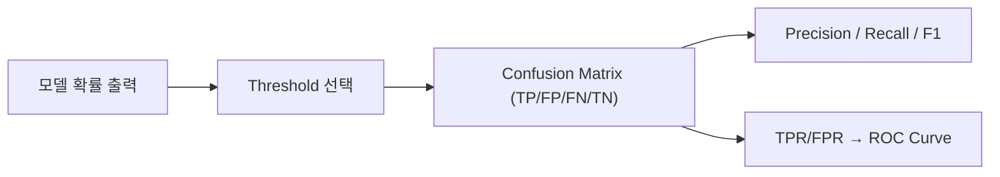

# Logistic Regression

> [!abstract] 강의 개요
> [[SupL_04_Classification|4강]] ← **지도학습 5강** → [[SupL_06_More_on_Supervised_Learning_and_Beyond|6강]]
>
> SVM의 "맞다/틀리다"라는 ==Hard Guess== 대신, **확률로 답하는(Soft Guess) 분류기**를 다룬다. 로지스틱 함수로 확률을 모델링하고, 분포 간 차이를 측정하는 ==KL Divergence==에서 ==Cross-Entropy Loss==를 유도한 뒤, 미분 가능하므로 Gradient Descent를 바로 적용할 수 있음을 보인다. 다중분류로 확장하는 Softmax Regression, 그리고 분류 성능을 평가하는 Precision/Recall/ROC까지 다룬다.

> [!summary]- 핵심 요약 (클릭해서 펼치기)
> | 주제 | 핵심 |
> | ---- | ---- |
> | Soft Guess | "비가 올 확률 70%"처럼 **확률**로 답함 |
> | Logistic Function | $\sigma(x) = \frac{1}{1+e^{-x}}$ — 확률을 모델링하는 smooth 함수 |
> | Cross-Entropy Loss | KL Divergence에서 유도 — **미분 가능** → Gradient Descent 적용 가능 |
> | Logistic vs Hinge Loss | 둘 다 분류 손실이지만 형태가 다름 |
> | Softmax Regression | 다중분류로 일반화, Logistic Regression ⊆ Softmax Regression |
> | 평가 지표 | ==Precision==, ==Recall==, F1-score, ROC curve(TPR/FPR) |

## 목차

1. [[#1. Hard Guess에서 Soft Guess로]]
2. [[#2. Logistic Function과 모델 클래스]]
3. [[#3. Cross-Entropy Loss]]
4. [[#4. Logistic Regression의 손실 함수와 최적화]]
5. [[#5. 다중분류 — Softmax Regression]]
6. [[#6. 분류 성능 평가]]
   - [[#6.1 Threshold와 False Positive/Negative]]
   - [[#6.2 Precision, Recall, F1, ROC]]

---

## 1. Hard Guess에서 Soft Guess로

> [!note] Soft Guess
> "Certainly Blue" / "Probably Red"처럼, 분류기가 **확신의 정도**까지 답하게 한다.
> 예: 일기예보에서 "70% 확률로 비가 온다(30% 확률로 안 온다)"처럼.

---

## 2. Logistic Function과 모델 클래스

> [!note] Logistic Function
> $$\sigma(x) = \frac{1}{1+e^{-x}}$$
> Smooth하고, 확률(0~1)을 모델링하기에 적합하다.
>
> $$g_{a,b}(x) = \begin{bmatrix}1-\sigma(\mathbf{a}^\top x+b)\\ \sigma(\mathbf{a}^\top x+b)\end{bmatrix} = \left[\dfrac{e^{-(\mathbf{a}^\top x+b)}}{1+e^{-(\mathbf{a}^\top x+b)}},\ \dfrac{1}{1+e^{-(\mathbf{a}^\top x+b)}}\right]$$

---

## 3. Cross-Entropy Loss

> [!quote] 출발점: 출력에 페널티를 줘야 한다
> 예측이 "70% 비"인데 실제로 비가 왔다면 좋은 예측, "30% 비"인데 비가 왔다면 나쁜 예측 — **사건에 더 많은 확률을 배정했을수록 loss는 낮아야** 한다.

> [!note] 분포 간 "차이"를 측정하기 — KL Divergence
> 실제 레이블 분포 $[0,1]$(또는 $[1,0]$)과 모델이 예측한 분포 $[\hat y(-1), \hat y(1)]$ 사이의 차이를 측정해야 한다. **Kullback-Leibler (KL) Divergence** (relative entropy):
> $$D(p\|q) = \sum_x p(x)\log\frac{p(x)}{q(x)}$$
> 예: 실제 $[0,1]$, 예측 $[0.7, 0.3]$이면:
> $$D\left(\begin{bmatrix}0\\1\end{bmatrix}\Big\|\begin{bmatrix}0.7\\0.3\end{bmatrix}\right) = 0\cdot\log\frac{0}{0.7} + 1\cdot\log\frac{1}{0.3}$$

> [!success] Cross-Entropy Loss
> $$\ell(g_{a,b}(x^{(i)}), y^{(i)}) = \log\frac{1}{\hat y(y^{(i)})}$$
> 진짜 레이블에 배정된 확률 $\hat y(y^{(i)})$의 역수에 log를 취한 형태 — **확률을 많이 배정할수록 loss가 작아진다.**

---

## 4. Logistic Regression의 손실 함수와 최적화

> [!note] Setup
> $$Pr(Y=1) = g_\theta(\mathbf{x}) = \frac{1}{1+e^{-\theta^\top \mathbf{x}}}, \qquad Pr(Y=-1) = 1-g_\theta(\mathbf{x})$$
> (bias 항은 $x_0=1$을 추가해 $\mathbf{x}=(1,x_1,\dots,x_d)$로 흡수)
>
> $$\mathcal{L}(\theta) = -\frac{1}{n}\sum_{i=1}^n\left[\frac{1+y^{(i)}}{2}\log(g_\theta(\mathbf{x}^{(i)})) + \frac{1-y^{(i)}}{2}\log(1-g_\theta(\mathbf{x}^{(i)}))\right]$$

> [!example] 정리하면 — 단일한 닫힌 형태
> $-\log g_\theta(\mathbf{x}) = \log(1+e^{-\theta^\top\mathbf{x}})$, $-\log(1-g_\theta(\mathbf{x})) = \log(1+e^{\theta^\top\mathbf{x}})$를 이용해 $y\in\{-1,1\}$ 표기로 통합하면:
> $$\mathcal{L}(\theta) = \frac{1}{n}\sum_{i=1}^n \log\left(1+e^{-y^{(i)}\theta^\top \mathbf{x}^{(i)}}\right)$$

> [!success] 핵심: 미분 가능 → Gradient Descent 적용 가능
> SVM의 0-1 loss와 달리, 이 손실은 **매끄럽고 미분 가능**하므로 [[SupL_03_Gradient_Descent|3강]]의 Gradient Descent를 바로 적용할 수 있다.

> [!tip] Logistic Loss vs Hinge Loss
> 두 손실 모두 분류 문제를 풀지만 형태가 다르다 — Hinge Loss는 margin 1 이상이면 손실이 정확히 0이 되는 반면(==SVM==), Logistic Loss는 점근적으로만 0에 가까워진다(연속적으로 더 confident한 예측에 보상).

---

## 5. 다중분류 — Softmax Regression

> [!note] 두 가지 접근
> - **1 vs. Others**: 여러 개의 이진 분류기를 적용
> - **==Softmax==**: 레이블에 대한 확률 분포를 한 번에 반환

> [!note] Softmax Function — Logistic Function의 일반화
> $$\mathbf{z}=[z_1,\dots,z_K], \qquad \sigma(\mathbf{z})_i = \frac{e^{z_i}}{\sum_{j=1}^K e^{z_j}}$$
> 지수화로 출력을 양수로 만들고, 정규화로 합이 1이 되게 한다.

> [!quote] Logistic Regression ⊆ Softmax Regression
> 이진 분류는 (정규화를 고려하면) feature가 하나만 필요한 Softmax Regression의 특수한 경우다.

> [!example] Softmax Regression 구조
> $$x_1,x_2,x_3,x_4 \to h_k = \mathbf{a}_k^\top x + b_k\ (k=1,2,3) \to \left[\frac{e^{h_1}}{e^{h_1}+e^{h_2}+e^{h_3}}, \dots\right]$$
> $$\ell(g_{a,b}(x^{(i)}), y^{(i)}) = \log\frac{1}{\hat y(y^{(i)})}$$
> (이진분류의 Cross-Entropy Loss와 동일한 형태가 다중분류로 그대로 확장됨)

---

## 6. 분류 성능 평가

### 6.1 Threshold와 False Positive/Negative

> [!warning] 확률 출력 → 최종 결정으로의 변환
> 모델이 확률을 출력했을 때, 최종 결정(threshold)을 어떻게 정할 것인가? **0.5가 안전한 기본값**이지만, 상황에 따라 다른 threshold가 필요할 수 있다.

> [!example] COVID 검사 예시
> 검사에서는 ==False Negative==(실제 양성을 음성으로 판정)가 매우 위험하므로, 차라리 **False Positive를 선호**하는 방향으로 threshold를 조정할 수 있다.

### 6.2 Precision, Recall, F1, ROC

> [!note] Precision vs Recall의 Trade-off
> 어떤 지표를 우선할지는 **응용(application)에 따라** 달라진다.
> $$\text{F1-score} = \text{Precision과 Recall의 harmonic mean}$$

> [!example] ROC Curve 핵심 개념
> $$\text{TPR (True Positive Rate)} = \frac{TP}{TP+FN}, \qquad \text{FPR (False Positive Rate)} = \frac{FP}{FP+TN}$$
> | 전략 | TPR/FPR |
> | ---- | ------- |
> | 항상 Positive라고 답함 | $FN=TN=0 \Rightarrow TPR=FPR=1$ |
> | 항상 Negative라고 답함 | $TP=FP=0 \Rightarrow TPR=FPR=0$ |
> | 무작위 추측 (Random Guess) | TPR과 FPR 사이에 차이 없음 (대각선) |

---

> [!success] 이번 강의 정리
> - **Soft Guess**: 분류기가 확률로 답하게 함
> - **Cross-Entropy Loss**: KL Divergence에서 유도되며 미분 가능 → Gradient Descent 적용
> - **Softmax Classification**: 이진 분류를 다중분류로 자연스럽게 확장
> - **Precision/Recall**: 단순 accuracy를 넘어서는, 응용에 맞는 평가지표 선택이 중요

---

%%
관련 노트:
- [[SupL_04_Classification]] — 4강: SVM·Hinge Loss와의 비교
- [[SupL_06_More_on_Supervised_Learning_and_Beyond]] — 6강: 지도학습 전체 정리와 그 다음 단계
%%
