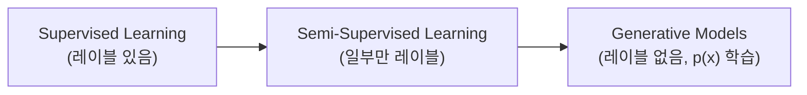

# More on Supervised Learning and Beyond

> [!abstract] 강의 개요
> [[SupL_05_Logistic_Regression|5강]] ← **지도학습 6강 (시리즈 마지막)**
>
> "항상 딥러닝이 필요한 것은 아니다"라는 메시지로 시작해, ==Naive Bayes==·==Decision Tree==·Ensemble(Bagging/Random Forest/AdaBoost) 같은 **고전 지도학습 모델**을 보충한다. 이어서 Super Resolution·Object Detection·BERT·Anomaly Detection 같은 실전 사례로 지도학습의 폭을 보여주고, 마지막으로 **지도학습을 넘어선** Semi-Supervised Learning과 Generative Model(GAN, Diffusion)을 미리 살펴본다.

> [!summary]- 핵심 요약 (클릭해서 펼치기)
> | 주제 | 핵심 |
> | ---- | ---- |
> | 메시지 | 문제가 단순하면 모델도 단순해야 한다 — 딥러닝이 항상 정답은 아님 |
> | Naive Bayes | feature 간 **조건부 독립** 가정으로 결합확률을 단순화 |
> | Laplace Smoothing | 학습 데이터에 없던 값에 확률 0을 주지 않기 위한 보정 |
> | Decision Tree | 분류는 entropy, 회귀는 variance로 분할 기준 결정 |
> | Bagging vs Boosting | 병렬·variance 감소 vs 순차·bias 감소 |
> | 지도학습의 폭 | Super Resolution, Object Detection, BERT, Anomaly Detection 등 |
> | 지도학습을 넘어서 | Semi-Supervised Learning, Generative Models (GAN, Diffusion) |

## 목차

1. [[#1. 항상 딥러닝이 필요한 것은 아니다]]
2. [[#2. Naive Bayes]]
   - [[#2.1 모델과 조건부 독립 가정]]
   - [[#2.2 Laplace Smoothing]]
3. [[#3. Decision Tree]]
4. [[#4. Ensemble Bagging·Random Forest·AdaBoost]]
5. [[#5. 지도학습의 다양한 응용]]
6. [[#6. 지도학습을 넘어서]]

---

## 1. 항상 딥러닝이 필요한 것은 아니다

> [!tip] 핵심 메시지
> 문제가 단순하다면 모델도 단순해야 한다 — **딥러닝은 overkill일 수 있다**. 해석 가능하고 가벼운 모델로도 충분한 경우가 많다.

---

## 2. Naive Bayes

### 2.1 모델과 조건부 독립 가정

> [!example] 스팸 필터 예시
> 이메일을 단어 존재 여부를 나타내는 indicator vector로 표현: $x = [1,0,0,\dots,1,\dots,0]^\top$ (각 차원이 "aardvark", "buy" 등 특정 단어 포함 여부).

> [!note] Naive Bayes Assumption
> $X$들이 $y$가 주어졌을 때 **조건부 독립**이라고 가정:
> $$p(x_1,\dots,x_{50000}\mid y) = \prod_{j=1}^d p(x_j\mid y)$$
> 이 가정 덕분에 결합 확률을 각 feature의 조건부 확률 곱으로 단순화할 수 있다.

> [!success] 파라미터 추정 (Maximum Likelihood)
> $$\phi_{j\mid y=1} = p(x_j=1\mid y=1), \quad \phi_{j\mid y=0} = p(x_j=1\mid y=0), \quad \phi_y = p(y=1)$$
> $$\phi_{j\mid y=1} = \frac{\sum_{i=1}^n \mathbb{1}\{x_j^{(i)}=1 \wedge y^{(i)}=1\}}{\sum_{i=1}^n \mathbb{1}\{y^{(i)}=1\}}, \qquad \phi_y = \frac{\sum_{i=1}^n \mathbb{1}\{y^{(i)}=1\}}{n}$$

> [!quote] 베이즈 정리로 예측
> $$p(y=1\mid x) = \frac{\left(\prod_{j=1}^d p(x_j\mid y=1)\right)p(y=1)}{\left(\prod_{j=1}^d p(x_j\mid y=1)\right)p(y=1) + \left(\prod_{j=1}^d p(x_j\mid y=0)\right)p(y=0)}$$

### 2.2 Laplace Smoothing

> [!warning] 문제: 학습 데이터에 없던 단어
> 어떤 단어가 학습 데이터에 전혀 등장하지 않으면:
> $$\phi_{35000\mid y=1} = \frac{\sum_i \mathbb{1}\{x_{35000}^{(i)}=1 \wedge y^{(i)}=1\}}{\sum_i \mathbb{1}\{y^{(i)}=1\}} = 0$$
> → 확률이 정확히 0이 되어버려, 이후 모든 곱이 0이 되는 문제가 생긴다.

> [!tip] 해결책: Laplace Smoothing
> 카운트를 **1부터 시작**해 0을 방지한다 (분자에 +1, 분모에 클래스 수를 더하는 형태의 보정).

---

## 3. Decision Tree

> [!note] 구조
> Flowchart 형태 — **내부 노드**는 결정(decision), **branch**는 그 결정의 결과, **leaf node**는 클래스 레이블(분류) 또는 값(회귀).

> [!example] 분류 예시 — 포유류 판별
> Root: "털이 있는가?" → No면 "포유류 아님" / Yes면 다음 질문 "새끼를 낳는가?" → Yes면 "포유류" / No면 "포유류 아님"

> [!example] 회귀 예시 — 주택 가격
> Root: "면적 > 2000 sqft?" → No면 \$150,000 / Yes면 "침실 수 > 3?" → Yes면 \$300,000 / No면 \$250,000

> [!note] Splitting Criteria
> | 과제 | 분할 기준 |
> | ---- | --------- |
> | **분류** | dispersion(==entropy==) 측정 |
> | **회귀** | subset 내 ==variance== 측정 |

---

## 4. Ensemble: Bagging·Random Forest·AdaBoost

> [!note] Bagging (Bootstrap Aggregating)
> 복원추출로 학습 데이터의 여러 부분집합을 만들어 각각 모델을 학습 → 과적합을 줄이고 모델의 강건성을 향상.

> [!note] Random Forest
> 여러 decision tree를 결합하는 ensemble 방법 (Bagging + feature 무작위성).

> [!note] AdaBoost (Adaptive Boosting)
> **순차(Sequential) 학습** — 이전 모델의 오차를 다음 모델이 교정한다:
> 1. 첫 모델 학습 → 오분류된 샘플에 더 큰 weight 부여
> 2. weight를 반영해 다음 모델 학습
> 3. 최종 예측 = 각 모델 예측의 **weighted sum** (weight는 각 모델의 error rate 기반)

> [!example] Bagging vs Boosting
> | | Bagging | Boosting |
> | --- | --- | --- |
> | 방식 | Parallel | Sequential |
> | 효과 | Variance 감소 | Bias 감소 |
> | 집계(분류) | Voting | Weighted majority voting |
> | 집계(회귀) | Averaging | Weighted averaging |

---

## 5. 지도학습의 다양한 응용

> [!example] Supervised Learning은 어디에나 있다
> | 응용 | Data | Model | Loss |
> | ---- | ---- | ----- | ---- |
> | **Super Resolution** | (저해상도, 고해상도) 이미지 쌍 | CNN | Pixel-wise MSE 또는 PSNR |
> | **Object Detection** (Faster R-CNN) | (이미지, bounding box+label) | CNN | box 좌표 차이 + 분류 손실 |
> | **BERT (Masked LM)** | (마스킹된 문장, 토큰화된 문장) | Transformer (LLM) | 분류 손실 |
> | **BERT (NSP)** | (문장 쌍, 연속 여부 binary) | Transformer (LLM) | 분류 손실 |
> | **Anomaly Detection** | (센서 입력, 이상 여부) | 딥러닝 모델 | (가중) 분류 손실 |

> [!quote] 공통 패턴
> 모든 supervised learning 응용은 결국 **(Data, Model, Loss)** 세 가지를 정의하는 문제로 환원된다 — 1강에서 배운 일반적인 틀이 최신 딥러닝 응용에도 그대로 적용된다.

---

## 6. 지도학습을 넘어서

> [!note] Semi-Supervised Learning
> 레이블링은 비용이 크므로, **레이블 없는 데이터**로부터도 학습한다 (augmentation, contrastive learning 등 활용). 관련 연구: *Big Self-Supervised Models are Strong Semi-Supervised Learners*, *A Simple Framework for Contrastive Learning of Visual Representations (SimCLR)*.

> [!note] Generative Models
> 레이블 없이 $x$만 존재 — 목표는 데이터의 분포 $p(x)$를 학습하는 것.
> | 모델 | 핵심 |
> | ---- | ---- |
> | **GAN** (Generative Adversarial Network) | 생성자와 판별자의 적대적 학습 |
> | **Diffusion Model** | 점진적 노이즈 제거 과정을 학습 (Score-based generative modeling, SDE 기반) |

---

> [!success] 시리즈 전체 정리
> "지도학습" 시리즈는 [[SupL_01_Supervised_Learning_Overview|함수 근사라는 통일된 틀]]에서 출발해 [[SupL_02_Linear_Regression|Linear Regression]] → [[SupL_03_Gradient_Descent|Gradient Descent]] → [[SupL_04_Classification|Classification(SVM)]] → [[SupL_05_Logistic_Regression|Logistic Regression]]을 거쳐, 이번 강의에서 **Naive Bayes·Decision Tree·Ensemble** 같은 고전 모델과 **Semi-Supervised/Generative Model**이라는 그 다음 지평까지 정리했다. 핵심은 항상 동일하다 — **데이터, 함수 클래스, 손실 함수**를 정의하고 최적화하는 것.

---

%%
관련 노트:
- [[SupL_05_Logistic_Regression]] — 5강: Cross-Entropy 기반 분류
- [[SupL_01_Supervised_Learning_Overview]] — 1강: 시리즈 전체를 관통하는 함수 근사 틀
%%
