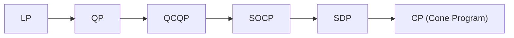
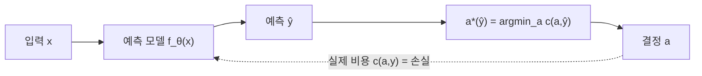

# Optimization and Decision-Focused Learning

> [!abstract] 강의 개요
> **1~3강 (Opt & DFL)** → [[OptDFL_02_Time_Series_Analysis_(4~6강)|4~6강 (Time Series)]]
>
> Convex Optimization의 기초(왜 convexity가 중요한가, LP/QP/QCQP/SOCP/SDP 계층구조)를 다진 뒤, 핵심 주제인 ==Decision-Focused Learning(DFL)==으로 나아간다. "예측을 잘 하는 것"과 "좋은 결정을 내리는 것"이 다르다는 문제의식에서 출발해, 예측 손실이 아닌 **결정 손실(decision loss)을 직접 최소화**하는 학습 패러다임을 다룬다.

> [!summary]- 핵심 요약 (클릭해서 펼치기)
> | 주제 | 핵심 |
> | ---- | ---- |
> | Convex Optimization | "산을 오르는데 봉우리가 하나뿐" — local optimum = global optimum |
> | 문제 계층 | LP ⊂ QP ⊂ QCQP ⊂ SOCP ⊂ SDP ⊂ CP (일반 cone program) |
> | Predict-then-Optimize의 문제 | (1) 예측엔 항상 오차가 있음 (2) 최선의 예측 ≠ 최적의 결정 |
> | ==Decision-Focused Learning== | $\mathcal{L}_{pred}$ 대신 $\mathcal{L}_{dec}=c(a^\star(\hat y), y)$를 직접 최소화 |
> | 핵심 난점 | $a^\star(y)$가 최적화 문제의 해 → 미분 불가능하거나 유일하지 않을 수 있음 |
> | 해결책 | Surrogate(SPO+, LODL), Tangent-space projection(PEAR), Prediction-loss 정규화 |

## 목차

1. [[#1. Convex Optimization 입문]]
   - [[#1.1 최적화란 무엇인가]]
   - [[#1.2 왜 Convexity가 중요한가]]
   - [[#1.3 Formulation이 중요한 이유 — 조명 문제]]
2. [[#2. Optimization Problems의 구조]]
   - [[#2.1 표준형과 최적해]]
   - [[#2.2 Convex Set·Function]]
   - [[#2.3 LP·QP·QCQP·SOCP·SDP 계층]]
3. [[#3. Decision-Focused Learning]]
   - [[#3.1 Predict-then-Optimize의 두 가지 문제]]
   - [[#3.2 DFL의 정식화]]
   - [[#3.3 미분 가능성 문제와 Surrogate]]
   - [[#3.4 최신 연구 동향]]

---

## 1. Convex Optimization 입문

### 1.1 최적화란 무엇인가

> [!note] Mathematical Optimization
> $$\text{minimize } f_0(x) \quad \text{subject to } f_i(x)\le b_i,\ i=1,\dots,m$$
> $x=(x_1,\dots,x_n)$: 결정변수, $f_0$: 목적함수, $f_i$: 제약함수. 최적해 $x^*$는 제약을 만족하는 모든 벡터 중 $f_0$가 최소인 점.

> [!example] 응용 예시
> | 응용 | 변수 | 제약 | 목적 |
> | ---- | ---- | ---- | ---- |
> | 포트폴리오 최적화 | 자산별 투자금액 | 예산, 자산별 최소/최대 투자, 최소 수익률 | 위험(수익률 분산) |
> | 회로 설계 | 소자 크기 | 제조 한계, 타이밍, 최대 면적 | 전력 소비 |
> | Data Fitting (ML) | 모델 파라미터 | 사전 정보, 파라미터 범위 | 오차/예측 오류 |

> [!tip] 최적화 vs 머신러닝
> 최적화는 결정과 결과에 대한 **수학적 모델링**에 기반하고, ML은 데이터로부터 그 매핑을 **학습**한다. 그러나 둘은 완전히 다르지 않다 — "학습" 자체가 결국 최적화를 포함하며, 강화학습·대규모 sampling 기반 최적화는 이 둘을 더욱 가깝게 만든다.

### 1.2 왜 Convexity가 중요한가

> [!quote] 산 오르기 비유
> 일반적인 최적화는 산을 오르는 것과 같다 — 봉우리가 여러 개면 어디가 최고봉인지 알아야 하고, 눈을 가린 채라면(gradient만 보임) 더 어렵다.
> **Convex optimization의 좋은 소식**: 봉우리가 **단 하나**뿐이라서, 매 step마다 더 높은 곳으로만 가면 결국 정상에 도달한다.

> [!example] 풀이 난이도 계층
> $$\text{Linear Programming} \subset \text{Convex Optimization} \subset \text{General (Non-convex) Optimization}$$
> Convex 문제(LP 포함)는 **효율적으로 풀 수 있고**, 일반 non-convex 문제는 풀기 어렵다.

> [!note] Least-Squares
> $$\text{minimize}\ \|Ax-b\|_2^2 \quad\Rightarrow\quad x^* = (A^\top A)^{-1}A^\top b \ (\text{closed-form})$$
> 계산 시간은 $A\in\mathbb{R}^{k\times n}$에서 $O(n^2k)$ — 매우 성숙한 기술. (예: 다항회귀는 $\mathbf{y}=\mathbf{X}\boldsymbol\beta+\boldsymbol\varepsilon$ 형태의 least-squares로 환원)

> [!note] Linear Programming
> $$\text{minimize}\ c^\top x \quad \text{s.t.}\ a_i^\top x\le b_i$$
> 닫힌 해는 없지만 효율적인 알고리즘이 존재. $\ell_1/\ell_\infty$-norm, piecewise-linear 함수가 들어간 문제를 LP로 변환하는 표준 트릭들이 있다.

> [!note] Convex Optimization Problem
> 목적·제약 함수가 모두 convex: $f(tx_1+(1-t)x_2)\le tf(x_1)+(1-t)f(x_2)$ (Jensen's inequality). Least-squares와 LP를 특수한 경우로 포함한다. 닫힌 해는 없지만 신뢰성 있는 효율적 알고리즘이 존재 — **거의 하나의 기술(technology)**.

### 1.3 Formulation이 중요한 이유 — 조명 문제

> [!example] $m$개 조명으로 $n$개 패치를 비추는 문제
> $$I_k = \sum_{j=1}^m a_{kj}p_j, \qquad \text{minimize}\ \max_k |\log I_k - \log I_{des}| \quad \text{s.t.}\ 0\le p_j\le p_{max}$$

> [!tip] 5가지 풀이법과 그 차이
> | 방법 | 비고 |
> | ---- | ---- |
> | 1. 균일한 전력 | 매우 단순, 최적성 보장 없음 |
> | 2. Least-squares + rounding | $0\le p_j\le p_{max}$ 위반 시 사후 보정 |
> | 3. Weighted least-squares | 가중치를 반복적으로 조정 |
> | 4. Linear Programming | $\max_k|I_k-I_{des}|$를 LP로 변환해 품 |
> | 5. **Convex Optimization** | $h(u)=\max\{u,1/u\}$ 사용 — $f_0$가 convex(convex 함수의 최댓값은 convex)이므로 **정확한 해를 least-squares와 비슷한 비용**으로 구할 수 있음 |

> [!warning] 직관이 항상 통하지 않는다
> "상위 10개 램프가 전체 전력의 절반을 넘지 않게" 제약을 추가해도 여전히 쉽게 풀리지만, "켜진 램프가 전체의 절반을 넘지 않게" 제약을 추가하면 **극도로 어려워진다**. 배경 지식 없이는 쉬운 문제와 어려운 문제가 비슷해 보일 수 있다.

---

## 2. Optimization Problems의 구조

### 2.1 표준형과 최적해

> [!note] 표준형
> $$\text{minimize } f_0(x) \quad \text{s.t. } f_i(x)\le0\ (i=1,\dots,m),\ \ h_i(x)=0\ (i=1,\dots,p)$$
> 최적값 $p^*=\inf\{f_0(x)\mid \text{제약 만족}\}$ — infeasible이면 $p^*=\infty$, unbounded below면 $p^*=-\infty$.

> [!example] Optimal vs Locally Optimal
> $f_0(x)=1/x$ ($x>0$): $p^*=0$이지만 도달하는 최적점은 없음. $f_0(x)=-\log x$: $p^*=-\infty$. $f_0(x)=x\log x$: $p^*=-1/e$ at $x=1/e$. $f_0(x)=x^3-3x$: $p^*=-\infty$이지만 $x=1$에서 **local optimum**.

### 2.2 Convex Set·Function

> [!note] Convex Set
> $x_1,x_2\in C,\ 0\le\theta\le1 \Rightarrow \theta x_1+(1-\theta)x_2\in C$. 유한합·무한합·적분·확률분포(기댓값)로 일반화 가능: $X$가 r.v.이고 $X\in C$이면 $\mathbb{E}[X]\in C$.

> [!note] Convex Function
> $f(\theta x+(1-\theta)y)\le \theta f(x)+(1-\theta)f(y)$. **Strictly convex**는 부등식이 엄격. $-f$가 convex이면 $f$는 concave.

> [!success] 핵심 성질
> Convex 최적화 문제의 **feasible set은 항상 convex**다. **미분가능한 $f_0$에 대한 최적성 조건**: $x$가 optimal $\iff$ feasible하고 모든 feasible $y$에 대해 $\nabla f_0(x)^\top(y-x)\ge 0$.

### 2.3 LP·QP·QCQP·SOCP·SDP 계층

> [!example] 문제 클래스와 표준형
> | 클래스 | 표준형 | 특징 |
> | ------ | ------ | ---- |
> | **LP** | $\min c^\top x$ s.t. $Gx\preceq h,\ Ax=b$ | feasible set = polyhedron |
> | **QP** | $\min \frac12 x^\top Px+q^\top x+r$ s.t. $Gx\preceq h,\ Ax=b$ ($P\succeq0$) | convex quadratic 최소화 |
> | **QCQP** | 목적과 제약이 모두 convex quadratic | $P_i\succ0$이면 feasible region = 타원체들의 교집합 |
> | **SOCP** | $\|A_ix+b_i\|_2\le c_i^\top x+d_i$ | QCQP·LP보다 일반적 |
> | **SDP** | $\min \text{tr}(CX)$ s.t. $\text{tr}(A_iX)=b_i,\ X\succeq0$ | LP의 행렬 버전 |
>
> $$\text{LP} \subset \text{QP} \subset \text{QCQP} \subset \text{SOCP} \subset \text{SDP} \subset \text{CP(cone program)}$$

> [!example] 실전 활용 예시
> - **Markowitz 포트폴리오 최적화 (QP)**: $\min_w w^\top\Sigma w - \lambda \mu^\top w$ s.t. $\mathbb{1}^\top w=1,\ w\succeq0$
> - **Sharpe Ratio 최대화 (QCQP)**: $\max_w \frac{w^\top\mu - r_f}{\sqrt{w^\top\Sigma w}}$ s.t. $\mathbb{1}^\top w=1$ → 변수 치환으로 QCQP로 변환
> - **Robust LP (SOCP)**: 파라미터 $a_i$의 불확실성을 타원체 제약 $\|P_i^\top x\|_2$ 또는 가우시안 확률 제약으로 다루면 SOCP로 환원됨

---

## 3. Decision-Focused Learning

### 3.1 Predict-then-Optimize의 두 가지 문제

> [!note] 일반적인 ML 기반 의사결정 흐름
> $$\text{Input} \to \text{Machine Learning(Prediction)} \to \text{Optimization(Decision Making)}$$

> [!warning] Issue 1 — 예측은 항상 오차를 포함한다
> "Garbage in, garbage out" — 예측 오차가 그대로 결정 단계로 전파된다.

> [!warning] Issue 2 — 최선의 예측 ≠ 최적의 결정
> 두 예측이 **비슷한 정도의 오차**를 가져도, 그로부터 도출되는 **결정은 완전히 다를 수 있다**.

> [!example] 동기 사례
> - **헬스케어 공급망** (Chung et al., 2022): 사전 재고가 높은 시설은 어떤 결정도 필요 없지만, 사전 재고가 낮은 시설은 조치가 필요 — MSE 최소화 예측 모델은 이 비대칭을 반영하지 못함
> - **Smart "Predict, then Optimize"** (Elmachtoub & Grigas, 2022): $\min c^\top x$ 문제에서, 오차 크기는 비슷해도 예측 $\hat c$가 실제 $c$와 **같은 방향**인지가 결정 $w^*(\hat c)$를 크게 좌우함

### 3.2 DFL의 정식화

> [!note] 표기
> $\mathcal{D}=\{(x_1,y_1),\dots,(x_n,y_n)\}$, $x$가 주어지면 결정을 내려야 함:
> $$A_\pi(x) = a^\star(f_{\hat\theta}(x)), \qquad a^\star(y) := \arg\min_{a\in\mathcal{A}} c(a,y)$$

> [!example] Predict-then-Optimize vs Decision-Focused Learning
> | | 목적함수 | 손실 |
> | --- | -------- | ---- |
> | **Predict-then-Optimize** | $\hat\theta = \arg\min_\theta \sum_i \mathcal{L}_{pred}(f_\theta(x_i), y_i)$ | $\mathcal{L}_{pred}(\hat y,y) = \|y-\hat y\|^2$ (e.g.) |
> | **==Decision-Focused Learning==** | $\hat\theta = \arg\min_\theta \sum_i \mathcal{L}_{dec}(f_\theta(x_i), y_i)$ | $\mathcal{L}_{dec}(\hat y,y) := c(a^\star(\hat y), y)$ |
>
> DFL은 예측 오차가 아니라, **그 예측으로 내린 결정이 실제로 얼마나 비용이 드는지**를 손실로 사용한다.

### 3.3 미분 가능성 문제와 Surrogate

> [!warning] Chain Rule의 까다로운 항
> 모든 것이 미분 가능하다면:
> $$\frac{d\mathcal{L}_{dec}}{d\theta} = \frac{dc(a^\star(f_\theta(x_i)),y_i)}{da^\star(f_\theta(x_i))}\cdot \frac{da^\star(f_\theta(x_i))}{df_\theta(x_i)}\cdot\frac{df_\theta(x_i)}{d\theta}$$
> 두 번째 항 $\dfrac{da^\star(y)}{dy}$가 특히 까다롭다 — $a^\star(y)$는 **최적화 문제의 해**이므로 유일하지 않거나 미분 불가능할 수 있다.

> [!tip] Proxy Objective (Surrogate) 전략
> $\mathcal{L}_{dec}$를 직접 최소화하는 대신, 다루기 쉬운 근사 $\hat{\mathcal{L}}_{dec}$를 사용:
> | 방법 | 핵심 아이디어 |
> | ---- | -------------- |
> | **Linear Reparameterization** (Wang et al., 2020) | 선형 재구성으로 미분 가능성 확보 |
> | **SPO+** (Elmachtoub & Grigas, 2022) | Smart Predict-then-Optimize의 convex surrogate loss |
> | **Local Approximation** (Chung et al. 2022; Shah et al. 2022) | 결정 손실을 지역적으로 근사 |
> | **LODL** (Locally Optimized Decision Losses, Shah et al. 2022) | "decision-making 없이도" 학습 가능한 지역 최적화된 결정 손실 |

> [!quote] 최신 연구: PEAR (Tangent-Space Projection)
> *Lee, Jin & Lee (ICML 2026)* — "Prediction Error As Regret-gradient": 예측 오차를 결정 공간의 ==tangent space==로 projection하여 regret-aware하게 만드는 접근.

### 3.4 최신 연구 동향

> [!warning] DFL의 부작용 — 예측 품질의 손상
> 예측 모델이 **결정 품질에만 과도하게 최적화**되면, 예측 자체의 품질이 심각하게 저하될 수 있다 — 다른 downstream task에는 그 예측이 무용해질 위험.

> [!tip] 대응책: Prediction Loss 정규화
> *Jeon, Bae, Kim, Lee & Kim (2025)*, "Prediction Loss Guided Decision-Focused Learning" — 결정 손실 최소화에 **예측 손실 정규화 항**을 추가해 두 목표를 균형.

> [!example] 응용 사례 (UNIST Financial Engineering Lab)
> - *Return Prediction for Mean-Variance Portfolio Selection* (Lee, Jeon, Bae & Lee, 2025) — DFL이 수익률 예측 모델의 형태를 어떻게 바꾸는지 분석
> - *Estimating Covariance for Global Minimum Variance Portfolio* (Kim, Tae & Lee, 2025) — 공분산 추정에 DFL 적용

---

> [!success] 이번 강의 정리
> Convex Optimization은 "유일한 봉우리"라는 성질 덕분에 신뢰성 있게 풀 수 있는 문제군(LP⊂QP⊂QCQP⊂SOCP⊂SDP)을 제공한다. 이 위에서 **Decision-Focused Learning**은 "예측이 좋다"와 "결정이 좋다"가 다를 수 있다는 문제의식으로, 예측 손실이 아닌 **결정에서 발생하는 실제 비용**을 직접 최적화 대상으로 삼는다 — 단, $a^\star(y)$의 미분 불가능성이라는 근본적 난점을 surrogate·tangent-space projection·정규화 등으로 우회해야 한다.

---

%%
관련 노트:
- [[OptDFL_02_Time_Series_Analysis_(4~6강)]] — 4~6강: Time Series Analysis (이용재 교수, 동일 시리즈)
%%
