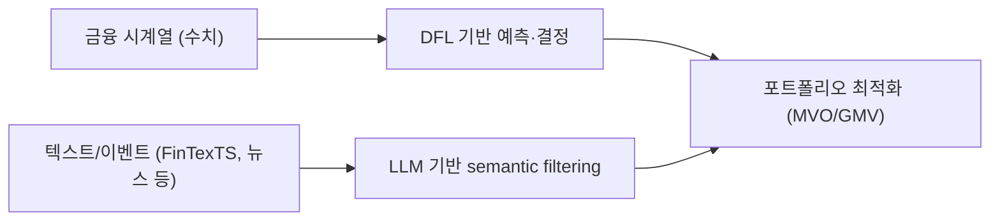

# Time-Series Analysis

> [!abstract] 강의 개요
> [[OptDFL_01_Optimization_and_Decision-Focused_Learning_(1~3강)|1~3강 (Opt & DFL)]] ← **4~6강 (Time Series)**
>
> 시계열 분석의 기본 개념(==정상성(stationarity)==, model-driven vs data-driven)에서 시작해, RNN/LSTM → 생성모형(GAN/Diffusion) → Attention/Transformer → LLM 기반 모델까지 시계열 딥러닝의 발전을 따라간다. 마지막으로 금융 시계열에 DFL과 LLM을 결합한 UNIST Financial Engineering Lab의 최신 연구(Case Studies)를 살펴본다.

> [!summary]- 핵심 요약 (클릭해서 펼치기)
> | 갈래 | 핵심 모델 |
> | ---- | --------- |
> | 전통 통계 기법 | Model-driven (ARIMA, GARCH) — 가정 명확, 해석 쉬움 |
> | RNN 계열 | RNN → ==LSTM==(vanishing gradient 해결) → Neural ODE → DeepAR |
> | 생성모형 | GAN(StyleGAN, TimeGAN, QuantGANs, TadGAN), Diffusion(TimeGrad) |
> | Attention/Transformer | Seq2Seq의 한계 → Attention → ==Transformer==(TFT, Informer, Autoformer) |
> | LLM 기반 | LLMTime, TimeLLM, TimesNet, Time-VLM, Time-MQA |
> | Case Studies | 금융 시계열 + DFL + LLM 결합, Prediction Markets에서의 LLM 활용 |

## 목차

1. [[#1. 시계열 분석 입문]]
   - [[#1.1 시계열의 특수성]]
   - [[#1.2 정상성과 예측 가능성]]
   - [[#1.3 Model-driven vs Data-driven]]
2. [[#2. 시계열을 위한 딥러닝 모델들]]
   - [[#2.1 RNN 기반 모델]]
   - [[#2.2 생성모형 GAN과 Diffusion]]
   - [[#2.3 Attention 기반 모델]]
   - [[#2.4 LLM 기반 모델]]
3. [[#3. Case Studies — 금융 시계열과 DFL·LLM의 결합]]

---

## 1. 시계열 분석 입문

### 1.1 시계열의 특수성

> [!warning] 왜 일반 통계 기법이 그대로 통하지 않는가
> 기존 통계 기법은 대부분 관측치가 ==i.i.d.(independent and identically distributed)==라고 가정한다. 그러나 시계열 데이터는 **인접한 관측치 사이에 명확한 관계성**이 있다 — 이를 잘 다루는 것이 시계열 분석의 핵심.

> [!example] 세 가지 직관 예시
> | 예시 | 관찰 | 질문 |
> | ---- | ---- | ---- |
> | LA 연간 강우량 | 변동이 크고 1880년대에 예외적 고점 | 전년과 이듬해 강우량에 관계가 있을까? → **아마 없음** (독립적) |
> | 연간 토끼 개체 수 | 인접 관측값이 유사 | 관계가 있을까? → **있는 듯** (자기상관) |
> | 월간 오일필터 판매량 | 변동폭이 큼 | 계절성(seasonality)이 있을까? → **있는 듯** |

### 1.2 정상성과 예측 가능성

> [!note] 예측 모형의 원리
> 예측 모형은 결국 $x \to f(x)$라는 함수적 관계를 찾는 것. "하나의 입력값에 하나의 출력값이 잘 대응되는" 데이터, 즉 ==정상성(stationarity)==이 있는 데이터는 예측이 잘 되는 편이다.

> [!quote] LLM과 시계열
> "미국 대선은 누가 이겼니?" → LLM은 사실 기반 질의에는 잘 답하지만, 시계열의 수치적·구조적 패턴을 이해하는 방식은 본질적으로 다르다는 것이 이후 LLM 기반 시계열 모델들의 핵심 화두가 된다.

### 1.3 Model-driven vs Data-driven

> [!example] 두 접근의 비교
> | | Model-driven (전통적 기법) | Data-driven (AI 기법) |
> | --- | --- | --- |
> | 가정 | 수식 구조와 데이터 분포에 대한 가정 명확 | 특별한 가정 없음 |
> | 장점 | 도메인 지식 활용 쉬움, 결과 일반화 쉬움 | 변수 간 복잡한 (비선형) 관계 반영 가능 |
> | 단점 | 복잡한 데이터/환경에서 사용 어려움 | 충분한 데이터 필요, 해석 어려움 |
> | 예시 | **ARIMA**, **GARCH** | **Random Forest**, **Neural Network** |

---

## 2. 시계열을 위한 딥러닝 모델들

### 2.1 RNN 기반 모델

> [!note] Recurrent Neural Network (RNN)
> 동일한 구조를 순차적으로 반복 적용하며 hidden state를 업데이트.

> [!warning] Vanishing Gradient 문제
> 구조를 계속 반복하기 때문에, 초기 입력의 영향이 뒤로 갈수록 **미미해지거나 지나치게 증폭**될 수 있음 — RNN이 "초기 입력값을 잊어버리는" 현상.

> [!success] LSTM (Long Short-Term Memory)
> Gate 구조(forget/input/output gate)로 정보를 선택적으로 기억·전달해 vanishing gradient 문제를 완화.

> [!example] 확장 모델들
> | 모델 | 핵심 |
> | ---- | ---- |
> | **Neural ODE** (Chen et al., 2018) | RNN/LSTM은 동일 간격 관측을 가정 — hidden state의 변화량(derivative)을 학습해 **불균등 간격** 데이터도 처리 |
> | **DeepAR** (Salinas et al., 2020, Amazon) | RNN 기반 확률적(probabilistic) 시계열 예측 |

### 2.2 생성모형: GAN과 Diffusion

> [!note] Discriminative vs Generative
> **Discriminative**: 데이터의 종류를 판별 (e.g., 개/고양이 구분). **Generative**: 학습된 분포로부터 **새로운 데이터를 생성**.

> [!note] GAN (Goodfellow et al., 2014)
> ==Generator==(데이터 분포를 학습해 가짜 데이터 생성, discriminator를 속이는 것이 목표)와 ==Discriminator==(진짜/가짜를 구분)가 게임처럼 경쟁하며 학습.

> [!example] GAN 계열 사례
> | 모델 | 응용 |
> | ---- | ---- |
> | StyleGAN (Karras et al., 2019, NVIDIA) | 이미지 생성 |
> | CycleGAN (Zhu et al., 2017) | 이미지 도메인 변환 |
> | **TimeGAN** (Yoon et al., 2019) | 시계열 데이터 생성 |
> | **QuantGANs** (Wiese et al., 2020) | 금융 시계열 생성 |
> | **TadGAN** (Geiger et al., 2020) | 시계열 이상 탐지(anomaly detection) |

> [!note] Diffusion Models
> 데이터에 점점 노이즈를 더하면 결국 완전한 노이즈가 된다 — 그 **역과정(노이즈 제거)을 학습**하면 노이즈로부터 실제 같은 데이터를 생성할 수 있다.
> - **TimeGrad** (Rasul et al., 2021): Diffusion 기반 시계열 예측

### 2.3 Attention 기반 모델

> [!warning] Seq2Seq의 한계
> Sequence-to-sequence 모델은 input을 hidden state로 누적하며 sequence output을 생성하지만, **input이 길어지면 앞부분을 기억하기 어렵다**.

> [!success] Attention Mechanism
> 전체 입력을 하나로 요약하는 대신, **입력의 어떤 부분에 더 집중(attend)해야 하는지**를 동적으로 판단해 사용한다.

> [!quote] Attention Is All You Need (Vaswani et al., 2017)
> RNN cell 없이 attention만으로 구성된 ==Transformer==. 핵심 장점은 **병렬화가 쉬워 모델을 매우 크게 만들 수 있다**는 것 — 대규모 데이터 학습을 가능케 함.

> [!example] 시계열 Transformer 계열
> | 모델 | 핵심 특징 |
> | ---- | --------- |
> | **Temporal Fusion Transformer (TFT)** (Lim et al., 2021) | 다양한 입력 유형을 통합, 분위수(quantile) 예측과 불확실성 추정 — COVID-19 충격 이후 변동성 regime shift에도 적절한 신뢰구간 유지 |
> | **Informer** (Zhou et al., 2021) | 장기(long-sequence) 시계열 예측에 효율적인 attention |
> | **Autoformer** (Wu et al., 2021) | 시계열의 주기성(seasonality)을 자동 분해하며 attention 수행 |

### 2.4 LLM 기반 모델

> [!example] LLM을 시계열에 적용하는 다양한 시도
> | 모델 | 접근 방식 | 한계 |
> | ---- | --------- | ---- |
> | **LLMTime** (Gruver et al., 2023) | 수치값을 토큰화 | 연산/대수적 관계를 제대로 이해하는 방식이 아님 — 한계가 명확 |
> | **TimeLLM** (Jin et al., 2023) | 시계열을 단일 모달리티 embedding으로 projection | Foundation LM을 backbone으로 쓰면서 발생하는 modality gap·정보 손실 |
> | **TimesNet** (Wu et al., 2022) | 시계열을 frequency/amplitude로 변환해 long/short context를 동시에 반영 | domain shift 시 inductive bias가 상당 부분 사라져 adaptation이 어려울 수 있음 |
> | **Time-VLM** (Zhong et al., 2025) | Vision-Language Model을 활용한 멀티모달 시계열 예측 | — |
> | **Time-MQA** (Kong et al., 2025) | Context를 보강한 시계열 multi-task QA | — |

---

## 3. Case Studies — 금융 시계열과 DFL·LLM의 결합

> [!quote] Motivation
> **외부 context(텍스트 등)가 금융 시계열의 불확실성·비정상성을 줄여줄 수 있다**는 가설 — 순수 수치 시계열만으로는 포착하지 못하는 정보를 텍스트가 보완.

> [!example] UNIST Financial Engineering Lab의 최근 연구
> | Paper | 핵심 내용 |
> | ----- | --------- |
> | **Return Prediction for MVO** (Lee, Jeon, Bae & Lee, 2025) | DFL이 Mean-Variance 포트폴리오 선택을 위한 수익률 예측 모델의 형태를 어떻게 바꾸는지 분석 |
> | **Estimating Covariance for GMV Portfolio** (Kim, Tae & Lee, 2025) | Global Minimum Variance 포트폴리오의 공분산 추정에 DFL 적용 |
> | **Decision-informed NN with LLM** (Hwang, Kong, Zohren & Lee, 2025) | ==DFL + LLM 기반 예측==을 Mean-Variance Optimization(MVO)에 결합 |
> | **FinTexTS** (Lee et al., 2026, KDD Datasets Track) | 의미론적·다단계 매칭으로 구성한 금융 **텍스트-시계열 페어 데이터셋** |

> [!note] Prediction Markets
> 연준의 금리 인하, 키노트 발언의 단어 선택 같은 **비정형(unstructured) 글로벌/로컬 이벤트**를 거래 가능한 liquid 데이터로 변환 — 시장 참여자가 직접 돈을 거는(skin-in-the-game) 독특한 정확성을 가짐.

> [!example] LLM as a Risk Manager (Kim, Kim, Kwon et al., 2026, ACL Industry Track)
> ==Granger Causality==로 찾은 lead-lag 관계를 **LLM으로 필터링·재정렬**해 일반화 성능을 향상. Kalshi Economics 시장에서 이 하이브리드(통계+LLM) 접근이 순수 통계 baseline을 일관되게 능가.

---

> [!success] 이번 강의 정리
> 시계열 분석은 i.i.d. 가정이 깨지는 데이터를 다루기 위해 **정상성**이라는 개념에서 출발해, RNN/LSTM(순서 정보 모델링) → GAN/Diffusion(생성) → Transformer(장거리 의존성·병렬화) → LLM(zero-shot, 텍스트 결합)으로 발전해왔다. Financial Engineering 분야에서는 이 발전을 [[OptDFL_01_Optimization_and_Decision-Focused_Learning_(1~3강)|Decision-Focused Learning]]과 결합해, "예측을 잘하는 것"을 넘어 "포트폴리오 결정에 실제로 도움이 되는 예측"을 만드는 방향으로 최신 연구가 향하고 있다.

---

%%
관련 노트:
- [[OptDFL_01_Optimization_and_Decision-Focused_Learning_(1~3강)]] — 1~3강: Convex Optimization과 Decision-Focused Learning (동일 강사)
%%
