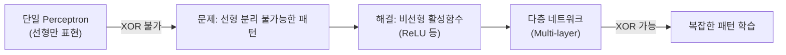
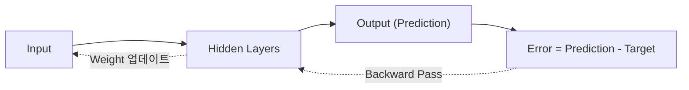

# AI의 첫걸음, 머신러닝과 딥러닝의 기초

> [!abstract] 강의 개요
> **딥러닝 자연어처리 기초와 LLM 에이전트 1강** → [[NLPAgent_02_자연어처리의_기초와_RNN|2강]]
>
> AI Landscape 전체를 조망하고 머신러닝의 4가지 유형(Supervised/Unsupervised/Semi-supervised/Reinforcement)을 정리한 뒤, 딥러닝의 핵심 동기인 ==XOR Problem==을 통해 "왜 비선형 활성함수와 다층 신경망이 필요한가"를 설명한다. Forward Pass/Backward Pass로 구성된 ==Backpropagation==의 직관까지 다룬다.

> [!summary]- 핵심 요약 (클릭해서 펼치기)
> | 개념 | 핵심 |
> | ---- | ---- |
> | AI ⊃ ML ⊃ DL | AI는 인간 행동 모방, ML은 데이터로부터 학습, DL은 다층 신경망 사용 |
> | 4가지 ML 유형 | Supervised(레이블) / Unsupervised(클러스터링) / Semi-supervised(혼합) / Reinforcement(보상) |
> | XOR Problem | 단일 perceptron은 선형분리만 가능 → XOR은 풀 수 없음 |
> | 해결책 | 비선형 활성함수(ReLU) + 다층 네트워크 |
> | Backpropagation | Forward Pass(예측) → Error 계산 → Backward Pass(가중치 업데이트) |
> | Softmax | 마지막 레이어에서 logit을 확률분포로 변환 |

## 목차

1. [[#1. AI, ML, DL의 관계]]
2. [[#2. 머신러닝의 4가지 유형]]
3. [[#3. 딥러닝과 신경망 기초]]
4. [[#4. XOR Problem — 왜 다층·비선형 네트워크가 필요한가]]
5. [[#5. Backpropagation — 신경망은 어떻게 학습하는가]]

---

## 1. AI, ML, DL의 관계

> [!note] 정의
> **Machine Learning**: 명시적 지시 없이 일반화하여 task를 수행할 수 있는 통계적 알고리즘. 데이터 기반 학습(Task T, Performance measure P, Training experience E)으로 정의된다 — 예: MNIST 숫자 분류에서 T=분류, P=정확도, E=레이블된 숫자 데이터셋.

> [!quote] AI ⊃ ML ⊃ DL
> Artificial Intelligence는 인간 행동을 모방하는 광범위한 개념, Machine Learning은 데이터로부터 학습하는 AI의 부분집합, Deep Learning은 다층 신경망을 사용하는 ML의 부분집합이다.

---

## 2. 머신러닝의 4가지 유형

> [!example] Feedback의 성격에 따른 분류
> | 유형 | 학습 데이터 | 핵심 |
> | ---- | ----------- | ---- |
> | **Supervised** | 레이블 있음(비쌈) | 레이블로 정확도 평가, 과적합 위험. Regression(연속값) / Classification(범주값) |
> | **Unsupervised** | 레이블 없음 | 데이터 자체에서 feature·패턴 추출 → ==Clustering== (e.g., k-Means) |
> | **Semi-supervised** | 소량 레이블 + 대량 무레이블 | 레이블 데이터로 학습 → 무레이블 데이터에 pseudo-label 부여 → 재학습 |
> | **Reinforcement** | 없음 (환경과 상호작용) | Trial and error + 보상(reward) 체계로 최적 행동을 강화 |

> [!note] Supervised Learning의 두 문제
> - **Regression**: 연속값 예측 (Linear/Nonlinear Regression)
> - **Classification**: 범주값 예측 (Naive Bayes, SVM, Logistic Regression 등)
> - Decision Tree, Random Forest, k-NN, Neural Network는 **둘 다** 풀 수 있음

---

## 3. 딥러닝과 신경망 기초

> [!note] Deep Neural Network
> Hidden layer가 2개 이상인 신경망(Shallow Network 대비). 레이어가 늘어날수록 더 복잡한 feature를 학습할 수 있는 능력이 커진다 — 각 feature는 입력의 한 가지 세부 특성을 반영.

> [!note] Artificial Neural Network 구조
> $$y = F(w_1x_1 + w_2x_2 + \cdots + w_Nx_N + b), \qquad F(x)=\max(0,x)\ (\text{ReLU})$$
> Input(데이터의 수치 표현) → Hidden(이전 레이어의 가중합에 비선형 활성함수 적용) → Output(연속값=회귀, 범주값=분류).

> [!tip] 학습(Training)이란
> 매 입력 샘플마다 모델 파라미터를 **자동으로 조정**해 출력이 ground truth에 가까워지게 하는 과정 — forward propagation으로 예측하고, error를 backpropagation으로 전달해 손실을 최소화하도록 각 노드의 파라미터를 조정.

---

## 4. XOR Problem — 왜 다층·비선형 네트워크가 필요한가

> [!warning] Minsky-Papert의 증명
> Perceptron은 논리적 AND·OR는 쉽게 계산할 수 있지만, **XOR은 계산할 수 없다** — Perceptron은 선형 분류기(linear classifier)인데 XOR은 ==선형 분리 불가능(not linearly separable)==하기 때문.

> [!note] 순수 선형 네트워크의 근본적 한계
> 순수하게 선형인 유닛으로 이루어진 다층 네트워크는, 아무리 층을 쌓아도 결국 **단일 선형 레이어로 환원**될 수 있다 — 단일 유닛이 XOR을 풀지 못한다는 사실이 곧 "선형 레이어를 아무리 쌓아도 XOR을 풀 수 없다"는 것과 같다.

> [!success] 해결책: 비선형 활성함수 + 다층 구조
> ReLU 같은 비선형 유닛을 **2개 레이어**로 구성하면 XOR을 계산할 수 있다 — 이는 복잡한 문제를 풀려면 다층 신경망이 필요함을 보여주는 대표 사례다.

> [!info] Softmax Layer
> Fully-connected layer 다음, 최종 출력 레이어로서 raw score(logit)를 **합이 1인 확률분포**로 변환 — 이 확률 출력이 Loss 계산(및 이를 이용한 backpropagation)의 기반이 된다.

---

## 5. Backpropagation — 신경망은 어떻게 학습하는가

> [!note] 두 단계로 구성된 학습 cycle
> 1. **Forward Pass (추측)**: 입력 → Hidden Layers → 출력. 예측과 정답을 비교해 Error 계산
> 2. **Backward Pass (학습)**: Error를 출력층에서 입력층 방향으로 역전파. 각 weight가 전체 오차에 얼마나 기여했는지 계산해, 오차를 줄이는 방향으로 weight를 조정
>
> 이 "Forward → Backward" 사이클을 반복하며 네트워크가 점진적으로 개선된다.

---

> [!success] 이번 강의 정리
> - **AI ⊃ ML ⊃ DL**: 딥러닝은 다층 신경망을 사용하는 머신러닝
> - **Supervised/Unsupervised/Semi-supervised/Reinforcement** 네 가지 학습 유형
> - **XOR 문제**가 단일 선형 모델의 한계를 증명 → **비선형 활성함수 + 다층 구조**가 해법
> - **Backpropagation** = Forward Pass(예측) + Error 계산 + Backward Pass(weight 조정)의 반복
> - **Softmax**는 분류 문제의 최종 레이어로 logit을 확률분포로 변환

---

%%
관련 노트:
- [[NLPAgent_02_자연어처리의_기초와_RNN]] — 2강: 이 신경망 기초가 NLP(RNN)로 확장됨
%%
