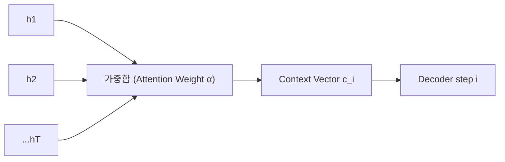
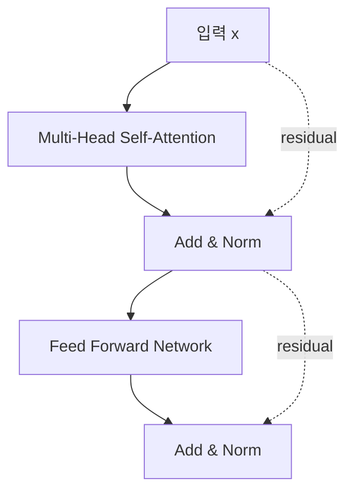

# LLM의 핵심, 트랜스포머와 어텐션 메커니즘

> [!abstract] 강의 개요
> [[NLPAgent_02_자연어처리의_기초와_RNN|2강]] ← **NLPAgent 3강** → [[NLPAgent_04_거대_언어_모델의_사전학습과_진화|4강]]
>
> Seq2Seq → Attention → Self-Attention/Transformer로 이어지는 언어모델 아키텍처의 진화를 따라간다. RNN의 정보 병목(single context vector)과 순차 계산이라는 두 가지 근본적 한계를, ==Attention Mechanism==과 ==Transformer==가 각각 어떻게 해결하는지 다루고, 마지막으로 autoregressive한 텍스트 생성과 ==Beam Search==를 살펴본다.

> [!summary]- 핵심 요약 (클릭해서 펼치기)
> | 단계 | 핵심 |
> | ---- | ---- |
> | **Seq2Seq** | Encoder가 전체 입력을 하나의 context vector로 압축 → Decoder가 그로부터 생성 |
> | **Attention** | Decoder가 매 step마다 모든 encoder hidden state를 참조해 가중합 |
> | **RNN의 한계** | 장기 의존성 어려움, 느린 순차 계산, 병렬화 불가 |
> | **Self-Attention** | 같은 문장 내 모든 단어 쌍의 관계를 동시에 계산 → 병렬화 가능, $O(1)$ path length |
> | **==Transformer==** | Multi-Head Self-Attention + Position-wise FFN + Positional Embedding + Residual/LayerNorm |
> | **생성** | Autoregressive하게 한 단어씩 예측, Greedy vs ==Beam Search== |

## 목차

1. [[#1. 언어모델 아키텍처의 진화]]
2. [[#2. Seq2Seq Model]]
3. [[#3. Attention Mechanism]]
4. [[#4. RNN의 한계와 Self-Attention]]
5. [[#5. Transformer 아키텍처]]
   - [[#5.1 전체 구조와 Positional Embedding]]
   - [[#5.2 Self-Attention (Scaled Dot-Product)]]
   - [[#5.3 Encoder — Multi-Head Attention·FFN·Residual]]
   - [[#5.4 Decoder]]
6. [[#6. Transformer로 텍스트 생성하기]]

---

## 1. 언어모델 아키텍처의 진화

> [!quote] 진화의 큰 흐름
> $$\text{Seq2Seq} \to \text{Seq2Seq with Attention} \to \text{Transformer}$$
> - **Seq2Seq**: Encoder-Decoder 구조의 모델 (source sequence → target sequence; 기계번역, 대화생성, 구문분석)
> - **Seq2Seq with Attention**: Decoding 과정에서의 ==Adaptive encoding==
> - **Transformer**: ==Self-Attention==과 ==Multi-head Attention==

---

## 2. Seq2Seq Model

> [!note] Encoder-Decoder 구조
> - **Encoder**: 단어 시퀀스 → 문장 표현(real-valued vector)
> - **Decoder**: 그 표현 → 단어 시퀀스 분포

> [!warning] 긴 문장에서의 문제
> Decoder는 오직 **마지막 hidden state**만으로 번역을 생성한다 — 첫 단어에 대한 정보까지 이 하나의 벡터에 압축되어야 한다. 50단어짜리 문장이라면 정보 손실이 불가피하다 (==information bottleneck==).

---

## 3. Attention Mechanism

> [!quote] 핵심 동기
> Decoder가 출력을 생성하는 매 단계마다, 입력 문장의 **어떤 부분에 "집중(attend)"할지**를 동적으로 결정하게 한다.

> [!note] 수식
> Decoder의 hidden state: $s_i = f(s_{i-1}, y_{i-1}, c_i)$
> Context vector는 encoder의 annotation $h_1,\dots,h_T$의 가중합:
> $$c_i = \sum_j \alpha_{ij} h_j$$
> **Alignment score**: $e_{ij} = \text{score}(s_{i-1}, h_j)$ — 입력 위치 $j$와 출력 위치 $i$가 얼마나 잘 맞는지 측정
> **정규화 (softmax)**: $\alpha_{ij}$는 target word $y_i$가 source word $x_j$에 align될 확률

---

## 4. RNN의 한계와 Self-Attention

> [!warning] RNN의 세 가지 근본적 한계
> 1. **장기 의존성 포착이 어려움** — Vanishing Gradient
> 2. **연산 비용이 큼** — 매우 긴 gradient path, 학습이 어려움
> 3. **병렬 처리 불가능** — 한 번에 하나의 입력만 처리 (순차적)

> [!success] Self-Attention
> 입력 문장 내에서 **각 단어가 다른 모든 단어에 미치는 영향을 계산**하고 그에 따라 가중치를 부여, 각 단어에 대한 새로운 표현을 얻는 기법. 같은 문장의 다른 요소들에 주목(attend)함으로써 ==context-sensitive== encoding을 만들어 텍스트에 대한 자동 이해를 향상시킨다.

> [!example] "it"이 무엇을 가리키는가
> "The animal didn't cross the street because **it** was too tired" — Self-Attention은 "it"의 표현을 만들 때 "animal"을 집중적으로 참조한다.

> [!example] RNN vs Transformer
> | | RNN | Transformer |
> | --- | --- | --- |
> | 핵심 연산 | Recurrent module | 고정 크기 행렬곱으로 구성된 Self-Attention |
> | 병렬화 | 순차적 특성 때문에 어려움 | **쉬움 → 빠름** |
> | 장거리 의존성 | 명시적 모델링 없음 | 연속 레이어 간 **완전 연결** |
> | Maximum Path Length | $O(n)$ ($n$=시퀀스 길이) | $O(1)$ |
> | 가변 길이 처리 | 적합 | (위치 임베딩 등으로) 처리 |

---

## 5. Transformer 아키텍처

### 5.1 전체 구조와 Positional Embedding

> [!note] 전체 흐름
> Input → Positional Embedding → **Encoder Layer × 6** (Self-Attention + Feed Forward Network) → **Decoder Layer × 6** (Self-Attention + Enc-Dec Attention + Feed Forward Network) → Linear → Softmax → Output

> [!warning] 왜 Positional Embedding이 필요한가
> Self-Attention 자체는 순서 정보가 없으므로, 토큰의 **상대적/절대적 위치 정보**를 명시적으로 주입해야 한다 (sin/cos 기반 함수, $pos$=위치, $i$=차원).
> $$e_i = \text{Token Embedding}(x_i) + \text{Positional Embedding}(p_i)$$

### 5.2 Self-Attention (Scaled Dot-Product)

> [!success] 핵심 메커니즘
> 시퀀스의 서로 다른 위치 간 관계를 고려해 표현을 계산:
> 1. 각 토큰에서 Query($Q$), Key($K$), Value($V$) 벡터 생성
> 2. $Q$와 모든 $K$의 ==Dot-product==로 유사도 계산
> 3. ==Softmax==로 정규화 → attention weight
> 4. weight로 $V$를 가중합 → 새 표현

> [!note] Multi-Head Attention
> "Scaled Dot-Product Attention"을 **서로 다른 linear projection으로 여러 번(head) 병렬 수행**한 뒤 결합 — 서로 다른 관점에서의 관계를 동시에 포착할 수 있다.
> 단일 head보다 multi-head(8개)에서 attention이 더 세밀하고 다양한 패턴을 포착하는 것을 시각화로 확인할 수 있다.

### 5.3 Encoder — Multi-Head Attention·FFN·Residual

> [!note] Encoder 구조
> $N=6$개의 동일한 레이어를 쌓음, 각 레이어는 2개의 sub-layer:
> 1. **Multi-Head Self-Attention** (Q=K=V, 모두 이전 레이어의 출력에서 옴)
> 2. **Position-wise Feed Forward Network** — 각 위치에 동일하게(레이어마다는 다른 파라미터) 적용되는 2개의 선형변환 + 중간 ReLU

> [!success] Residual Connection과 Layer Normalization
> $$\text{output} = \text{LayerNorm}(x + \text{Sublayer}(x))$$
> - **Residual(Skip) Connection**: 일부 레이어를 건너뛰는 shortcut → 깊은 네트워크의 학습 안정화
> - **Layer Normalization**: feature 차원에 대해 입력을 정규화

### 5.4 Decoder

> [!note] Encoder와 거의 동일하지만 3개의 sub-layer
> 1. **Masked Multi-Head Self-Attention** (미래 토큰을 보지 못하도록 마스킹)
> 2. **Encoder-Decoder Attention** — Query는 decoder의 이전 레이어에서, **Key와 Value는 encoder의 출력**에서
> 3. **Position-wise Feed Forward Network**

---

## 6. Transformer로 텍스트 생성하기

> [!note] 학습 — Cross Entropy Loss
> Transformer 학습은 본질적으로 **다음 토큰을 맞추는 분류(classification) 문제**로 볼 수 있다 — 각 위치 $w_i$에서 다음 단어 $w_{i+1}$을 예측하고 cross-entropy loss로 학습.

> [!success] 추론(Inference) — Autoregressive 생성
> 매 step마다 다음 단어를 예측하고, 그 예측을 문장 끝에 추가해 **다음 입력으로 재사용**한다 (GPT 계열의 핵심 동작 방식).
> $$\text{"근육이 커지기 위해서는"} \to \text{예측: "무엇보다"} \to \text{"근육이 커지기 위해서는 무엇보다"} \to \text{예측: "규칙적인"} \to \cdots$$

> [!example] Greedy Search vs Beam Search
> | 방법 | 설명 |
> | ---- | ---- |
> | **Greedy Search** | 매 step에서 확률이 가장 높은 단어만 선택 |
> | **==Beam Search==** | 매 step에서 가장 가능성 높은 `num_beams`개의 후보(hypotheses)를 유지하다가, 최종적으로 전체 확률이 가장 높은 경로를 선택 |

---

> [!success] 이번 강의 정리
> RNN 기반 모델에서 Transformer로의 발전은 **장거리 의존성 문제**와 **병렬 처리 필요성**이라는 두 동력에 의해 이루어졌다. Seq2Seq의 정보 병목은 Attention으로 해결되었고, RNN의 순차성은 Self-Attention으로 제거되었다. Transformer는 Multi-Head Attention + Feed-Forward Network + Positional Embedding으로 구성된 Encoder-Decoder 스택이며, 추론 시에는 Beam Search 등을 이용해 한 단어씩 자기회귀적으로 텍스트를 생성한다.

---

%%
관련 노트:
- [[NLPAgent_02_자연어처리의_기초와_RNN]] — 2강: RNN/LSTM (Transformer의 비교 대상)
- [[NLPAgent_04_거대_언어_모델의_사전학습과_진화]] — 4강: Transformer를 기반으로 한 대규모 사전학습 LLM
%%
