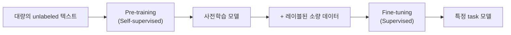

# 거대 언어 모델의 사전학습과 진화

> [!abstract] 강의 개요
> [[NLPAgent_03_트랜스포머와_어텐션_메커니즘|3강]] ← **NLPAgent 4강** → [[NLPAgent_05_LLM_에이전트|5강]]
>
> 정적인 Word Embedding에서 ==Pre-training/Fine-tuning== paradigm으로의 전환을 다루고, GPT-3가 보여준 ==In-Context Learning==의 의미를 짚는다. 핵심은 "다음 단어 예측"이라는 학습 목표와 "도움이 되고 진실하며 해롭지 않은" 모델이라는 목표 사이의 ==Misalignment==를 ==RLHF==가 어떻게 해결하는지, 그리고 InstructGPT → ChatGPT로 이어지는 흐름이다.

> [!summary]- 핵심 요약 (클릭해서 펼치기)
> | 단계 | 핵심 |
> | ---- | ---- |
> | Pre-trained Word Embedding | 정적 벡터, context 없음 — 다운스트림에서 context 학습 |
> | **Pre-training Whole Models** | BERT(encoder)/GPT(decoder)/BART,T5(encoder-decoder) — 입력 일부를 숨기고 복원하며 학습 |
> | **GPT-3** | 1750억 파라미터, ==In-Context Learning==(zero/few-shot, gradient update 없음) |
> | **Misalignment** | "다음 토큰 예측"으로 학습된 모델 ≠ "지시를 따르는" 모델 |
> | **3H 원칙** | Helpful, Honest, Harmless |
> | **SFT → RLHF** | 시범 데이터로 fine-tune → Reward Model 학습 → PPO로 정책 최적화 |
> | **InstructGPT → ChatGPT** | 동일 방법론을 대화 형식에 특화 |
> | **RAG** | 사전학습 지식의 한계(시점 고정)를 검색으로 보완 |

## 목차

1. [[#1. Pre-training의 진화]]
   - [[#1.1 Pre-trained Word Embedding의 한계]]
   - [[#1.2 Pre-training Whole Models — BERT·GPT·BART]]
   - [[#1.3 Pre-training/Fine-tuning Paradigm]]
2. [[#2. GPT-3와 In-Context Learning]]
3. [[#3. Misalignment 문제와 3H 원칙]]
4. [[#4. SFT와 RLHF]]
   - [[#4.1 Supervised Fine-Tuning (SFT)]]
   - [[#4.2 Reinforcement Learning from Human Feedback (RLHF)]]
   - [[#4.3 RLHF가 SFT보다 나은 이유]]
5. [[#5. InstructGPT에서 ChatGPT로]]
6. [[#6. Retrieval-Augmented Generation (RAG)]]

---

## 1. Pre-training의 진화

### 1.1 Pre-trained Word Embedding의 한계

> [!warning] Context가 없는 정적 임베딩
> 사전학습된 word embedding으로 시작해, LSTM/Transformer를 task 학습 중에 context를 반영하도록 학습하는 방식. 문제점:
> - downstream task의 학습 데이터가 언어의 모든 contextual 측면을 가르치기에 **충분해야 함**
> - 네트워크의 대부분 파라미터가 **무작위로 초기화**됨 (e.g., "movie"는 어떤 문장에 나타나든 같은 embedding을 가짐)

### 1.2 Pre-training Whole Models — BERT·GPT·BART

> [!success] 현대 NLP의 표준
> NLP 네트워크의 거의 모든 파라미터가 **사전학습으로 초기화**된다. Pretraining은 입력의 일부를 가리고, 모델이 그 부분을 **복원(reconstruct)**하도록 학습 — 이는 강력한 언어 표현·파라미터 초기값·샘플링 가능한 확률분포를 만드는 데 매우 효과적이다.

> [!example] 아키텍처에 따른 세 가지 Pre-training 방식
> | 아키텍처 | 대표 모델 | 특징 |
> | -------- | --------- | ---- |
> | **Decoder** | GPT | 생성에 적합, 미래 단어는 조건화 불가 |
> | **Encoder** | BERT | 양방향 context — 미래 단어도 조건화 가능 |
> | **Encoder-Decoder** | BART, T5 | 인코더·디코더 각각의 장점 결합 |

> [!quote] 사전학습 모델이 배우는 것들 (입력 복원으로부터)
> Trivia(예: "중앙대학교는 서울의 ___에 있다"), 문법(syntax), 공지시(coreference), 어휘 의미론(lexical semantics), 감성(sentiment), 약간의 추론(reasoning), 약간의 산술(arithmetic, 단 피보나치 수열 자체를 외운 것은 아님) 등 — **언어의 통계적 속성에 대한 매우 다양한 지식**을 학습한다는 증거가 늘고 있다.

> [!note] Pre-training through Language Modeling
> $$p_\theta(w_t \mid w_{1:t-1})$$
> 대량의 텍스트로 언어모델링을 학습한 뒤 파라미터를 저장 (Dai et al., Semi-supervised Sequence Learning, NeurIPS 2015).

### 1.3 Pre-training/Fine-tuning Paradigm

> [!success] 2단계 패러다임
> 1. **Pretrain** (language modeling) — 대량의 텍스트로 **일반적인 것**을 학습
> 2. **Finetune** (목표 task) — 적은 레이블로 **특정 task에 적응**

> [!example] BERT의 Pre-training 설정
> - 데이터셋: BooksCorpus(8억 단어) + Wikipedia(25억 단어)
> - 목표: (1) Masked word 예측 (2) Next Sentence Prediction
> - Fine-tuning: 사전학습된 BERT + **출력 레이어 하나만 추가**해서 다운스트림 task(예: 스팸 분류) 학습

---

## 2. GPT-3와 In-Context Learning

> [!note] "Large" Language Model 사전학습
> 웹의 방대한 데이터로 다음 단어를 예측하며 매우 큰 모델을 사전학습 — 마치 세상의 모든 문서를 읽는 것과 같으며, 이 과정에서 다양한 "상식"과 "사전 지식"을 습득한다.

> [!example] GPT-3 스펙 (2020년 6월 발표)
> - 1750억 파라미터 Transformer (96 layers, hidden dim 12k, 96 heads)
> - Dense attention과 sparse attention 함께 사용
> - 학습 데이터: 3000억 토큰 (CommonCrawl 60% + WebText2 22% + Books 16% + Wikipedia 3%)
> - 모델 자체는 비공개, 상업 API로만 제공

> [!success] In-Context Learning
> Few-shot learning의 한 형태 — **gradient update 없이** prompt 안의 예시만으로 새로운 task를 수행:
> - **Zero-shot**: 예시 없이 instruction만으로 수행
> - **Few-shot**: prompt에 몇 개의 입출력 예시를 포함

> [!tip] GPT-3 In-Context Learning의 장점
> - **범용성**: 하나의 모델로 요약·코딩·번역·감성분석 등 다양한 문제 해결
> - 대량의 사람이 레이블링한 fine-tuning 데이터 불필요
> - 데이터셋이 부족해 풀 수 없던 새로운 문제들을 해결 가능하게 함

---

## 3. Misalignment 문제와 3H 원칙

> [!warning] GPT-3의 한계
> GPT-3는 다음 단어/문장은 잘 생성하지만, **주어진 instruction에 맞게 잘 생성하지는 못한다**.

> [!quote] The Three H's of Model Desiderata (Ouyang et al.)
> 1. **Helpful**: 사용자의 task 해결을 도와야 함
> 2. **Honest**: 정확한 정보를 제공해야 함
> 3. **Harmless**: 사람이나 환경에 신체적·심리적·사회적 해를 끼치지 않아야 함

> [!warning] Misalignment란
> 학습 목표가 우리가 원하는 desiderata를 포착하지 못할 때 발생:
> $$\text{Training: 다음 토큰 예측} \quad \neq \quad \text{Evaluation: instruction을 따르는 것}$$

> [!success] 해결책: Human Feedback으로부터 직접 학습
> Misalignment의 해법은 **사람의 피드백으로부터 직접 학습**하는 것.

---

## 4. SFT와 RLHF

> [!note] Instruction을 따르도록 학습하는 두 단계
> 1. **Supervised Fine-Tuning (SFT)**: 사람이 작성한 시범(demonstration)으로 학습
> 2. **Reinforcement Learning from Human Feedback (RLHF)**: Agent=언어모델, Environment=사람 사용자, State=사람의 입력, Action=모델 출력, Policy=입력에 대한 모델의 생성, Reward=사람의 피드백

### 4.1 Supervised Fine-Tuning (SFT)

> [!example] 절차
> 1. Prompt를 샘플링
> 2. labeler가 원하는 출력 행동을 시범(demonstrate)
> 3. 그 시범으로 GPT-3를 fine-tune

### 4.2 Reinforcement Learning from Human Feedback (RLHF)

> [!success] 2단계 절차
> **① 비교 데이터 수집 + Reward Model 학습**
> 1. Prompt와 (여러) 모델 출력을 수집
> 2. 사람이 출력들을 순위(rank)로 매김
> 3. 그 순위로 Reward Model 학습
>
> **② 강화학습으로 정책 최적화 (PPO)**
> 1. 새 prompt 샘플링 → 2. 출력 생성 → 3. Reward Model로 보상 계산 → 4. 그 보상으로 모델 업데이트 → 반복
>
> > [!note] PPO 학습의 손실 함수 구성
> > - PPO 모델 출력이 SFT 모델로부터 너무 벗어나지 않도록 하는 항
> > - 사전학습 데이터에 대한 보조적인(auxiliary) language modeling objective

### 4.3 RLHF가 SFT보다 나은 이유

> [!tip] 4가지 이유
> | 이유 | 설명 |
> | ---- | ---- |
> | **더 미묘한 학습 신호** | AR loss는 정답 "great" 대신 "amazing"이든 "sandwiches"든 동일하게 페널티 — Reward Model은 유사한 품질의 시퀀스에 유사한 보상을 줌 |
> | **모델 자신의 생성물을 평가** | SFT는 완전히 offline(모델 생성물 사용 안 함); RM은 모델이 실제로 생성한 completion을 "비평"해 더 맞춤화된 피드백 제공 |
> | **선호(preference)를 직접 포착** | 선호는 순위를 유도하고, 보상 신호는 이를 자연스럽게 포착 (더 좋은 시퀀스 = 더 높은 보상); SFT는 "최선의 예시"만 따라하므로 선호를 명시적으로 포착하지 못함 |
> | **데이터 효율적** | SFT는 사람이 직접 target을 작성해야 하지만, RM은 한 번 학습되면 어떤 출력이든 점수를 매길 수 있음 (e.g., step 1: 13k prompt, step 3: 31k prompt) |

> [!success] InstructGPT 결과
> GPT-3 + SFT + RLHF(=InstructGPT)가 **가장 좋은 human preference 결과**를 보임 — instruction을 더 정확히 따르고(Helpful), 환각(hallucination)이 더 적음(Honest).

---

## 5. InstructGPT에서 ChatGPT로

> [!note] ChatGPT = InstructGPT와 거의 동일한 방법론, 데이터 수집만 다름
> - **SFT 데이터**: AI trainer가 사용자와 AI assistant 양쪽 역할을 모두 대화로 작성, 이를 InstructGPT 데이터셋(대화 형식으로 변환)과 혼합
> - **Reward Model 데이터**: 챗봇과의 실제 대화에서 모델이 작성한 메시지 하나를 무작위 선택 → 여러 대안 completion을 샘플링 → AI trainer가 순위 매김

> [!warning] Naïve ChatGPT의 한계
> 사전학습 시점 이후의 **최신 정보를 알지 못함** (knowledge cutoff).

---

## 6. Retrieval-Augmented Generation (RAG)

> [!success] 해결책
> 답변을 생성하기 전에, 검색 엔진 등으로부터 **최신의 외부 정보를 모델에 제공**해 더 정확한 응답을 만든다.

> [!note] Base Model vs Instruct Model
> | | Base Model | Instruct Model |
> | --- | --- | --- |
> | 정의 | 초기 사전학습 결과 | Base Model을 사용자 의도에 맞게 fine-tune |
> | 특기 | 텍스트 완성(completion) | 질문 답변·instruction 수행에 최적화 |

> [!example] NLP 학습 패러다임의 흐름
> $$\text{Supervised Learning(~2019)} \to \text{Pre-training+Fine-tuning(2019~)} \to \text{Pre-training+Few/Zero-shot/PEFT(2020~)} \to \text{Pre-training+Instruction Tuning+RLHF(2022~)}$$
> 각 단계는 **모델 크기↑, 사전학습 데이터 크기↑**와 함께 발전 (BERT/GPT/BART → GPT-3 → GPT-3.5/GPT-4(ChatGPT, InstructGPT)).

---

> [!success] 이번 강의 정리
> 정적 Word Embedding에서 BERT·GPT 같은 **Pre-training Whole Model**로의 전환이 현대 NLP의 표준 ==Pre-training/Fine-tuning Paradigm==을 만들었다. 이 접근의 스케일업이 GPT-3의 ==In-Context Learning==을 낳았지만, "다음 단어 예측"과 "지시를 따르는 것" 사이의 **Misalignment**가 드러났다. InstructGPT는 **SFT + RLHF**로 이를 해결했고, 이 방법론이 대화 형식에 특화되어 ChatGPT가 되었다. 마지막으로, 사전학습 지식의 시점 고정 문제는 **RAG**로 보완된다.

---

%%
관련 노트:
- [[NLPAgent_03_트랜스포머와_어텐션_메커니즘]] — 3강: 이 모든 LLM의 기반이 되는 Transformer 아키텍처
- [[NLPAgent_05_LLM_에이전트]] — 5강: RLHF로 정렬된 LLM을 Agent로 확장
%%
