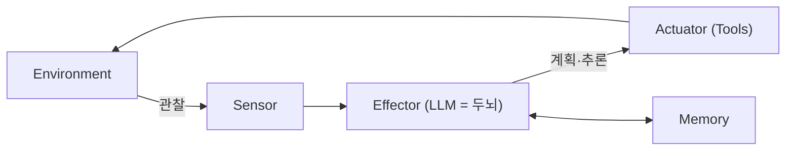
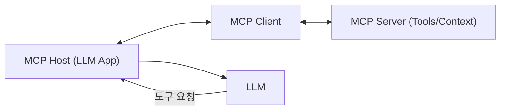
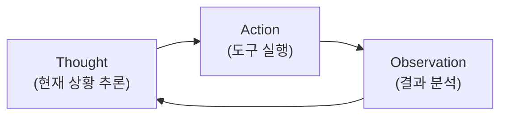
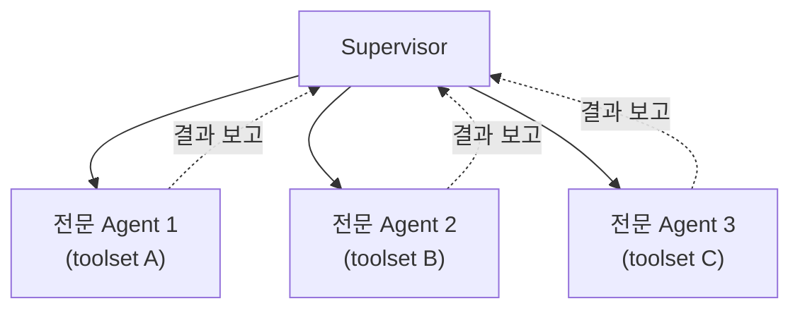

# 스스로 계획하고 실행하는 AI, LLM 에이전트

> [!abstract] 강의 개요
> [[NLPAgent_04_거대_언어_모델의_사전학습과_진화|4강]] ← **NLPAgent 5강** → [[NLPAgent_06_AI_하드웨어와_GPU|6강]]
>
> LLM 단독으로는 곱셈 같은 기본 연산조차 실수하기 쉽다 — Anthropic이 말하는 ==Augmented LLM==(외부 시스템으로 강화된 LLM)이 바로 ==LLM Agent==다. Agent를 구성하는 4가지 요소(Memory, Tool, Planning, Multi-Agent)를 차례로 다루고, 추론과 행동을 결합하는 ==ReAct==, 실패로부터 배우는 ==Reflexion==까지 살펴본다.

> [!summary]- 핵심 요약 (클릭해서 펼치기)
> | 구성요소 | 핵심 |
> | -------- | ---- |
> | **정의** | Agent = Environment + Sensor + Actuator + Effector(LLM이 brain 역할) |
> | **Short-term Memory** | Context window에 대화 기록을 담음 (또는 LLM으로 요약) |
> | **Long-term Memory** | 외부 Vector DB + ==RAG==로 과거 정보 검색 |
> | **Tool Use** | Function Calling으로 외부 API/코드 실행 — Toolformer가 학습 방법 제시 |
> | **==MCP==** | Tool 연동을 표준화 (Host-Client-Server) |
> | **Planning/Reasoning** | 복잡한 task를 실행 가능한 단계로 분해 |
> | **==ReAct==** | Thought → Action → Observation 사이클 |
> | **Reflexion** | Actor-Evaluator-Self-reflection으로 실패에서 학습 |
> | **Multi-Agent** | Supervisor가 전문화된 Agent들에게 task를 위임 |

## 목차

1. [[#1. LLM Agent란 무엇인가]]
2. [[#2. Memory]]
   - [[#2.1 Short-term Memory]]
   - [[#2.2 Long-term Memory]]
3. [[#3. Tool Use와 MCP]]
   - [[#3.1 Tool Use와 Function Calling]]
   - [[#3.2 Toolformer]]
   - [[#3.3 Model Context Protocol (MCP)]]
4. [[#4. Planning과 Reasoning]]
   - [[#4.1 ReAct — Reason and Act]]
   - [[#4.2 Reflexion]]
5. [[#5. Multi-Agent Collaboration]]

---

## 1. LLM Agent란 무엇인가

> [!warning] LLM 단독의 한계
> LLM은 곱셈·나눗셈 같은 기본적인 수학에서도 실패하는 경우가 많다.

> [!quote] The Augmented LLM (Anthropic)
> 외부 시스템(도구·메모리·계획 등)을 통해 LLM의 능력을 강화한 것 — 예를 들어 수학 문제를 만나면 LLM이 **적절한 도구(계산기)를 사용하기로 결정**할 수 있다.

> [!note] 고전적인 Agent 프레임워크로 일반화
> | 구성요소 | 정의 |
> | -------- | ---- |
> | **Environment** | Agent가 상호작용하는 세계 |
> | **Sensor** | 환경을 관찰하는 수단 |
> | **Actuator** | 환경과 상호작용하는 도구 |
> | **Effector** | 관찰을 행동으로 바꾸는 "두뇌"/규칙 — **여기서는 LLM** |

> [!success] Planning 행동
> 추론(reasoning) 능력을 이용해 LLM Agent는 필요한 행동들을 **계획(plan)**한다 — 상황을 이해(LLM)하고, 다음 단계를 계획(planning)하고, 행동을 취하고(tools), 취한 행동을 기록(memory)하는 통합 과정.

> [!info] Autonomy의 정도
> 시스템에 따라 LLM Agent는 다양한 수준의 자율성(autonomy)을 가질 수 있다 (고정된 순서로 도구를 쓰는 것부터, 완전히 자율적으로 도구를 선택하는 것까지).

---

## 2. Memory

### 2.1 Short-term Memory

> [!warning] LLM은 "잊어버리는" 시스템
> 질문 후 후속 질문을 하면, 모델은 **이전 질문을 기억하지 못한다** — 정확히 말하면, 애초에 어떤 memorization도 수행하지 않는다.

> [!success] 구현: Context Window
> 모델의 context window에 전체 대화 기록을 담는 방식 — 사실은 "기억"하는 것이 아니라, **매번 대화 내용을 다시 알려주는** 것이다. context window가 작거나 대화가 길면, **다른 LLM으로 지금까지의 대화를 요약**해서 사용한다.

### 2.2 Long-term Memory

> [!note] 왜 필요한가
> Agent는 가장 최근 행동뿐 아니라 수십~수백 단계에 걸친 행동들을 추적해야 할 수 있다.

> [!success] 구현: 외부 Vector Database + RAG
> 1. 과거의 모든 상호작용·행동·대화를 **embedding으로 변환**해 외부 vector DB에 저장
> 2. 새 prompt가 들어오면 그것도 embedding으로 변환
> 3. DB의 embedding들과 비교해 **가장 관련성 높은 정보**를 검색
> 4. 이 방식이 바로 ==Retrieval-Augmented Generation (RAG)==

> [!example] Memory의 종류
> 심리학의 다양한 memory 유형 중, *Cognitive Architectures for Language Agents* 논문은 4가지를 LLM Agent에 결합한다. 예: ==Semantic memory==(세상에 대한 사실)는 ==Working memory==(현재·최근 상황)와는 **다른 저장소**에 보관될 수 있다.

---

## 3. Tool Use와 MCP

### 3.1 Tool Use와 Function Calling

> [!note] Tool의 두 가지 용도
> - **정보 검색**: 최신 정보를 가져오는 것 (fetching data)
> - **행동 수행**: 미팅 예약, 음식 주문 같은 실제 action

> [!success] Function Calling
> LLM이 사용할 수 있는 커스텀 함수(예: 곱셈 함수)를 생성 — 적절히, 충분히 prompt되면 대부분의 현재 LLM이 tool-use 능력을 가진다.

> [!example] 도구 사용 방식의 두 극단
> | 방식 | 설명 |
> | ---- | ---- |
> | **고정된(Fixed) 순서** | Agentic framework가 정해진 순서로 도구 사용 |
> | **자율적(Autonomous) 선택** | LLM이 **어떤 도구를, 언제** 쓸지 스스로 결정. 중간 단계의 출력이 다시 LLM에 입력되어 처리를 계속함 |

### 3.2 Toolformer

> [!note] 핵심 아이디어
> 어떤 API를 어떻게 호출할지 **결정하도록 학습된 모델**.

> [!example] 동작 방식
> `[`와 `]` 토큰으로 도구 호출의 시작·끝을 표시. LLM이 `→` 토큰까지 생성하면 생성을 멈추고, 그 시점에 도구가 호출되어 출력이 지금까지 생성된 토큰에 추가된다. `]` 기호가 나오면 필요시 계속 생성할 수 있다.

> [!tip] 학습 데이터 생성 방법
> 각 도구마다 few-shot prompt를 수동으로 작성해, 그 도구를 사용하는 출력을 샘플링 — 이렇게 **도구 사용이 포함된 데이터셋**을 신중하게 생성해 모델을 학습시킨다.

### 3.3 Model Context Protocol (MCP)

> [!warning] 많은 API를 다룰 때의 어려움
> 각 도구마다 다음이 필요해 번거로움이 커진다:
> - 수동으로 추적하고 LLM에 전달
> - 수동으로 설명 작성 (JSON schema 포함)
> - API가 바뀔 때마다 수동으로 업데이트

> [!success] MCP (Anthropic 개발) — Tool 연동의 표준화
> | 구성요소 | 역할 |
> | -------- | ---- |
> | **MCP Host** | 연결을 관리하는 LLM 애플리케이션 (예: Cursor) |
> | **MCP Client** | MCP 서버와 1:1 연결을 유지 |
> | **MCP Server** | LLM에게 context·tool·capability를 제공 |

> [!example] 동작 예시 — "최근 커밋 5개 요약"
> 1. MCP Host(+Client)가 MCP Server에 **사용 가능한 도구**를 질의
> 2. LLM이 정보를 받아 도구 사용을 결정 → Host를 통해 MCP Server에 요청 전송
> 3. 결과(사용된 도구 포함)를 수신
> 4. LLM이 결과를 받아 사용자에게 답변을 구성

---

## 4. Planning과 Reasoning

> [!quote] Planning이 필요한 이유
> Tool은 보통 JSON 형식의 요청으로 호출된다. 그런데 **어떤 도구를, 언제** 쓸지는 어떻게 결정하는가? 이것이 ==Planning==의 역할 — 주어진 task를 실행 가능한 단계들로 분해하는 것.

> [!tip] Plan은 반복적으로 개선된다
> Plan은 모델이 과거 행동을 반복적으로 반성(reflect)하고 필요시 현재 계획을 업데이트하게 한다.

> [!note] Reasoning이 Planning의 기반
> 실행 가능한 단계를 계획하려면 복잡한 추론 행동이 선행되어야 한다. "Reasoning" LLM은 답하기 전에 "생각(think)"하는 경향이 있는 모델.

> [!warning] Reasoning ≠ Planning
> Reasoning 능력이 있다고 해서 자동으로 실행 가능한 단계를 계획할 수 있는 것은 아니다. **Chain-of-Thought**는 순수하게 reasoning에만 집중한다.

### 4.1 ReAct — Reason and Act

> [!success] ReAct: Reasoning과 Action을 결합한 최초의 기법 중 하나
> 신중한 prompt engineering을 통해 동작. ReAct prompt는 3단계를 기술한다:
> 1. **Thought** — 현재 상황에 대한 추론 단계
> 2. **Action** — 실행할 행동(도구 등) 집합
> 3. **Observation** — 행동의 결과에 대한 추론 단계

> [!example] ReAct 사이클
> 이 prompt(system prompt로 사용 가능)를 이용해 LLM은 **Thought → Action → Observation**의 cycle을 반복하도록 행동이 유도된다.

### 4.2 Reflexion

> [!warning] ReAct에 없는 것: 실패로부터 배우기
> ReAct를 쓰는 LLM도 모든 task를 완벽히 수행하지는 못한다 — 실패는 과정의 일부이며, 중요한 것은 그 과정을 **반성(reflect)**할 수 있는가이다.

> [!success] Reflexion — Verbal Reinforcement로 실패에서 학습
> 3가지 LLM 역할로 구성:
> | 역할 | 기능 |
> | ---- | ---- |
> | **Actor** | 상태 관찰을 바탕으로 행동을 선택·실행 (CoT나 ReAct 사용 가능) |
> | **Evaluator** | Actor의 출력을 점수화(score) |
> | **Self-reflection** | Actor의 행동과 Evaluator의 점수를 반성 |
>
> Memory 모듈이 추가되어 행동과 self-reflection을 추적한다.

---

## 5. Multi-Agent Collaboration

> [!note] Multi-Agent 프레임워크
> 각자 도구·메모리·계획 능력을 가진 **여러 Agent**가 서로, 그리고 환경과 상호작용하는 구조.

> [!example] 전형적인 구성
> - 전문화된(specialized) Agent들, 각자 고유한 toolset 보유
> - **Supervisor**가 Agent 간 통신을 관리하고 특정 task를 전문 Agent에게 할당
> - Agent마다 도구뿐 아니라 **메모리 시스템도 다를 수 있음**

> [!tip] Multi-Agent 아키텍처의 두 핵심 요소
> | 요소 | 질문 |
> | ---- | ---- |
> | **Agent Initialization** | 개별(전문화된) Agent를 어떻게 생성하는가? |
> | **Agent Orchestration** | 모든 Agent를 어떻게 조율(coordinate)하는가? |

---

> [!success] 이번 강의 정리
> **LLM Agent**는 고전적 Agent 프레임워크에서 LLM이 "두뇌(Effector)" 역할을 하는 ==Augmented LLM==이다 — 외부 ==Tool==(Actuator), ==Memory== 모듈, ==Planning== 능력을 결합해 복잡한 task를 자율적으로 해결한다. **Short-term Memory**는 context window로, **Long-term Memory**는 vector DB + RAG로 구현된다. **ReAct**는 Thought-Action-Observation 사이클로 추론과 행동을 결합하고, **Reflexion**은 실패로부터의 학습을 더하며, **Multi-Agent** 구조는 Supervisor 아래 전문화된 Agent들의 협업으로 확장한다.

---

%%
관련 노트:
- [[NLPAgent_04_거대_언어_모델의_사전학습과_진화]] — 4강: RLHF로 정렬된 LLM이 Agent의 "두뇌"가 됨
- [[NLPAgent_06_AI_하드웨어와_GPU]] — 6강: 이 모든 LLM/Agent를 구동하는 하드웨어 기반
%%
