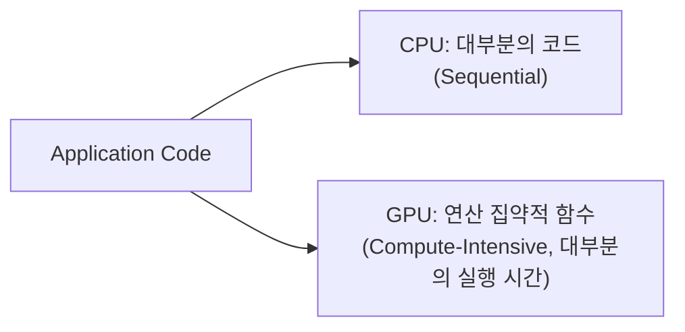

# LLM을 움직이는 힘, AI 하드웨어와 GPU

> [!abstract] 강의 개요
> [[NLPAgent_05_LLM_에이전트|5강]] ← **NLPAgent 6강 (시리즈 마지막)**
>
> 운영체제·CPU·GPU 내부 구조에서 시작해, **왜 딥러닝은 GPU에 적합한가**(Latency vs Throughput)를 짚는다. Floating-Point 표현과 양자화(Quantization)가 VRAM 사용량에 미치는 영향을 다루고, 마지막으로 ==LLM 모델 크기·정밀도·context 길이로부터 VRAM 요구량을 추정하는 실전 가이드==로 마무리한다.

> [!summary]- 핵심 요약 (클릭해서 펼치기)
> | 주제 | 핵심 |
> | ---- | ---- |
> | OS | 하드웨어-소프트웨어 사이의 계층, 자원·프로세스 관리 |
> | **CPU** | 적은 코어, **Latency 최소화**, 순차 처리에 최적 |
> | **GPU** | 수천 개 코어, **Throughput 최대화**, 병렬 처리에 최적 |
> | Heterogeneous Programming | CPU(host)가 연산 집약적 부분만 GPU(accelerator)에 위임 |
> | Floating-Point | Exponent(범위) + Fraction(정밀도) — FP32→FP16→INT8→INT4로 양자화 시 VRAM 절감 |
> | **VRAM 소비 요소** | Model Weights, Optimizer States, Activations/Gradients, ==KV Cache== |
> | Full Fine-tuning vs PEFT | Full FT는 weights의 4배 이상 VRAM 필요 → ==LoRA/QLoRA==로 완화 |

## 목차

1. [[#1. 컴퓨터 내부와 운영체제]]
2. [[#2. CPU와 GPU]]
   - [[#2.1 CPU — Latency 최적화]]
   - [[#2.2 GPU — Throughput 최적화]]
   - [[#2.3 Heterogeneous Programming]]
3. [[#3. 숫자 표현과 양자화]]
4. [[#4. LLM 모델 크기와 GPU VRAM 사이징 가이드]]

---

## 1. 컴퓨터 내부와 운영체제

> [!note] Operating System (OS)
> 하드웨어와 소프트웨어 사이의 계층. 핵심 역할: 자원 관리, 프로세스 관리, 디바이스 I/O 지원, 시스템 서비스 제공, 사용자 인터페이스, 보안·권한 관리.

> [!note] Kernel과 Shell
> **Kernel**은 OS의 핵심부로 여러 프로그램이 하드웨어 자원을 공유하며 병렬로 실행되게 한다. **Shell**(CLI 또는 GUI)은 사용자가 kernel과 상호작용하는 인터페이스 — kernel을 씨앗의 "핵"으로, shell을 그 "껍질"로 보는 비유. Kernel은 디바이스 드라이버와 함께 하드웨어와 상호작용한다.

> [!example] 4대 프로세서 종류
> CPU(Central Processing Unit), GPU(Graphics Processing Unit), FPGA(Field Programmable Gate Array), ASIC(Application Specific Integrated Circuit)

---

## 2. CPU와 GPU

### 2.1 CPU — Latency 최적화

> [!note] CPU란
> 컴퓨터 프로그램의 명령을 시작·실행하는 "두뇌". 명령어를 **Fetch → Decode → Execute** 순서로 순차 처리(serial processing).

> [!note] Physical Core vs Logical Core
> Physical core는 CPU 내 하드웨어 구현체, Logical core는 하나의 physical core가 동시에 여러 thread를 실행하는 능력(Intel의 hyper-threading). 예: physical core 2개 × logical core 2개 = 총 4개 logical core, 4 thread 동시 실행 — 단, logical core는 physical core만큼 완전한 병렬성을 내지 못한다.

> [!success] CPU의 설계 철학
> $$\text{Latency} = \text{하나의 연산을 시작부터 끝까지 수행하는 시간}$$
> CPU는 **단일 연산의 latency를 최소화**하도록 설계 — 코어 수는 적지만 그 코어들이 매우 빠르게 동작.

### 2.2 GPU — Throughput 최적화

> [!note] GPU란
> 원래 그래픽 렌더링 가속을 위한 하드웨어. GPU computing은 GPU를 범용 과학·공학 연산을 가속하는 co-processor로 사용하는 것 — 여러 GPU 코어에서 명령을 **병렬로** 실행해 처리를 가속.

> [!example] GPU 코어의 특징
> - 각 코어는 CPU보다 훨씬 단순하고, 단독으로는 CPU만큼 빠르지 않음
> - 차이를 만드는 것은 **코어의 수** — CPU 1~6개 대비 GPU는 수백~수천 개
> - 연산은 병렬적·비동기적으로 수행
> - 여전히 데이터 관리·전달은 CPU에 의존
> - 병렬 처리를 활용하려면 **프로그램을 다시 작성**해야 함

> [!example] CPU vs GPU 비교
> | | CPU | GPU |
> | --- | --- | --- |
> | 코어 수 | 적음 | 많음 |
> | 설계 목표 | Latency 최소화 | ==Throughput 최대화== |
> | 적합한 작업 | 순차 처리 | 병렬 처리 |
> | 데이터 유형 | 다양한 유형 | 단일 유형 |
> | 동시 연산 수 | 소수 | 수천 |

> [!tip] CPU·GPU 각각의 강점/약점 (NVIDIA)
> | | CPU | GPU |
> | --- | --- | --- |
> | 강점 | 큰 메인 메모리, 빠른 clock speed, 큰 캐시로 latency 최적화 | 높은 메모리 대역폭, 훨씬 많은 연산 자원, 병렬성으로 latency 감내, 높은 throughput·performance/watt |
> | 약점 | 낮은 메모리 대역폭, cache miss 비용이 큼, 낮은 performance/watt | 상대적으로 적은 메모리 용량, 낮은 per-thread 성능 |

> [!warning] Accelerator Node의 메모리 구조
> CPU와 GPU는 **서로 다른 메모리**를 가지며(CPU: 크고 느림, GPU: 작고 빠름), ==PCIe==를 통해 통신한다 — 데이터는 이 메모리들 사이에서 PCIe로 복사되어야 하고, PCIe 대역폭은 양쪽 메모리보다 훨씬 낮다 (최근에는 NVLink 같은 기술이 이를 보완).

### 2.3 Heterogeneous Programming

> [!success] CPU(Host) + GPU(Accelerator) 협업 모델
> 애플리케이션 코드의 **대부분(%)은 CPU**(host)에서 순차 실행되고, 시간의 대부분을 차지하는 **연산 집약적(compute-intensive) 함수만 GPU**(accelerator)로 오프로딩되어 병렬 실행된다.

---

## 3. 숫자 표현과 양자화

> [!tip] 핵심 원리: Bit-width가 작을수록 에너지가 적게 든다
> $$\text{Bit-Width} \downarrow \quad\Rightarrow\quad \text{Energy} \downarrow$$

> [!example] 정수 표현
> | 표현 | $n$-bit 범위 |
> | ---- | ------------ |
> | Unsigned Integer | $[0,\ 2^n-1]$ |
> | Signed (Sign-Magnitude) | $[-(2^{n-1}-1),\ 2^{n-1}-1]$ (0이 두 가지로 표현됨) |
> | Signed (Two's Complement) | $[-2^{n-1},\ 2^{n-1}-1]$ (0이 하나로만 표현됨) |

> [!note] Floating-Point Number (IEEE 754)
> $$\text{Sign} + \text{Exponent} + \text{Fraction(Mantissa)}$$
> - **Exponent Width** → 표현 가능한 **범위(Range)** 결정
> - **Fraction Width** → 표현의 **정밀도(Precision)** 결정

---

## 4. LLM 모델 크기와 GPU VRAM 사이징 가이드

> [!warning] VRAM이 핵심 bottleneck인 이유
> LLM을 (추론이든 학습이든) 구동하려면 필요한 모든 데이터가 GPU의 고속 ==VRAM==에 올라가야 한다. VRAM이 부족하면 모델이 실행되지 않거나, 더 느린 system RAM으로 데이터를 "offload"해야 해서 속도가 크게 저하된다.

> [!note] VRAM을 소비하는 4가지 요소
> | 요소 | 설명 |
> | ---- | ---- |
> | **Model Weights** | 가장 큰 단일 구성요소 |
> | **Optimizer States** | (Full fine-tuning 시) AdamW 등에서 weight의 2배 이상 |
> | **Activations & Gradients** | forward/backward pass의 중간 계산값 |
> | **==KV Cache==** | (추론에서 핵심) 시퀀스 상태 저장, **context 길이·batch size에 비례해 선형 증가** |

> [!example] Precision별 파라미터당 메모리 (Llama 3 8B 예시)
> | Precision | 파라미터당 bytes | 8B 모델 메모리 |
> | --------- | ----------------- | -------------- |
> | **FP32** (Full Precision) | 4 bytes | ≈ 32GB |
> | **FP16/BF16** (Half Precision, 현재 표준) | 2 bytes | ≈ 16GB |
> | **INT8** (Quantized) | 1 byte | ≈ 8GB |
> | **INT4** (QLoRA/GPT-Q, 강하게 양자화) | 0.5 bytes | ≈ 4GB (+1~2GB 오버헤드) |

> [!example] 16GB GPU(예: Colab T4/L4, RTX 4060Ti) 시나리오
> | 작업 | 가능 여부 |
> | ---- | --------- |
> | FP16 추론 (8B 모델) | 가능 (≈16GB, 단 KV Cache를 위한 여유가 거의 없음) |
> | FP16 Full Fine-Tuning | **불가능** (weights 16GB + optimizer 32GB+ + activations > 16GB) |
> | PEFT (LoRA/QLoRA) | 가능 (4-bit 로딩 시 ≈5~6GB, fine-tuning용 여유 충분) |
> | 긴 context (32k 토큰) FP16 추론 | KV Cache 때문에 ==OOM(Out of Memory)== 위험 |

> [!warning] Full Fine-Tuning의 VRAM 폭증
> Full Fine-Tuning은 추론에 필요한 모든 것 + weight 업데이트 계산용 데이터까지 필요:
> $$\text{Full-Tuning VRAM} \approx \underbrace{16\text{GB}}_{\text{Weights}} + \underbrace{16\text{GB}}_{\text{Gradients}} + \underbrace{32\text{GB}}_{\text{Optimizer States (AdamW, 2×)}} + \underbrace{\alpha}_{\text{Activations}} \approx 64\text{GB+}$$
> ($\alpha$는 sequence 길이에 따라 증가) — 이것이 ==LoRA/QLoRA== 같은 PEFT 기법이 필요한 이유다.

---

> [!success] 이번 강의 정리
> CPU는 적은 강력한 코어로 **latency**를 최소화해 OS·순차 로직 실행에 적합하고, GPU는 수천 개의 단순한 코어로 **throughput**을 최대화해 딥러닝의 행렬 연산에 핵심적이다. Heterogeneous Programming에서 CPU(host)는 메인 애플리케이션을 실행하고 연산 집약적 부분만 GPU(accelerator)에 위임한다. LLM은 Floating-Point 연산에 의존하므로 **낮은 정밀도(FP16, INT8 등)**를 쓰면 VRAM·에너지·시간을 절약할 수 있다. GPU **VRAM**(Weights, Optimizer States, KV Cache)이 LLM 구동의 핵심 bottleneck이며, 이 제약 때문에 Llama 3 8B 같은 모델의 Full Fine-tuning(64GB+ 필요)은 16GB GPU에서 불가능하고 **양자화(QLoRA 등)**가 필요해진다.

---

%%
관련 노트:
- [[NLPAgent_05_LLM_에이전트]] — 5강: 이 하드웨어 위에서 동작하는 LLM Agent
%%
