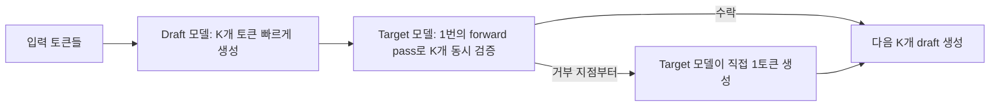
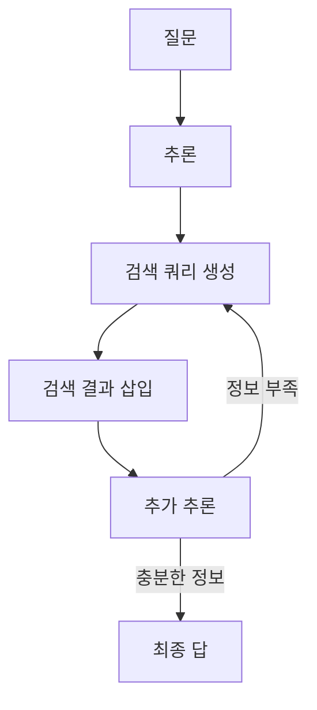

# LLM의 활용과 평가: Decoding·RAG·Evaluation

> [!abstract] 강의 개요
> LG Aimers 9기 「LLM Application & Evaluation」 시리즈의 단일 강의(강사: Jaehyung Kim, Yonsei University). LLM을 실제로 **활용**하는 두 핵심 기법인 ==Decoding==(어떻게 다음 토큰을 골라 텍스트를 생성하는가)과 ==Retrieval-Augmented Generation(RAG)==(외부 지식을 어떻게 결합하는가)을 다루고, 마지막으로 이렇게 만들어진 LLM의 출력을 어떻게 **평가**하는지(ground-truth가 있는 경우/없는 경우, 그리고 ==LLM-as-Judge==)를 다룬다.

> [!summary]- 핵심 요약 (클릭해서 펼치기)
> | 대주제 | 핵심 |
> | ---- | ---- |
> | **Decoding** | Greedy/Beam Search(결정론적) vs Sampling(Temperature/Top-K/Top-P) — Nucleus Sampling이 사실상 표준 |
> | Diverse/Contrastive/Speculative Decoding | 다양성 확보, 환각 억제, 추론 가속이라는 각기 다른 목적의 디코딩 변형 |
> | **RAG** | Knowledge Cutoff 문제를 외부 retrieval로 보완 — Sparse(BM25) vs Dense(DPR, Contriever) |
> | REPLUG / HyDE | black-box LLM에 retrieval을 결합하는 법(REPLUG), query를 가상 문서로 보강하는 법(HyDE) |
> | RetRobust / Search-R1 | 노이즈에 강한 RAG(RetRobust), RL로 LLM이 스스로 검색 시점을 결정(Search-R1) |
> | **Evaluation** | Target task + Evaluation method + Evaluation metric의 3요소로 구성 |
> | Ground Truth 있는 경우 | MMLU(객관식 accuracy), NQ(EM/F1), XSum(ROUGE/임베딩 거리) |
> | Ground Truth 없는 경우 | Open-ended generation(Perplexity, G-Eval), ==Relative Evaluation==(Chatbot Arena), ==LLM-as-Judge== |
> | LLM-as-Judge의 함정 | Position bias, Verbosity bias, Self-preference bias — 위치 swap·길이 보정(AlpacaEval LC)으로 완화 |

## 목차

1. [[#1. Decoding — LLM은 다음 토큰을 어떻게 고르는가]]
   - [[#1.1 Tokenization과 Autoregressive Generation]]
   - [[#1.2 결정론적 디코딩 — Greedy와 Beam Search]]
   - [[#1.3 확률적 디코딩 — Sampling]]
   - [[#1.4 디코딩의 변형들 — Diverse, Contrastive, Speculative]]
2. [[#2. Retrieval-Augmented Generation (RAG)]]
   - [[#2.1 왜 RAG가 필요한가 — Knowledge Cutoff]]
   - [[#2.2 Retrieval 방법론 — Sparse vs Dense]]
   - [[#2.3 REPLUG — Black-box LLM과 Retriever의 결합]]
   - [[#2.4 Query Enhancement — HyDE]]
   - [[#2.5 Noisy-Robust RAG와 Search-R1]]
3. [[#3. Evaluation of Large Language Models]]
   - [[#3.1 평가의 3요소와 LLM 평가의 특수성]]
   - [[#3.2 Ground Truth가 있는 경우 — MMLU·NQ·XSum]]
   - [[#3.3 Ground Truth가 없는 경우 — Open-ended Generation]]
   - [[#3.4 Relative Evaluation과 LLM-as-Judge]]

---

## 1. Decoding — LLM은 다음 토큰을 어떻게 고르는가

### 1.1 Tokenization과 Autoregressive Generation

> [!note] Language Model의 정의
> LM은 토큰 시퀀스에 대한 확률분포다.
> $$p(x_1, x_2, \dots, x_n) = \prod_{i=1}^{n} p(x_i \mid x_1, \dots, x_{i-1})$$
> 이렇게 ==chain rule==로 분해해 직전까지의 토큰들로 다음 토큰을 예측하는 모델을 **Autoregressive LM**이라 부른다. 현대 LLM(Transformer + 자기지도학습 + 대량의 비정형 텍스트)은 모두 이 형태를 따른다.

> [!note] Tokenization — 입력 텍스트를 토큰 시퀀스로 매핑
> | 방식 | 설명 |
> | ---- | ---- |
> | Character-level | 글자 단위. Vocabulary는 작지만 시퀀스가 매우 길어짐 |
> | Word-level | 단어 단위. 직관적이지만 vocabulary가 매우 커지고 OOV(미등록 단어) 문제 발생 |
> | **Subword-level** | 둘의 절충, 현재 LLM의 표준(BPE 등) — 빈도 높은 단어는 그대로, 드문 단어는 더 작은 단위로 분해 |

> [!success] Autoregressive Generation
> 모델은 매 step마다 vocabulary 전체에 대한 확률분포를 출력하고, 그중 하나의 토큰을 골라 시퀀스에 추가한 뒤 그것을 다시 입력으로 사용한다. 이 과정은 특수 토큰 ==EOS(End-of-Sequence)==가 생성되거나 최대 길이에 도달할 때까지 반복된다. **"토큰을 어떻게 고르는가"**가 바로 Decoding 전략이다.

### 1.2 결정론적 디코딩 — Greedy와 Beam Search

> [!example] Greedy Decoding
> 매 step에서 확률이 가장 높은 토큰 **하나만** 선택. 빠르고 단순하지만, 근시안적(myopic) 선택이 누적되어 전체적으로 최적이 아닌 시퀀스를 만들기 쉽고, 반복적이고 지루한 텍스트를 생성하는 경향이 있다.

> [!note] Beam Search
> 매 step마다 가장 가능성 높은 `num_beams`개의 후보 시퀀스(hypotheses)를 동시에 유지하다가, 최종적으로 전체 시퀀스 확률(log-prob 합)이 가장 높은 경로를 선택한다.
> $$\text{score}(y_{1:t}) = \sum_{i=1}^{t} \log p(y_i \mid y_{1:i-1})$$
> Greedy보다 더 넓은 탐색공간을 보지만 여전히 결정론적이며, 번역처럼 정답이 비교적 명확한 task에 적합하다. 다만 자유로운 open-ended 생성에서는 단조롭고 반복적인 결과를 내는 경향이 있다.

### 1.3 확률적 디코딩 — Sampling

> [!warning] 결정론적 디코딩의 근본적 한계
> Greedy/Beam은 항상 "가장 그럴듯한" 텍스트를 추구하는데, 실제 인간의 글쓰기는 그렇게 단조롭지 않다 — Holtzman et al.(ICLR 2020)은 이를 ==Neural Text Degeneration==이라 부르며, 결정론적 디코딩이 반복적이고 지루한 텍스트로 퇴화함을 보였다.

> [!note] Temperature Sampling
> Softmax 직전 logit을 temperature $T$로 나누어 분포의 뾰족함(sharpness)을 조절한다.
> $$p_i = \frac{\exp(z_i / T)}{\sum_j \exp(z_j / T)}$$
> $T \to 0$이면 Greedy에 수렴(확률 1위에 집중), $T \to \infty$이면 균등분포(무작위)에 가까워진다. $T<1$은 분포를 뾰족하게(보수적), $T>1$은 평평하게(다양하게) 만든다.

> [!note] Top-K Sampling
> 확률 상위 $K$개의 토큰만 남기고 나머지는 제외한 뒤, 그 $K$개 안에서 확률을 재정규화해 샘플링. 너무 낮은 확률의 토큰(횡설수설)을 막아주지만, $K$가 고정이라 분포가 뾰족할 때는 불필요하게 후보를 좁히고 분포가 평평할 때는 여전히 이상한 토큰을 포함할 수 있다.

> [!success] Top-P Sampling (Nucleus Sampling)
> Holtzman et al.(ICLR 2020)이 제안. 누적 확률이 임계값 $p$를 넘는 **최소한의 토큰 집합**(nucleus)만 남기고 그 안에서 재정규화해 샘플링.
> $$V^{(p)} = \min \left\{ V' \subseteq V : \sum_{x \in V'} p(x) \ge p \right\}$$
> Top-K의 "고정된 후보 개수"라는 한계를 보완 — 분포가 뾰족할 때는 후보가 자동으로 적어지고, 분포가 평평할 때는 후보가 자동으로 많아진다. ==현재 LLM 생성의 실질적 표준== 디코딩 방법.

> [!tip] 실전 가이드
> - 번역·코드처럼 정답이 명확한 task → Greedy/Beam
> - 창작·대화처럼 다양성이 필요한 task → Temperature + Top-P
> - Self-Consistency(Wang et al., ICLR 2023): 같은 질문에 대해 Sampling으로 여러 답을 생성하고 **다수결(majority voting)**로 최종 답을 정하면 추론 정확도가 올라간다 — 이는 3강의 Evaluation 섹션에서도 다시 등장한다.

### 1.4 디코딩의 변형들 — Diverse, Contrastive, Speculative

> [!note] Diverse Beam Search (Vijayakumar et al., AAAI 2018)
> 일반 Beam Search는 beam들이 서로 비슷한 문장으로 수렴하는 문제가 있다. 이를 beam들을 그룹으로 나누고, 그룹 간에 ==dissimilarity term==을 점수에 추가해 서로 다른 답을 유도하도록 개선한 것이 Diverse Beam Search다.
> $$\text{score}(y) = \log p(y) + \lambda \cdot \Delta(y, \text{다른 그룹의 후보들})$$

> [!success] Contrastive Decoding (Li et al., ACL 2023)
> 작고 약한 ==amateur 모델==과 크고 강한 ==expert 모델==의 logit 차이를 이용해, expert가 강조하지만 amateur도 쉽게 맞추는(=너무 일반적이거나 반복적인) 토큰의 점수를 깎는다.
> $$\text{score}(x) = \log p_{\text{expert}}(x) - \alpha \cdot \log p_{\text{amateur}}(x)$$
> - **Adaptive Plausibility Constraint**($\alpha = 0.1$ 권장)로 expert가 충분히 신뢰하는 토큰만 후보로 남겨 무의미한 토큰이 선택되는 것을 막는다.
> - 응용: ==Context-aware Decoding==(Shi et al.) — context 있음/없음의 logit 차이로 context를 더 잘 반영하게 함. ==Visual Contrastive Decoding==(Leng et al., CVPR 2024) — 원본 이미지/왜곡된 이미지 입력의 logit 차이로 VLM의 환각(hallucination)을 줄임.

> [!success] Speculative Decoding (Leviathan et al., ICML 2023)
> 디코딩의 **품질이 아니라 속도**를 다루는 기법. 작고 빠른 ==draft 모델==이 $K$개의 토큰을 먼저 생성하고, 크고 느린 ==target 모델==이 이를 **단 한 번의 forward pass**로 검증한다 — target 모델이 직접 생성했을 확률과 비교해 토큰별로 수락(accept) 또는 거부(reject)하며, 거부된 지점부터는 target 모델이 직접 생성한다.
> ==출력 분포는 target 모델 단독 디코딩과 수학적으로 동일==하면서(품질 손실 없음), 모델 호출 횟수를 줄여 추론을 가속한다.

---

## 2. Retrieval-Augmented Generation (RAG)

### 2.1 왜 RAG가 필요한가 — Knowledge Cutoff

> [!warning] Knowledge Cutoff 문제
> LLM은 특정 시점까지 수집된 데이터로만 학습되므로, 학습 이후에 발생한 사건이나 모델이 보지 못한 전문 지식에 대해서는 답할 수 없거나 환각(hallucination)을 일으킨다. ==RAG(Retrieval-Augmented Generation)==는 외부 지식 베이스에서 관련 문서를 **검색(retrieve)**해 프롬프트에 추가함으로써 이 문제를 완화한다.

> [!note] RAG의 기본 파이프라인
> $$\text{Query} \xrightarrow{\text{Retriever}} \text{관련 문서 } d_1, \dots, d_k \xrightarrow{\text{Prepend to prompt}} \text{LLM} \to \text{Answer}$$

### 2.2 Retrieval 방법론 — Sparse vs Dense

> [!example] Sparse Retrieval — BM25
> 키워드 매칭 기반의 전통적 검색 방법(TF-IDF 계열). 단어의 등장 빈도와 문서 길이를 고려해 쿼리와 문서의 관련도를 계산. 학습이 필요 없고 빠르지만, ==어휘 불일치(lexical mismatch)==(동의어·바꿔쓰기)에 취약하다.

> [!note] (참고) PageRank
> 웹 검색에서 문서(페이지)의 ==전역적 중요도==를 그래프 구조(다른 페이지로부터의 링크)로 계산하는 방법 — 쿼리와 무관하게 문서 자체의 권위(authority)를 측정한다는 점에서 BM25 등의 쿼리-문서 관련도 계산과 상호보완적으로 쓰인다.

> [!success] Dense Retrieval — DPR / Contriever
> 쿼리와 문서를 각각 임베딩 공간의 벡터로 인코딩하고, 벡터 간 유사도(내적/코사인)로 관련도를 계산. 의미적 유사성을 포착해 어휘 불일치 문제를 완화한다.
> | 모델 | 특징 |
> | ---- | ---- |
> | **DPR**(Karpukhin et al., EMNLP 2020) | Question encoder + Passage encoder를 ==in-batch negative==로 대조학습(contrastive learning) — QA용 supervised dense retrieval의 표준 |
> | **Contriever**(Izacard et al., TMLR 2022) | 레이블 없는 텍스트만으로 ==자기지도(self-supervised)== contrastive learning — 같은 문서의 다른 부분을 positive pair로 사용 |

### 2.3 REPLUG — Black-box LLM과 Retriever의 결합

> [!quote] REPLUG (Shi et al., NAACL 2023)
> GPT-3처럼 가중치에 접근할 수 없는 ==black-box LLM==에도 retrieval을 결합할 수 있게 한 방법. 검색된 문서 $k$개 각각을 쿼리 앞에 prepend한 $k$개의 prompt를 LLM에 통과시키고, 각 결과를 **retrieval score로 가중한 ensemble**로 합친다.
> $$p(y \mid x) \approx \sum_{d \in \mathcal{D}} p(d \mid x) \cdot p_{\text{LLM}}(y \mid d \circ x)$$

> [!success] LM-Supervised Retrieval (LSR)
> REPLUG의 핵심 기여 — retriever를 fine-tune하기 위해 ==LLM 자신의 출력 확률을 supervision 신호==로 사용한다. "이 문서를 prepend했을 때 LLM이 정답을 더 잘 생성했는가"를 retriever의 학습 목표로 역전파한다 — LLM은 그대로 두고(black-box) retriever만 LLM의 선호에 맞게 적응시키는 것.

### 2.4 Query Enhancement — HyDE

> [!note] 문제의식
> 짧고 모호한 쿼리는 그 자체로는 관련 문서와 임베딩 공간에서 멀리 떨어져 있을 수 있다(질문과 답변의 어휘·문체가 다름). ==Query Enhancement==는 쿼리를 검색에 더 유리한 형태로 변형한다.

> [!success] HyDE — Hypothetical Document Embeddings (Gao et al., ACL 2023)
> 쿼리를 직접 임베딩해 검색하는 대신, LLM에게 그 쿼리에 대한 **가상의(hypothetical) 답변 문서를 먼저 생성**시키고, 그 가상 문서를 임베딩해 검색에 사용한다.
> $$\text{Query} \xrightarrow{\text{LLM}} \text{가상 문서 } \hat{d} \xrightarrow{\text{Encode}} \text{embedding} \xrightarrow{\text{검색}} \text{실제 관련 문서}$$
> 가상 문서가 사실과 다를 수 있어도, ==실제 정답 문서와 임베딩 공간에서 더 가까운 "문체·구조"==를 가지므로 검색 품질이 향상된다. (관련: ==LameR==, Chen et al., ACL 2024 Findings — 유사한 motivation의 query rewriting 기법)

### 2.5 Noisy-Robust RAG와 Search-R1

> [!warning] 검색 노이즈 문제
> 검색된 문서가 항상 관련성이 높거나 정확한 것은 아니다 — 관련 없거나 상충하는 문서가 섞이면 LLM이 오히려 더 나쁜 답을 생성할 수 있다.

> [!note] RetRobust (Yoran et al., ICLR 2024)
> 노이즈에 강인한 RAG를 위한 두 가지 접근:
> 1. **Training-free**: ==NLI(Natural Language Inference) 모델==로 검색된 문서가 질문-답변과 논리적으로 entail/contradict하는지 판단해 관련 없는 문서를 필터링
> 2. **소량 학습**: ==QLoRA== 기반 경량 fine-tuning으로 LLM이 관련 있는 문서와 없는 문서를 구분해 노이즈에 강해지도록 적응

> [!success] Search-R1 (Jin et al., arXiv 2025.03)
> DeepSeek-R1 스타일의 ==RL(강화학습)==로 LLM이 "언제, 무엇을 검색할지"까지 스스로 학습하게 만든 ==adaptive RAG==.
> - 특수 토큰 `<think>`(추론) / `<search>`(검색 쿼리) / `<information>`(검색 결과 삽입) / `<answer>`(최종 답)을 모델이 생성 과정에서 직접 호출
> - ==PPO/GRPO==로 학습하며, 별도의 reward model 없이 **최종 answer가 ground-truth와 일치하는지만으로 outcome reward**를 계산(rule-based reward)
> - 결과적으로 모델은 쉬운 질문엔 검색 없이 바로 답하고, 어려운 질문엔 여러 차례 검색을 반복하는 등 ==검색 시점과 횟수를 스스로 조절==

---

## 3. Evaluation of Large Language Models

### 3.1 평가의 3요소와 LLM 평가의 특수성

> [!note] 모든 시스템 평가에 공통되는 3요소
> 1. **Target task**: 시스템이 수행해야 할 일이 무엇인가
> 2. **Evaluation method**: 어떤 방식으로 평가하는가
> 3. **Evaluation metric**: 성공을 어떻게 수치화하는가

> [!example] 배달 서비스로 보는 3요소
> Target task = 음식을 식당에서 사용자에게 배달 / Evaluation method = 배달 시간 측정 / Evaluation metric = 사용자 전체의 평균 배달 시간

> [!note] 전통적 딥러닝 모델의 평가
> Test data(학습에 쓰이지 않은, 같은 task·분포의 데이터)로 평가. 예: 감정분류로 fine-tune한 BERT(Devlin et al., NAACL 2019) → Target task=감정분류 / Method=test data의 예측과 사람 라벨 비교 / Metric=평균 accuracy.

> [!warning] LLM 평가가 어려운 이유
> LLM은 QA, 요약, 코드 등 ==매우 다양한 task에 in-context learning(few-shot prompting)만으로 적응==할 수 있다(Brown et al., NeurIPS 2020). 이는 활용 측면에서는 장점이지만, 평가 입장에서는 **"단일 task가 아니라 여러 task를 동시에 평가해야 한다"**는 어려움을 만든다.
> - 프롬프트의 instruction 품질·예시 선택(Zhang et al., EMNLP 2022; Rubin et al., NAACL 2022)과 예시 개수(Bertsch et al., arXiv 2024)가 성능을 좌우 — Chain-of-Thought도 복잡한 추론에는 필수적
> - **Decoding 온도가 0보다 크면** 같은 질문에도 다른 답이 나올 수 있음 → ==Self-Consistency==(Wang et al., ICLR 2023)로 여러 샘플의 다수결을 취해 안정화
> - 실제로 GPT-4(OpenAI Technical Report)나 Claude 3.5 Sonnet 같은 모델의 리포트는 위 3요소(다양한 academic benchmark = target task, few-shot 등 = method, accuracy 등 = metric)를 묶어 보고한다

### 3.2 Ground Truth가 있는 경우 — MMLU·NQ·XSum

> [!note] Ground Truth가 있는 벤치마크의 의의
> 공개 벤치마크에는 보통 정답(ground truth)이 포함되어 공정한 비교가 쉬워진다. 다만 데이터셋마다 evaluation method·metric은 다를 수 있다.

> [!example] MMLU — 객관식 지식 평가 (Hendrycks et al., ICLR 2021)
> 57개 학과 분야를 망라한 ==16,000개 객관식 문제==. Method=few-shot prompting, Metric=평균 accuracy(%) — 객관식 QA의 가장 보편적인 metric.
> $$\text{Accuracy} = \frac{\text{정답을 맞춘 문제 수}}{\text{전체 문제 수}}$$

> [!warning] MMLU 채점의 함정 — 출력 포맷 불일치
> LLM의 출력은 정해진 포맷을 따르지 않거나 일관성 없는 패턴을 보일 때가 많다(예: 정답이 답변 맨 앞/맨 뒤 어디에나 나올 수 있음). ==구체적인 instruction(예: "답은 A/B/C/D 중 하나만 출력하라")==으로 이를 완화할 수 있지만, 완벽하게 해결되지는 않는다.

> [!example] Natural Questions (NQ) — 자유형 QA (Kwiatkowski et al., TACL 2019)
> 7,830개의 5-way 주석(annotation)이 달린 평가용 예제. 객관식이 아니라 **긴 답변 또는 짧은 답변을 직접 생성**해야 한다.
> | Metric | 정의 |
> | ---- | ---- |
> | **EM(Exact Match)** | 예측이 정답 문자열과 정확히 같으면 1, 아니면 0 |
> | **F1** | 단어 단위로 비교한 Precision·Recall의 조화평균 |
>
> $$\text{Precision} = \frac{\text{예측 \& 정답에 공통된 단어 수}}{\text{예측의 단어 수}}, \quad \text{Recall} = \frac{\text{예측 \& 정답에 공통된 단어 수}}{\text{정답의 단어 수}}$$
> $$F_1 = \frac{2 \cdot \text{Precision} \cdot \text{Recall}}{\text{Precision} + \text{Recall}}$$
> 두 metric 모두 ==Lexical Matching==(표면적 단어 일치) 기반이라는 공통된 한계가 있다.

> [!example] XSum — 추상적 요약 (Narayan et al., EMNLP 2018)
> 230,000개 예제, 평균 문서/요약 길이 430/23 단어의 ==극단 요약(extreme summarization)== 데이터셋. 정답 요약과 LLM 출력 요약은 표현이 달라도 의미가 같을 수 있어("Severe flooding..." vs "Clean-up operations...") 단순 단어 매칭으로는 평가가 부족하다.
> | 방법 | 설명 |
> | ---- | ---- |
> | **ROUGE** | 생성문/정답문 사이의 단어·구(phrase) 중첩을 측정(Rouge-N = N-gram 중첩) |
> | **임베딩 거리** | Sentence-BERT(Reimers & Gurevych, EMNLP 2019) 등으로 두 문장을 임베딩한 뒤 L2/코사인 거리로 의미적 유사도 측정 |
> [!warning] 문장 임베딩 자체의 품질이 결과를 좌우하므로, MTEB leaderboard 같은 곳에서 검증된 인코더를 사용해야 한다.

### 3.3 Ground Truth가 없는 경우 — Open-ended Generation

> [!warning] 현실의 많은 task는 정해진 정답이 없다
> 요약이나 이야기 이어쓰기(story continuation)처럼, "이것이 유일한 정답"이라고 할 수 없는 ==open-ended text generation== task가 많다 — 주어진 context를 자연스럽게 이어가는 능력 자체를 평가해야 한다(Holtzman et al., ICLR 2020).

> [!note] Perplexity
> 모델이 시퀀스의 다음 단어를 얼마나 잘 예측하는지 측정.
> $$\text{PPL}(x_{1:n}) = \exp\left(-\frac{1}{n}\sum_{i=1}^n \log p(x_i \mid x_{<i})\right)$$
> 확률은 생성 LLM 자신 또는 별도의 평가용 LLM에서 가져올 수 있다. ==낮을수록 좋은 품질==을 시사하는 경향이 있지만, ==사람이 느끼는 품질과 항상 일치하지는 않는다==는 한계가 있다.

> [!success] G-Eval — LLM을 평가자로 사용 (Liu et al., EMNLP 2023)
> "명료성·일관성·창의성" 같은 다축 평가 기준을 사람이 일일이 채점하기엔 비용이 너무 크다. G-Eval은:
> 1. 사용자가 (1) task 정보와 (2) 평가 기준(criteria)을 제공
> 2. LLM이 이를 바탕으로 ==평가 단계(evaluation steps)를 스스로 생성==
> 3. 생성된 단계에 따라 임의의 입력을 평가 기준에 맞춰 채점
>
> GPT-4 기반 G-Eval은 ROUGE나 BERTScore(임베딩 기반)보다 ==사람 평가와의 상관관계가 가장 높았다== — 이후 "특정 기준을 명시해 LLM을 평가자로 쓰는 방식"이 표준으로 자리잡았다(Self-Rewarding Language Models, Yuan et al., ICML 2024).

### 3.4 Relative Evaluation과 LLM-as-Judge

> [!note] Relative Evaluation — 절대점수 대신 비교
> 좋은 출력을 찾는 또 다른 방법은 **후보들 사이의 쌍별(pairwise, 또는 그 이상) 비교**로 더 나은 쪽을 고르는 것이다(Ouyang et al., NeurIPS 2022 — InstructGPT의 human feedback 수집 방식과 동일한 원리).

> [!example] Chatbot Arena
> 실제 사용자 피드백으로 LLM들을 비교하는, 가장 신뢰받는 비교 플랫폼 중 하나. 사용자가 두 모델의 답변 중 더 나은 쪽에 투표하고, 그 결과를 누적해 리더보드 순위를 매긴다.

> [!warning] 사람에 의한 쌍별 비교의 비용
> Llama2 같은 모델 발표에서도 흔히 쓰이는 방식이지만, ==대규모 사람 평가에는 막대한 비용==이 든다.

> [!success] LLM-as-Judge (Zheng et al., NeurIPS 2023 — MT-Bench & Chatbot Arena)
> 사람 평가자를 LLM(예: GPT-4)으로 대체하자는 아이디어.
> - **장점**: (1) ==Scalability==(비용 없이 무한히 확장) (2) ==Explainability==(채점 이유를 설명 가능)
> - MT-Bench: roleplay·수학 등 8개 카테고리의 80개 고품질 multi-turn 질문으로 구성된 평가셋
> - GPT-4와 사람의 판정 일치율이 ==85%==로, 사람 간 일치율(81%)보다도 높게 측정됨

> [!warning] LLM Judge의 3가지 편향(bias)
> | 편향 | 설명 |
> | ---- | ---- |
> | **Position bias** | 답변이 제시되는 ==순서==를 선호 — 보통 1번째로 제시된 답을 더 선호 |
> | **Verbosity bias** | 품질이 같거나 낮아도 ==더 긴 답변==을 선호("repetitive list" attack으로 입증) |
> | **Self-preference bias** | 자기 자신(또는 같은 계열 모델)이 생성한 답을 선호 |

> [!tip] 편향을 줄이는 실전 방법
> 1. **Position bias** → 같은 비교를 ==위치를 바꿔(swap) 두 번 평가==한 뒤 평균. 1번째 평가에서 A 선호, 2번째(swap)에서 B 선호로 나오면 "Tied"로 처리. 단 비용이 2배.
> 2. **Verbosity bias** → 길이의 영향을 통계적으로 제거. ==AlpacaEval==(Dubois et al., arXiv 2024)의 **LC(Length-Controlled) Win Rate**가 대표적 — 길이를 통제한 win rate는 GPT-4 judge 기준임에도 Chatbot Arena(사람 평가)와 ==높은 상관관계==를 보인다.

---

> [!success] 이번 강의 정리
> LLM을 "쓰는" 단계에서는 ==Decoding==(다음 토큰을 결정론적으로 고를지/샘플링할지, 그리고 다양성·환각 억제·속도라는 목적에 맞춰 변형 기법을 선택)과 ==RAG==(외부 지식으로 knowledge cutoff를 보완하되, retrieval 방식·query 보강·노이즈 강건성·검색 시점 자체를 어떻게 최적화할지)가 핵심 도구다. LLM을 "평가하는" 단계에서는 ground truth가 있는 전통적 벤치마크(MMLU/NQ/XSum)의 한계를 인식하고, ground truth가 없는 open-ended task에는 LLM 자신을 평가자로 활용하는 ==LLM-as-Judge==가 표준이 되었지만, position/verbosity/self-preference 편향을 반드시 통제해야 신뢰할 수 있는 평가가 된다는 점이 이 강의의 핵심 메시지다.

---

%%
관련 노트: LG Aimers 9기 「LLM Application & Evaluation」 시리즈 단일 강의 (이전/다음 강의 없음)
%%
