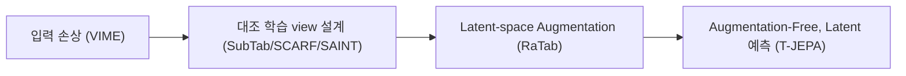

# Tabular Representation Learning

> [!abstract] 강의 개요
> [[TabML_03_Deep_Architectures_for_Tabular_Data|3강]] ← **TabML 4강** → [[TabML_05_LLMs_with_Tabular_Data|5강]]
>
> 레이블이 부족한 상황에서 **레이블 없는 테이블로부터 의미 있는 표현을 학습**하는 방법을 다룬다. (1) Self-Supervised Learning(SSL), (2) Few-shot·cross-table transfer, (3) 정상 패턴 학습 기반 Anomaly Detection 세 갈래로 정리한다.

> [!summary]- 핵심 요약 (클릭해서 펼치기)
> | 갈래 | 핵심 질문 | 대표 방법 |
> | ---- | --------- | --------- |
> | **SSL (Reconstruction)** | 손상된 입력을 복원할 수 있는가? | VIME |
> | **SSL (Contrastive)** | 두 view가 관련되어 있음을 인식할 수 있는가? | SubTab, SCARF, SAINT |
> | **SSL (Latent-space)** | 입력을 직접 건드리지 않고 latent에서 augmentation/예측 | RaTab, ==T-JEPA== |
> | **Few-shot/Transfer** | 적은 레이블/다른 테이블 스키마로 전이 가능한가? | STUNT, TransTab, CARTE |
> | **Anomaly Detection** | 레이블 없이 "정상"을 어떻게 정의하는가? | ICL, MCM, NPT-AD, Disent-AD, DRL |

## 목차

1. [[#1. 왜 Representation Learning인가]]
2. [[#2. Self-Supervised Learning]]
   - [[#2.1 Reconstruction 기반 — VIME]]
   - [[#2.2 Contrastive Learning으로의 전환]]
   - [[#2.3 View 생성 전략 — SubTab·SCARF·SAINT]]
   - [[#2.4 Input-level Augmentation을 넘어서 — RaTab·T-JEPA]]
3. [[#3. Few-Shot & Transferable Representations]]
4. [[#4. Tabular Anomaly Detection]]

---

## 1. 왜 Representation Learning인가

> [!quote] 동기
> 레이블은 비싸고 부족하거나 노이즈가 많은 반면, **레이블 없는 테이블은 풍부**하다. 핵심 질문: *의미를 보존하면서 레이블 없는 테이블로부터 어떻게 유용한 표현을 학습할 것인가?*

> [!warning] Tabular SSL의 어려움
> - 이종 feature(수치·범주·이진·결측)
> - 이미지·텍스트와 달리 보편적인 공간/순차 구조가 없음
> - 도메인마다 의미가 다름
> - **tabular data에는 보편적인 augmentation 전략이 없다**

| 응용 | 설명 |
| ---- | ---- |
| Self-supervised pretraining | 레이블 없는 행으로 표현을 학습 후 fine-tune |
| Few-shot/transfer | 레이블이 적거나 테이블이 다를 때 표현을 재사용 |
| Anomaly Detection | 정상 패턴을 학습하고 이탈 샘플을 탐지 |
| Semantic/Foundation 확장 | 메타데이터·텍스트 설명 통합 (다음 강의에서 다룸) |

---

## 2. Self-Supervised Learning

> [!note] SSL의 기본 절차
> 1. 레이블 없는 데이터로부터 **pretext task** 생성
> 2. pretext task로 encoder를 pre-train
> 3. downstream 예측을 위해 fine-tune
>
> 표현의 품질은 **pretext task 설계**에 크게 의존한다.

### 2.1 Reconstruction 기반 — VIME

> [!note] VIME (Yoon et al., NeurIPS 2020)
> **핵심 아이디어**: 입력을 손상시키고 모델이 이를 복원하도록 학습.
> - 일부 feature를 무작위로 마스킹하고 다른 row의 값으로 대체
> - **Mask Estimation**: 어떤 feature가 손상되었는가?
> - **Value Imputation**: 원래 값은 무엇이었는가?

> [!tip] 왜 작동하는가
> 손상된/마스킹된 feature를 복원하려면 모델이 **column 간 의존성**을 학습해야 한다 (e.g., occupation·income·education은 서로를 예측하는 데 도움). VIME은 semi-supervised 프레임워크에서 unlabeled 샘플도 함께 활용한다.

> [!warning] 한계
> - corruption이 의미 있는 학습 과제를 만드는지에 성능이 좌우됨
> - 임의의 값 대체가 비현실적인 샘플을 만들 수 있음

### 2.2 Contrastive Learning으로의 전환

> [!note] Reconstruction vs Contrastive Learning
> - **Reconstruction**: 손상된 입력을 복원할 수 있는가?
> - **Contrastive Learning**: 두 개의 관련된 view를 인식할 수 있는가? — 관련 view의 표현은 끌어당기고(pull), 다른 샘플의 표현은 밀어낸다(push)

> [!quote] 핵심 질문
> Tabular row의 **두 view를 어떻게 생성할 것인가**가 tabular contrastive learning의 중심 문제다.

### 2.3 View 생성 전략 — SubTab·SCARF·SAINT

| 모델 | View 생성 방식 |
| ---- | --------------- |
| **SubTab** (NeurIPS 2021) | column의 서로 다른 **부분집합(subset)** 을 같은 row의 다중 view로 취급 — 부분 view들 간 공유되는 정보를 포착 |
| **SCARF** (ICLR 2022) | feature 일부를 **각자의 marginal 분포에서 샘플링한 값**으로 무작위 손상 → 원본/손상본을 positive pair로 사용 |
| **SAINT** (2021) | ==CutMix==(샘플 간 feature 값 교체) + ==Mixup==(embedding space 보간)으로 positive view 생성, intersample attention 아키텍처 추가 |

> [!success] 두 접근을 결합하는 이유
> Reconstruction은 feature 의존성 학습을 장려하고, Contrastive learning은 다양한 view에 걸친 안정적인 표현을 장려한다 — 각 feature가 task-critical한 의미를 담을 수 있기 때문에 둘 다 유용하다.

> [!quote] 공통 가정
> 초기 tabular SSL 방법들은 수작업 설계된 input-level augmentation(손상·마스킹·대체·믹스·부분집합)에 의존하며, "수정된 view가 원본 행의 본질적 의미를 보존해야 한다"고 가정한다.

### 2.4 Input-level Augmentation을 넘어서 — RaTab·T-JEPA

> [!warning] Input-level Augmentation의 어려움
> - feature 제거 → task에 중요한 정보 손실 가능
> - 값 대체 → 비현실적인 row 생성 가능
> - 유효한 변환이 도메인마다 다름
>
> → 최근 방법들은 **원시 feature 값을 직접 건드리지 않고, latent space에서 조작/예측**하는 방향을 추구한다.

> [!note] RaTab (Eo et al., AAAI 2025)
> Encoder를 수정해 대안적 view를 생성 (raw feature 수정 X): encoder 마지막 레이어 weight matrix에 ==truncated SVD== 적용 → augmented encoder 구성 → reconstruction + contrastive loss를 함께 사용. *(RaTab pretraining → supervised fine-tuning 평가에서 다양한 아키텍처의 성능을 개선)*

> [!note] T-JEPA (Thimonier et al., ICLR 2025) — Augmentation-Free
> 손상된 입력을 복원하는 대신, **하나의 latent feature view로부터 다른 view를 예측**: context feature 부분집합으로부터 target feature 부분집합을 latent space에서 예측. **feature masking만 사용**하며 input-level augmentation이 전혀 필요 없음.

> [!info] JEPA란? (Joint-Embedding Predictive Architecture)
> **입력 공간이 아닌 embedding 공간**에서 latent를 예측(혹은 생성)하도록 학습하는 SSL 프레임워크. Joint-Embedding Architecture(수작업 augmentation에 invariant한 표현 추구)와 달리, JEPA는 그런 invariance를 직접 추구하지 않는다. 이미지(I-JEPA), 비디오(V-JEPA), world model(LeWorldModel) 등 여러 도메인에 확장되고 있다.

> [!summary]- SSL 정리
> **핵심 질문**: 레이블 없는 tabular data로부터 어떻게 유용한 표현을 학습할 것인가?
> - 이종 feature 간 의미 있는 의존성을 어떻게 포착할 것인가?
> - 도메인 특화 지식이나 수작업 augmentation에 의존하지 않는 일반적 방법을 어떻게 설계할 것인가?
>
> **남은 과제**: 보편적으로 우세한 SSL objective가 없음, 범용 pretraining을 위한 대규모·다양한 tabular 데이터셋의 부족, downstream 데이터셋마다 pretraining 효과가 크게 다름.

---

## 3. Few-Shot & Transferable Representations

> [!note] 설정의 확장
> 일반 SSL은 하나의 target table을 가정(같은 데이터셋에서 pretrain → fine-tune)하지만, transferable representation은 이를 완화한다: 레이블 없는 테이블로 학습 → **적은 레이블로 적응** → **다른 column 구조로 전이**.
> 문제의 중심이 "하나의 테이블 안에서 학습"에서 "task/schema 간 전이"로 이동한다.

> [!note] STUNT (Nam et al., ICLR 2023) — Self-Generated Tasks
> 레이블 없는 테이블의 **column feature 자체를 pseudo-target**으로 활용해 다양한 가짜 task를 생성:
> 1. column의 무작위 부분집합 선택
> 2. 선택된 column으로 샘플 클러스터링
> 3. 클러스터 할당을 pseudo-label로 사용
> 4. 다양한 self-generated task에 걸쳐 few-shot learner 학습
>
> > [!tip] 강점
> > 일반 supervised/SSL 방법은 적은 레이블 샘플로부터의 적응 능력이 없어 실패하는 상황에서도, STUNT는 **소수의 레이블만으로 적응**할 수 있다.

> [!warning] Cross-Table 문제
> 대부분의 tabular 모델은 고정된 column 집합을 가정 — train/test table이 같은 feature schema를 공유해야 한다. 그러나 실제로는 테이블 간 column이 부분적으로만 겹친다. *(Wang & Sun, TransTab, NeurIPS 2022)*

| 모델 | 전이 전략 |
| ---- | --------- |
| **TransTab** | column description(컬럼명 등)을 이용해 tabular data를 "의미 인코딩된" token으로 변환 → 전이 가능 |
| **CARTE** (Kim et al., 2024) | 각 row를 column명·값으로 이루어진 ==star-shaped graphlet==으로 표현 → 서로 다른 테이블을 동일한 그래프 입력 형식으로 매핑, 외부 관계 지식으로부터 contextual entity representation 학습 |

> [!summary]- Transferable Representation 정리
> 목표: 레이블이 제한된 task와 이종 테이블 사이에 tabular 지식을 재사용. 
> - self-generated task로부터의 few-shot 적응
> - 서로 다른 테이블 스키마 간 전이
> - column명·cell 값·외부 지식을 이용한 semantic transfer
>
> 현재 방법들은 특정 설정에서의 전이를 개선할 뿐 — 언어모델과 foundation model이 더 일반적인 tabular 학습 프레임워크의 방향을 제시한다 (다음 강의에서 계속).

---

## 4. Tabular Anomaly Detection

> [!quote] 핵심 질문
> 명시적인 anomaly 레이블 없이 어떻게 "정상(normality)"을 학습할 수 있는가? 이상 샘플은 드물고 레이블링이 비싸므로, 대부분 정상 데이터만 주어진다 — **"비정상을 분류"하기보다 "정상을 모델링"** 하는 데 집중한다.

> [!note] Normality를 보는 두 관점
> | 관점 | 가정 | Anomaly Score |
> | ---- | ---- | -------------- |
> | **Reconstruction 기반** | 정상 샘플은 부분 정보로부터 예측 가능해야 함 | 높은 reconstruction error |
> | **Representation 기반** | 정상 샘플은 학습된 정상 구조 근처에 위치 | 정상 manifold로부터의 큰 거리 |

> [!example] 대표 방법 비교
> | 방법 | 가정 |
> | ---- | ---- |
> | **ICL** (Internal Contrastive Learning, ICLR 2022) | 정상 샘플은 feature 부분집합 간 강한 내부 의존성을 가짐 — 샘플을 마스킹 부분과 나머지로 나누고, 일치하는 부분 간 일치도를 최대화하는 두 매핑 학습. ==Contrastive loss 자체를 anomaly score로== 사용 |
> | **MCM** (Masked Cell Modeling, ICLR 2024) | 정상 feature 값은 정보가 풍부한 마스킹 context로부터 복원 가능 — 고정된 무작위 마스크 대신 학습 가능한 mask generator로 다양한 마스크 생성. 여러 마스킹 버전에 대한 평균 reconstruction error를 score로 사용 |
> | **NPT-AD** (ICML 2024) | Normality는 feature-wise 의존성과 sample-wise context 둘 다에 의존 — NPT를 사용해 Attention Between Attributes/Datapoints를 결합, 추론 시 학습셋을 context로 사용 |
> | **Disent-AD** (AAAI 2025) | 정상 attribute는 겹치지 않지만 상관된 부분집합으로 나눌 수 있음 — 두 attention head로 다른 latent attribute 부분집합 추출 후 각각 원본을 재구성 |
> | **DRL** (Decomposed Representation Learning, ICLR 2025) | 정상 representation은 공유된 orthogonal basis로 분해 가능 — 분해 오차(decomposition error)를 anomaly score로 사용 |

> [!success] 핵심 결론
> 서로 다른 anomaly detector들은 결국 **"정상"을 어떻게 정의하느냐**에서 갈린다. Tabular anomaly detection은 본질적으로 **"정상에 대한 올바른 가정을 선택하는 문제**다.

---

> [!success] 이번 강의 정리
> SSL은 레이블 없는 테이블을 활용할 수 있지만, 일반적인 pretraining은 여전히 어렵다. 학습된 표현은 (1) few-shot/cross-table transfer, (2) anomaly detection을 위한 normality modeling 등 더 넓은 응용으로 확장된다. 핵심은 **tabular semantics를 의미 있게 보존하는 학습 신호를 설계하는 것**이다.

---

%%
관련 노트:
- [[TabML_03_Deep_Architectures_for_Tabular_Data]] — 3강: MLP/Attention 기반 supervised 아키텍처
- [[TabML_05_LLMs_with_Tabular_Data]] — 5강: 언어모델로 tabular semantics를 다루는 방법
%%
